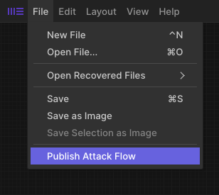

Attack Trees
============

Attack Flow's builder and command line tools can be used to visualize Attack Trees. There is an example Attack Tree in the corpus :doc:`example_flows` which can be used as a reference.

Getting Started
-------------------

The first step is to open the Attack Flow Builder in either the online version or run it locally. Click the button below to open the builder in a new tab.

.. raw:: html

    

        <a class="btn btn-primary" target="_blank" href="../ui/">
         Open Attack Flow Builder <i class="fa fa-external-link"></i></a>
    

Build Attack Tree
-------------------

When you open the builder and create a new flow, you will see a blank workspace. 

The first step to building an Attack Tree is setting the scope attribute to Attack Tree. Without this attribute, the attack tree will be rendered as a regular attack flow. The scope attribute is located in the right panel. 

  Set the scope attribute to Attack Tree.

Next, build an attack tree similarly to how you would build an attack flow. Anywhere you want to use an operator (AND or OR node), connect the actions to the operator block. Then, create an action object with the information you want in the operator node. When the Attack Tree gets rendered into image format, the operator and action node will be condensed down into one node. 

.. figure:: _static/attack-tree-builder.png
  :alt: Screenshot of Attack Flow Builder depicting what an Attack Tree looks like in the builder.
  :align: center

  Example of a completed Attack Tree in the Attack Flow Builder.

.. caution::
  It is important that while many nodes may lead into the operator node, the operator may only point to one child node. 

When you've finished building your attack tree, press Save to save the ``.afb`` format and press Publish to save the ``.json`` format. 

  Press Publish to export the flow in JSON format to be able to use the render tools.

Render Attack Tree
-------------------

Your first step will be to clone the attack flow repository onto your machine. Then, open a terminal window in the attack-flow base repository.

Having node and poetry installed are prerequisites for this next step. Refer to the :doc:`developers` Guide's initial steps for more information on setting up your repository.

The first step is opening a virtual environment in the terminal.

.. code:: bash
    
    $ poetry shell

Now, identify where the file you want to transform from json to an image is located. It may be easiest to add your newly downloaded file to the corpus folder of the attack flow repository.

Visualize with GraphViz
~~~~~~~~~~~~~~~~~~~~~~~

Follow the steps in our :ref:`Developer Guide <viz_graphviz>` to render to GraphViz. The first step is converting to `GraphViz <https://graphviz.org/>`__ format:

.. code:: bash

    $ af graphviz corpus/attack-tree.json attack-tree.dot

The example command converts the Attack Flow ``attack-tree.json`` into GraphViz format
``attack-tree.dot``. If you have GraphViz installed, you can use one of its layout tools to
create an image:

.. code:: bash

    $ dot -Tpng -O attack-tree.dot
    
The rendered GraphViz png will look something like this:

  The result of converting ``attack-tree.json`` to ``attack-tree.png``

Visualize with Mermaid
~~~~~~~~~~~~~~~~~~~~~~

Another visualization tool is to use `Mermaid <https://mermaid-js.github.io/mermaid/#/>`__ .  Mermaid is a newer format with fewer features than GraphViz, but does have the benefit that it can be embedded directly into `GitHub-Flavored Markdown <https://github.blog/2022-02-14-include-diagrams-markdown-files-mermaid/>`__. 

Follow the steps in our :ref:`Developer Guide <viz_mermaid>` to render to Mermaid. The first step is converting to Mermaid format:

.. code:: bash

    $ af mermaid corpus/attack-tree.json attack-tree.mmd

This command will transform your json file into mermaid format. From here you can include the mermaid code directly into markdown, or you can run one more command to render it as an image.

.. code:: bash

    $ mmdc -i attack-tree.mmd -o attack-tree.mmd.png
    
The rendered GraphViz png will look something like this:

.. figure:: _static/attack-tree-mermaid.png
  :alt: Example Attack Tree rendered using Mermaid
  :align: center

  The result of converting ``attack-tree.json`` to ``attack-tree.png``

