Best Practices & Real-World Applications
========================================
The Attack Flow Best Practices Guide outlines how to build clear, well-structured attack flows. It provides guidance on flow structure, documentation, and quality standards, along with real-world uses in cyber threat intelligence, defensive posture analysis, and red teaming. The goal is to help teams visualize adversary behavior, identify detection gaps, and improve communication across threat-informed operations.

General Advice
---------------

**Project Name**

The technical specification and the project as a whole are referred to as "Attack Flow"
(with capital letters), while the individual files created using the language are
referred to as "attack flows" (lower case).

**Flow Structure**

The following best practices pertain to how the individual objects are arranged together
to form an attack flow.

**Begin a flow with either a Reconnaissance, Resource Development, or Initial Access
Technique.** If the Initial Access vector is unknown, begin the flow with a condition
stating that the Initial Access vector is unknown, along with any other details on the
compromised state of the system. If there are multiple possible Initial Access vectors,
combine them using an OR operator.

**Use preconditions to enhance human understanding of the flow.** If a set of actions are self-explanatory, omit the precondition and connect the actions to each other directly. For example, the NotPetya encryption routine does not require preconditions in between the actions.

.. figure:: _static/notpetya-excerpt.png
   :alt: An excerpt from the NotPetya flow. A scheduled task action to reboot the machine leads to the rebooting action.
   :align: center

   A condition object is not necessary between these actions because the relationship
   between is very obvious.

**End a flow with an Impact technique.** If the Impact is unknown, end the flow with condition stating that the impact is unknown, along with any other relevant details.

*Flow Data*

**The description field for the flow is open-ended but should bring context and
relevance to the flow.** For example, include information on attribution, targeted
company/industry/geography, specific technologies targeted, etc. This helps readers can quickly gauge the relevance of the attack to their own assets. You may
also want to include lessons learned, IOCs, or any other information that will inform
threat prioritization and decision-making.

**Action descriptions should provide sufficient detail and not simply repeat the
technique name.** For example, "Exploits remote services," is a poor description because
it is a rephrasing of a technique name. A better description would be, "to move
laterally, NotPetya tests for vulnerable SMBv1 condition (Eternal Blue/Eternal Romance
exploit) and deploys an SMB backdoor.""

**Refrain from attaching conditions directly to other conditions.** Although the
specification does not forbid this, it is duplicative and wastes space. Consider
combining the two conditions into one object with a description that describes both
aspects of the state.

*Tailoring Flows by Audience*

   Attack flow content and metadata should be tailored to the specific audience to maximize effectiveness. Consider the following:

   * **Threat Hunters** – Reference or include specific **analytics**, detection logic, or alert mappings that helped identify the behavior. This ensures repeatability and allows other hunters to validate or refine detection capabilities.  
   * **Cyber Threat Intelligence (CTI) Analysts** – If the flow is used for external reporting, remove **sensitive information** and focus on the **critical impact** and adversary behavior. Consider including **TTPs and relevant threat groups** for a broader intelligence context.  
   * **Adversary Emulation Teams** – Provide details on **malicious commands and techniques** that were **not detected** by existing analytics, helping them build realistic tests to improve detection.  
   * **Incident Responders** – Include **timeline information, lateral movement paths, and compromised credentials** to support forensic analysis and remediation efforts.  
   * **Leadership & Executives** – Emphasize the **scale of the operation**, highlight **critical assets compromised**, and demonstrate the **business impact**. Use high-level summaries rather than technical details to ensure clarity.  
   * **SOC Analysts** – Provide actionable insights such as **log sources**, event IDs, and real-world examples of detection to aid faster investigation and triage.  

   Structuring your flow according to your audience improves communication, speeds up response times, and ensures the right level of detail is conveyed.

*Quality Standards for Public Flows*

The project includes a number of :doc:`example_flows`. We encourage you to submit flows
you create for inclusion in this public corpus. Additions to the public corpus should
follow the best practices described above as well as meet the following requirements:

* Must have 10+ actions with proper structure.
* Must include at least one credible source in metadata.

*Integration & Automation*

**Attack Flow Usages Guides**
-------------------------

This section addresses considerations for creating flows that are outside the scope of the technical specification. While it is possible to construct a valid flow without strictly following these guidelines, we recommend adopting these best practices to develop high-quality flows that effectively serve your intended purpose.

We will cover 3 common applications of Attack Flow in Industry:
1. **Cyber Threat Intelligence**: Mapping CTI reports to flows with reliable sources, technical detail, and victimology.
2. **Defensive Posture**: Identifying coverage gaps, modeling real attacks from logs, and improving detection with chokepoint analysis.
3. **Adversary Emulation & Red Teaming**:  Planning and documenting operations with flows, recording attack outcomes, and collaborating with Blue Teams to validate and improve defenses.

Cyber Threat Intelligence
-------------------------

Attack Flow helps CTI teams transform threat data into structured, sequential, visual narratives that improve analysis, reporting, and decision-making.

**Key applications include:**

* CTI analysts can use Attack Flow to create highly detailed, behavior-based threat intelligence reports. 
* Flows can be embedded in published CTI reports and blogs to visualize adversary activity and enhance understanding of attack paths.
* Malware analysts may reverse engineer samples discovered during threat hunting and use flows to document the TTPs uncovered—streamlining the creation of CTI blog posts or internal reports.
* Analysts can extract ATT&CK techniques from CTI reports, blogs, and research papers to build structured flows from unstructured data.
* Flows help preserve IOCs (Indicators of Compromise) and IOAs (Indicators of Attack) in their original context for better correlation and recall.
* Visual attack flows enhance threat briefings by making complex behavior more accessible to diverse stakeholders.

.. Attention::
   Attack Flow now supports the automatic import of STIX bundles to provide an intial flow diagram from threat intelligence

Mapping CTI Reports to ATT&CK Techniques
~~~~~~~~~~~~~~~~~~~~~~~~~~~~~~~~~~~~~~~~

*Open-Source Report Selection*

If you choose to use an open-source report to create an attack flow, it is important to
assess the strengths and weaknesses of the report in order to establish a confidence
level in its data and assessments. Factors affecting source quality include the manner
of data collection, the level of source access to the data, report completeness, and the
age and currency of the information. In addition to extracting the technical details, it
is also beneficial to construct the victimology of the attack from the reports, as its
inclusion will allow any reader to quickly gauge the scope and applicability of the flow
to their own organization. It is important to use high-quality sources, because they
will support the credibility of your flow and provide an accurate portrayal of the
threat, which may be used to inform decisions on defense and resource prioritization.

.. important::

   **Key Takeaways for Selecting a Report**

   * Reports should be transparent about where the data originates and provide a technically competent overview of an incident.
   * Reports should originate from a credible vendor with a track record of accurate reporting
     and first-hand analysis of the incident in question.
   * Reports should provide the most current information on the malware or breach.
   * Reports should make it easy to identify any information gaps. Use multiple sources
     to address gaps and corroborate the data, if possible.
   * Reports should distinguish between facts, assumptions, and analytical assessments.
   * When available, use attribution and targeting information from reports to enrich
     your attack flows.

Conversely, sources that do not meet the above criteria should be avoided. Sources that
do not have technical expertise and the ability to analyze the malware or attack
themselves (for example, news sites) are not considered optimal for creating attack
flows.

**Characteristics of Reports to Avoid:**

* Second-hand sources that simply regurgitate information about attacks instead of providing their own technical analysis.
* Sources that do not provide the context in which the information was obtained.
* Reports focusing mainly on a security product rather than the attack.
* Sources that do not provide adequate technical information and/or contain vague timelines.

Examples of Reports to Avoid
~~~~~~~~~~~~~~~~~~~~~~~~~~~~~

Cloudflare: `"What are Petya and NotPetya?" <https://www.cloudflare.com/learning/security/ransomware/petya-notpetya-ransomware>`_
     This article simply summarizes the attack and does not offer the technical detail
     needed to create a flow.

Vox: `"U.S. hospitals have been hit by the global ransomware attack" <https://www.vox.com/2017/6/27/15881666/global-eu-cyber-attack-us-hackers-nsa-hospitals>`_
     This news article does not have the source credibility and technical detail needed
     to create a flow.

Trellix: `"Update on WhisperGate, Destructive Malware Targeting Ukraine - Threat Intelligence & Protections Update" <https://www.trellix.com/en-us/about/newsroom/stories/threat-labs/update-on-whispergate-destructive-malware-targeting-ukraine.html>`_
     This article focuses on mitigation strategies and tools rather than the technical
     details of the attack. However, the report bases its information on a technical
     report by Trellix, which would be a good source to create an attack flow.

Examples of Reports to Use
~~~~~~~~~~~~~~~~~~~~~~~~~~~

Crowdstrike: `“NotPetya Technical Analysis -  A Triple Threat: File Encryption, MFT Encryption, Credential Theft” <https://www.crowdstrike.com/blog/petrwrap-ransomware-technical-analysis-triple-threat-file-encryption-mft-encryption-credential-theft/>`_
     Crowdstrike performs a first-hand analysis of the NotPetya malware and provides a
     sufficient level of technical detail.

Cisco Talos: `"Ukraine Campaign Delivers Defacement and Wipers, in Continued Escalation" <https://blog.talosintelligence.com/2022/01/ukraine-campaign-delivers-defacement.html>`_
     Cisco performs a first-hand analysis of the WhisperGate malware and provides
     sufficient technical detail. This report also provides information on adversary
     intent, targeting, and attribution, and distinguishes between information and
     analytical judgements.

The DFIR Report: `"SEO Poisoning - A Gootloader Story" <https://thedfirreport.com/2022/05/09/seo-poisoning-a-gootloader-story/>`_
     DFIR performs a first-hand analysis of this attack and provides sufficient
     technical detail, including a detailed timeline of events.

.. note::

   The three examples in this section have all been mapped into attack flows in
   :doc:`example_flows`.

MITRE ATT&CK™ is a knowledge base observed adversary tactics, techniques, and procedures
extracted from public threat reporting. There are hundreds of techniques in the ATT&CK
knowledge base, and it can be challenging to map CTI reports if you are not familiar
with the overall structure of ATT&CK.

.. Attention::

   Attack Flow does not require the use of MITRE ATT&CK. You can represent adversary behaviors from
   other knowledge bases (e.g., MITRE ATLAS, etc.) or even internal proprietary techniques.

Consider the following steps when mapping reports to ATT&CK techniques:

* Familiarize yourself with the `ATT&CK Enterprise Matrix <https://attack.mitre.org/matrices/enterprise/>`_.
* Read CISA's `best practices for mapping to ATT&CK
  <https://www.cisa.gov/uscert/sites/default/files/publications/Best%20Practices%20for%20MITRE%20ATTCK%20Mapping.pdf>`__.
* Read through your selected report(s) and try to order the behaviors into chronological
  events, beginning with Reconnaissance or Initial Access tactics and ending with the
  Impact of the attack.
* If the order of events is unclear in your report, you may need to compare several
  technical reports to determine a timeline.
* Once you have your order of events, assign a technique to each event. You may need to
  conduct further research on the behavior to determine the best-fitting technique.
* Use the Center for Threat-Informed Defenses `ATT&CK Powered Suit
  <https://chrome.google.com/webstore/detail/attck-powered-suit/gfhomppaadldngjnmbefmmiokgefjddd?hl=en&authuser=0>`_
  browser extension to quickly research ATT&CK techniques, groups, and more.
* Set the confidence property in your actions to reflect any potential uncertainty in
  your sources.

Example Technique Mapping
~~~~~~~~~~~~~~~~~~~~~~~~~

This section works through an example of mapping a report to illustrate the process. The
report used is from Cisco Talos: `"Iranian APT MuddyWater targets Turkish users via
malicious PDFs, executables"
<https://blog.talosintelligence.com/2022/01/iranian-apt-muddywater-targets-turkey.html>`_.
The corresponding "Muddy Water" Attack Flow can be found in :doc:`example_flows`. The
"Muddy Water" Attack Flow has some additional details and depicts two variants of the
Muddy Water beahvior. This section is based on the older variant of Muddy Water
campaigns.

**Initial Access**

The adversary gains initial access to the system through the distribution of PDF files
containing embedded links.

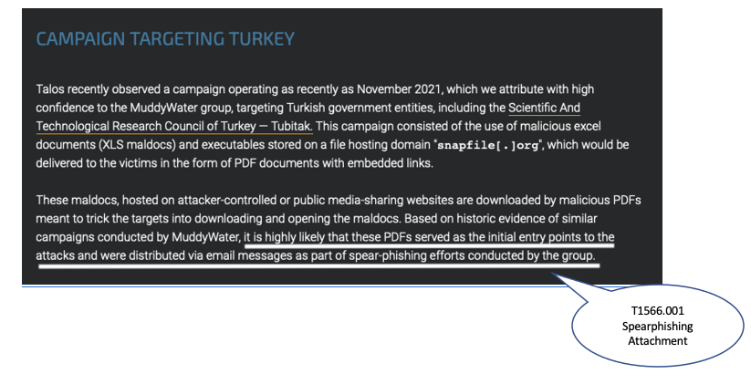 labeled with ATT&CK technique T1566.001 SpearPhishing Attachment.

**Execution**

The malware requires user-interaction to execute.

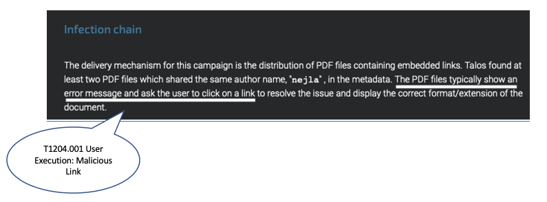

**Command and Control**

This report downloads two variants of the infection chain. The PDF either downloads
malicious XLS files or a Windows executable from an attacker-hosted website. In an
attack flow, multiple paths would be passed using an operator "OR"/"AND." However, for
the sake of this example, we will only map the first variation.

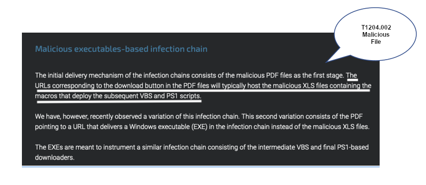oy the subsequent VBS and powershell scripts." The sentence is labeled with ATT&CK technique T1105 Ingress Tool Transfer.

**Infection Chain**

The malicious XLS file variation executes via VBA macros and establishes persistence.

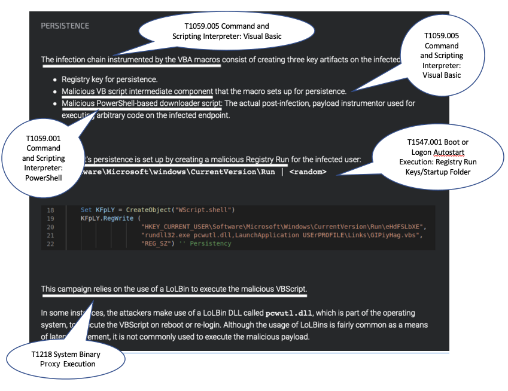tifacts is the malicious VB script intermediate component that the macro sets up for persistence. The third technique is T1059.001 Command and Scripting Interpreter: PowerShell drawn from the bullet stating that one of the artifacts is a malicious PowerShell-based downloader script. The fourth technique is T1547.001 Boot or Logon Autostart Execution: Registry Run Keys/Startup Folder drawn from the sentence "...persistence is set up by creating a malicious Registry run for the infected user." The final technique is T1218 System Binary Process Execution drawn from the sentence "This campaign relies on the use of a LoLBin to execute the malicious VBScript."

There was no ATT&CK technique associated with this Canary Token technique that may have
served as a means of defense evasion or anti-analysis. The action was simply named
"Canary Token Execution."

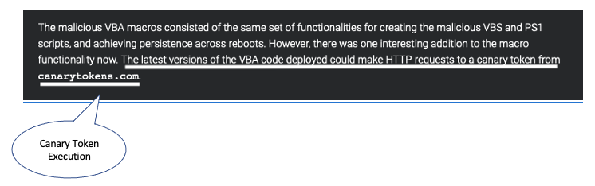n Execution."

This variation of the malware concludes with the PowerShell downloader reaching out to a
remote location for the final payload, which Cisco was unable to obtain.

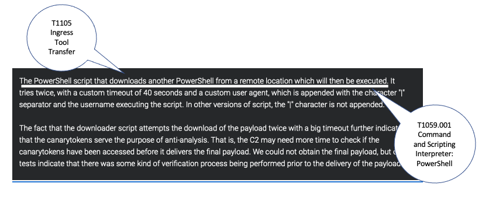ote location which will then be executed." The second technique is T1059.001 Command and Scripting Interpreter: Powershell, which is also drawn from the same sentence.

**Impact**

Because Cisco was unable to obtain the final payload, we cannot determine the objective
of the attack. However, we can assess possible impact based on information in the report
on Muddy Water's observed behavior in past campaigns. We will reflect this uncertainty
in our flow in the Action descriptions and confidence property and by using an ``OR
operator``.

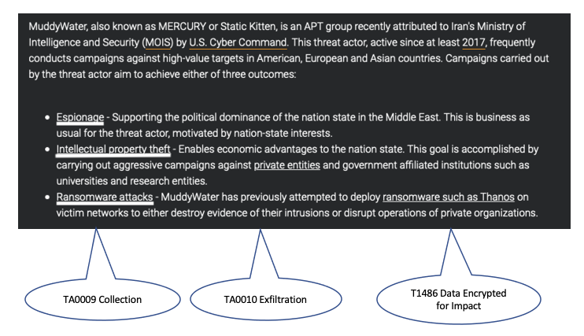

Defensive Posture
-----------------

Defenders use Attack Flow to visualize chains of adversary behavior and assess where their security controls are effective—and where they’re not. By modeling attack sequences, they can identify detection gaps, prioritize mitigations, and strengthen resilience across the kill chain.

**Key applications include:**

- Providing a clear, structured representation of attack paths to identify **coverage gaps** and **defensive choke points**.
- Building large flow diagrams to **support incident response**, extracting actionable insights from system logs and telemetry.
- Visualizing convergence points across different attack paths to assess **layered defenses** and where to focus **mitigation efforts**.
- Highlighting **critical assets** that have been or could be compromised, helping defenders prioritize protections.
- Enriching red team flows post-engagement: Blue teams can **annotate flows with detection rules**, showing which actions were observed or blocked.
- Collaborating with CTI teams to receive **adversary-specific flows**, then overlaying **existing detection rules or controls** to measure preparedness and identify blind spots.

Attack Flow helps defenders go beyond single detections to understand how adversaries chain behaviors—and how to break those chains effectively.

Mapping System Data to Attack Flow
~~~~~~~~~~~~~~~~~~~~~~~~~~~~~~~~~~

Mapping event logs to Attack Flow is often more straightforward than mapping CTI reports, as event logs provide **detailed, sequential data** that naturally aligns with Attack Flow’s structured format. 
Since system event logs capture actions in chronological order, they translate more directly into attack sequences. 
While automation tools exist to try and map event logs to ATT&CK TTPs, we will walk through the process manually.

Example Windows Event Logs for Attack Flow
******************************************

Below are example **Windows Event Logs (Sysmon and Security Event Logs)** representing different attack behaviors. These logs are formatted in **true Windows Event Log (XML format)**.

*Event Log 1: File Enumeration (`Get-ChildItem`)*

.. code-block:: xml

    <Event xmlns="http://schemas.microsoft.com/win/2004/08/events/event">
      <System>
        <Provider Name="Microsoft-Windows-Sysmon" Guid="{5770385F-C22A-43E0-BF4C-06F5698FFBD9}" />
        <EventID>1</EventID>
        <TimeCreated SystemTime="2025-02-24T14:34:50.123Z"/>
        <Execution ProcessID="5432" ThreadID="2345"/>
        <Computer>COMP123</Computer>
      </System>
      <EventData>
        <Data Name="UtcTime">2025-02-24T14:34:50.123Z</Data>
        <Data Name="ProcessGuid">{d47a9e53-3e1a-4123-9d50-bf8f8f7c6db6}</Data>
        <Data Name="ProcessId">5432</Data>
        <Data Name="Image">C:\Windows\System32\WindowsPowerShell\v1.0\powershell.exe</Data>
        <Data Name="CommandLine">Get-ChildItem -Path C:\Users\Public\Documents\ -Include *.txt,*.doc,*.docx,*.xlsx,*.pub -Recurse</Data>
        <Data Name="User">COMP123\JohnDoe</Data>
        <Data Name="ParentProcessId">4210</Data>
        <Data Name="ParentImage">C:\Windows\explorer.exe</Data>
      </EventData>
    </Event>

*Event Log 2: File Deletion (`Remove-Item`)*

.. code-block:: xml

    <Event xmlns="http://schemas.microsoft.com/win/2004/08/events/event">
      <System>
        <Provider Name="Microsoft-Windows-Sysmon" Guid="{5770385F-C22A-43E0-BF4C-06F5698FFBD9}" />
        <EventID>1</EventID>
        <TimeCreated SystemTime="2025-02-24T14:36:05.234Z"/>
        <Execution ProcessID="5531" ThreadID="2356"/>
        <Computer>COMP123</Computer>
      </System>
      <EventData>
        <Data Name="UtcTime">2025-02-24T14:36:05.234Z</Data>
        <Data Name="ProcessGuid">{e15f3e2d-2c44-4a7d-b765-9a8c23e12345}</Data>
        <Data Name="ProcessId">5531</Data>
        <Data Name="Image">C:\Windows\System32\WindowsPowerShell\v1.0\powershell.exe</Data>
        <Data Name="CommandLine">Remove-Item -Path C:\Users\Public\Documents\* -Force -Recurse</Data>
        <Data Name="User">COMP123\JohnDoe</Data>
        <Data Name="ParentProcessId">4210</Data>
        <Data Name="ParentImage">C:\Windows\explorer.exe</Data>
      </EventData>
    </Event>

*Event Log 3: New User Account Created (`net user /add`)*

.. code-block:: xml

    <Event xmlns="http://schemas.microsoft.com/win/2004/08/events/event">
      <System>
        <Provider Name="Microsoft-Windows-Security-Auditing" Guid="{54849625-5478-4994-A5BA-3E3B0328C30D}" />
        <EventID>4720</EventID>
        <TimeCreated SystemTime="2025-02-24T15:40:10.567Z"/>
        <Execution ProcessID="5672" ThreadID="1243"/>
        <Computer>COMP123</Computer>
      </System>
      <EventData>
        <Data Name="TargetUserName">hackeradmin</Data>
        <Data Name="TargetDomain">COMP123</Data>
        <Data Name="TargetSid">S-1-5-21-987654321-234567890-345678901-1010</Data>
        <Data Name="CallerUserName">JaneAdmin</Data>
        <Data Name="CallerDomain">COMP123</Data>
        <Data Name="CallerSid">S-1-5-21-1454471165-1004336348-682003330-1001</Data>
        <Data Name="Privileges">SeCreateGlobalPrivilege</Data>
        <Data Name="NewAccountType">Standard</Data>
        <Data Name="SamAccountName">hackeradmin</Data>
        <Data Name="Description">New local user account added, possibly for persistence.</Data>
      </EventData>
    </Event>

*Event Log 4: Mimikatz Execution (Credential Dumping - LSASS)*

.. code-block:: xml

    <Event xmlns="http://schemas.microsoft.com/win/2004/08/events/event">
      <System>
        <Provider Name="Microsoft-Windows-Sysmon" Guid="{5770385F-C22A-43E0-BF4C-06F5698FFBD9}" />
        <EventID>1</EventID>
        <TimeCreated SystemTime="2025-02-25T15:25:37.456Z"/>
        <Execution ProcessID="7852" ThreadID="3152"/>
        <Computer>COMP123</Computer>
      </System>
      <EventData>
        <Data Name="UtcTime">2025-02-25T15:25:37.456Z</Data>
        <Data Name="ProcessGuid">{b2f8d0d7-c62f-4e4b-9a3c-38d74bca4321}</Data>
        <Data Name="ProcessId">7852</Data>
        <Data Name="Image">C:\Windows\Temp\mimikatz.exe</Data>
        <Data Name="CommandLine">mimikatz.exe privilege::debug sekurlsa::logonpasswords exit</Data>
        <Data Name="Hashes">MD5=5f66b82558ca92e54e77f216ef4c066c; SHA1=b8c2d5a2a3b2d5d3a6b5c3d2a4e7c5d1b6c7e8d9; SHA256=419a3c39243e6615993547d3b5443b005c3fc6b2b3e4f8c53a5e8e3c5d6a9f8b</Data>
        <Data Name="User">COMP123\JaneAdmin</Data>
        <Data Name="ParentProcessId">3240</Data>
        <Data Name="ParentImage">C:\Windows\System32\cmd.exe</Data>
        <Data Name="ParentCommandLine">cmd.exe /c mimikatz.exe</Data>
        <Data Name="Description">Adversary executed Mimikatz to dump credentials from LSASS memory.</Data>
      </EventData>
    </Event>

These event logs demonstrate **Windows system events for different attack stages**:

- PowerShell enumeration (`Get-ChildItem`)
- File deletion (`Remove-Item`)
- New local user creation (`net user /add`)
- Credential dumping via Mimikatz (`sekurlsa::logonpasswords`)

If applicable, you can map the events you observe directly to MITRE ATT&CK techniques (but you can also label it more generally).
Once you identify malicious or interesting activity in your logs, you can list out the techniques and what indicators were related to that event.

- T1083 - File and Directory Discovery → `Get-ChildItem`
- T1070.004 - File Deletion → `Remove-Item`
- T1136.001 Create Account: Local Account → `net user /add`
- T1003.001 - OS Credential Dumping: LSASS Memory → `sekurlsa::logonpasswords`

Event Logs to Flow Diagram
~~~~~~~~~~~~~~~~~~~~~~~~~~

.. Attention::
  Attack Flow now supports the automatic import of STIX bundles to provide an intial flow diagram.

The close timing of these events may suggest a coordinated sequence involving data staging, exfiltration, and cleanup. Highlighting the timestamps in the Attack Flow can help illustrate this progression.

Let’s now map these four techniques into an Attack Flow diagram to visualize the sequence of behaviors more effectively.

.. figure:: _static/example-flow-short.png
   :alt: Attack Flow diagram built from the example system event logs with just ATT&CK techniques in sequential order based off timestamp.
   :figclass: center

   Diagram showing ATT&CK techniques in sequence from example system event logs, based on timestamps.

Post-Flow: Identifying Gaps in Adversary Behaviors
~~~~~~~~~~~~~~~~~~~~~~~~~~~~~~~~~~~~~~~~~~~~~~~~~~
This sequence shows how an adversary leveraged **PowerShell command shells** to carry out multiple malicious actions. By identifying PowerShell as a key execution method, we can **prioritize detection and mitigation strategies**.
If you're conducting **chokepoint analysis**, consider strengthening **detections and mitigations around PowerShell activity**. Enhancing coverage here can help detect, disrupt, and/or prevent downstream techniques before they escalate.

.. note::

  **Key Tips for Hunting for Malicious Activity and Threats**

    * Your first clue of malicious activity can appear at any point in an attack—tracing backward helps identify the initial compromise, while looking forward reveals the adversary's actions and attack progression.
    * A useful tool for searching for related techniques is `"CTID's Technique Inference Engine (TIE)" <https://center-for-threat-informed-defense.github.io/technique-inference-engine/#/>`_ which can help piece together missed areas of compromise.
    * Once you determine malicious activity, investigate to determine the scope and scale of the attack.

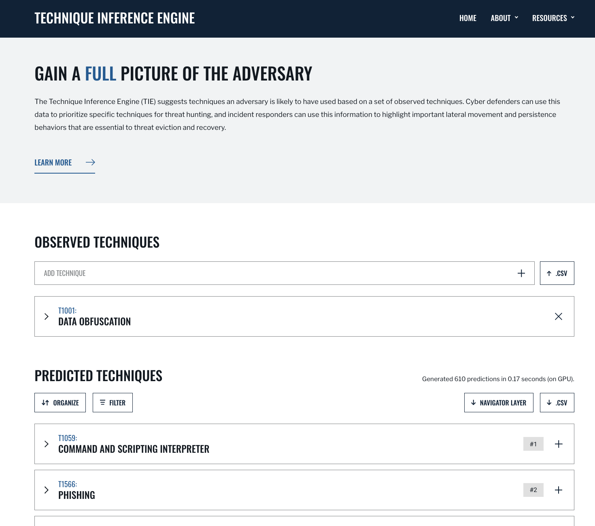rpus of threat intelligence.
   :figclass: center

   Diagram showing ATT&CK techniques in sequence from example system event logs, based on timestamps.

So what does visualizing this show us? We can see PowerShell and Windows Command Shell being used, where one leads to  three techniques and the other leads to one. This can give us insight into prioritization of detections to build in the future, but it may  also indicate that we need to investigate detections around the one with less behaviors detected as something could have been missed.

Supplemental Fields and STIX Object Mappings
~~~~~~~~~~~~~~~~~~~~~~~~~~~~~~~~~~~~~~~~~~~~

Lastly, consider incorporating these **supplemental fields**, many of which map directly to **STIX (Structured Threat Information eXpression) objects**. 
These details help correlate related events, track adversary behavior, and enhance detection and response throughout an investigation.

*These can be automatically generated if importing a STIX bundle into an Attack Flow.*

.. list-table::
   :header-rows: 1
   :widths: 30 70

   * - **Field (STIX Object)**
     - **Description**
   * - **Process or Executable Name & Location (Process)**
     - Identifies unusual or suspicious programs, especially those outside standard directories or with deceptive names.
   * - **Parent Process (Process)**
     - Reveals whether a process is spawned by a legitimate application or leveraged by malware for stealth.
   * - **Command-Line Arguments & Parameters (Process)**
     - Exposes execution intent and potential malicious actions.
   * - **Configuration Changes (Windows Registry Key, Software)**
     - Tracks altered system or application settings, including modified **Windows Registry keys** or configurations impacting security.
   * - **User Accounts Involved (User Account)**
     - Highlights **privilege escalation**, suspicious account activity, or abnormal user behaviors.
   * - **Network Connections (Network Traffic, IPv4/IPv6 Address, Domain Name)**
     - Links processes to external threats, **Command & Control (C2) servers**, suspicious IP addresses, or malicious domains.
   * - **File & Executable Hashes (File, Artifact)**
     - Helps identify **known malware samples**, detect tampered files, and correlate threats via hash values (MD5, SHA-1, SHA-256).
   * - **In-Memory Artifacts (Process, Attack Pattern)**
     - Captures **loaded processes, injected code segments**, and memory-based attack techniques.
   * - **Timestamps of Key Actions (Observed Data, Indicator)**
     - Establishes attack **sequence and progression**, helping analysts reconstruct the attack timeline.

By integrating these **STIX-compatible attributes** into your **attack flow**, you can improve **event correlation, adversary tracking, and intelligence sharing**, ultimately enhancing your cybersecurity defense strategy.

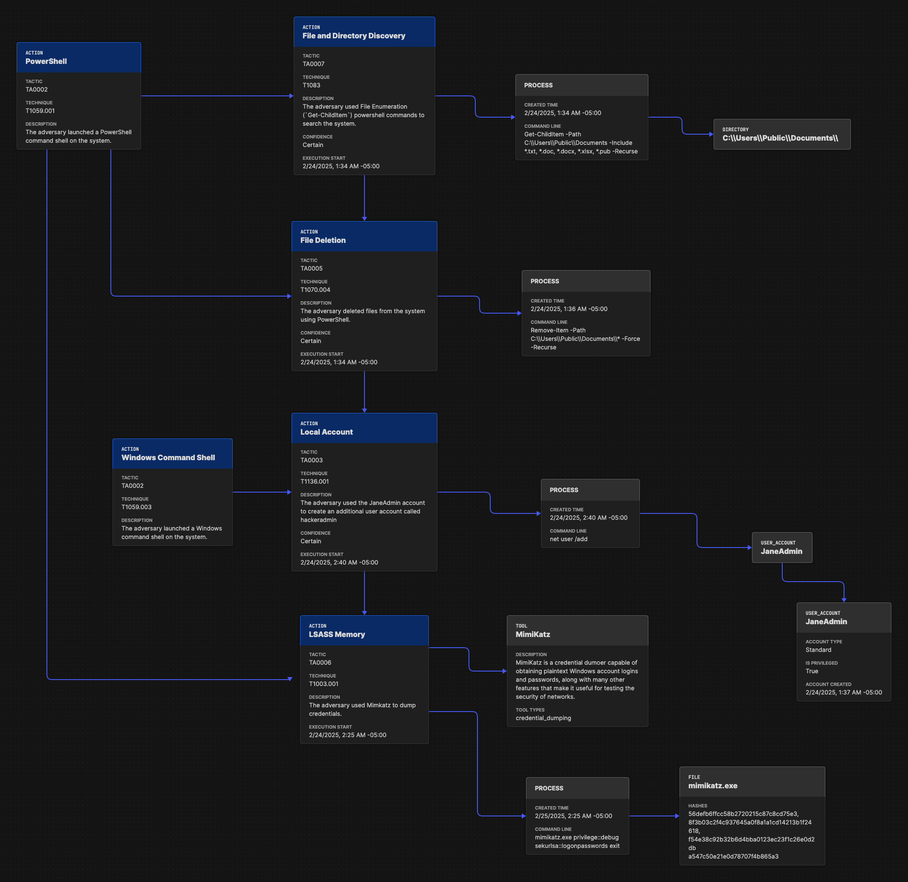

   Attack Flow diagram combining ATT&CK techniques with contextual data from STIX objects and observables.

*Asset Interaction and Tracking*

**Assets**: such as systems, services, credentials, and data—are central to any red team operation. Attack Flow can help track and visualize:

- **Initial Access Targets**: Systems that serve as entry points (e.g., vulnerable web servers, email clients).
- **Pivot Assets**: Hosts used for lateral movement or privilege escalation.
- **Compromised Resources**: Credentials, file shares, databases, domain controllers.
- **Critical Assets**: Data exfiltration targets or mission-critical systems.

An example of what an asset may look like 

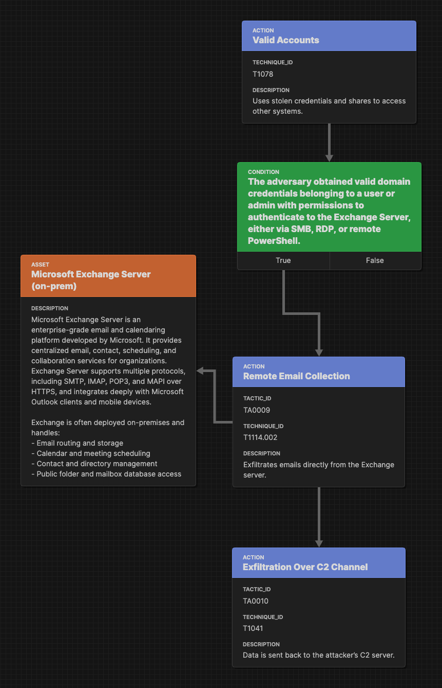

   Example Flow Snippet of techniques leading to a compromised asset and a related course of action STIX object to take.

Adversary Emulation & Red Teaming
---------------------------------
Attack Flow is a powerful tool for red teams to plan, document, and communicate simulated adversary behavior during engagements. 

**Key applications include:**

* Red teams will build out a flow as part of the planning phase before a live operation. 
* Red teamers use Attack Flow at the end of an operation in their final report to show what they performed and compare with Blue Team. They summarize total TTPs executed, indicators, and assets that were compromised. This tells the story of the entire attack path (i.e., what were the meanings of the route taken)

Attack Flow can be applied throughout the lifecycle of a red team operation:

* **Pre-engagement**: Plan out attack paths using known TTPs of a real adversary.
* **During the operation**: Track which techniques were executed, which failed, and the outcome of each action.
* **Post-engagement**: Generate a report comparing Red vs. Blue team results, showing missed detections, compromised assets, and executed commands relating to specific adversary behaviors.

Pre-Engagement: Planning with Attack Flow
~~~~~~~~~~~~~~~~~~~~~~~~~~~~~~~~~~~~~~~~~

When planning a red team engagement, Threat Intelligence and IR teams will have the opportunity to weigh in on which adversaries are needing to be tested based off what they see as a threat to their organization. This collaborative planning ensures that the red team’s tests are not only realistic but also strategically valuable for improving detection and defense.
Attack Flows can help visualize these threat scenarios for red teamers and help them select representative behaviors to emulate.

Prior to the operation, red teams often collaborate with:

- **CTI teams** to identify adversaries that align with current threats to the organization. CTI analysts may suggest:

  - Determine active or trending APT groups, novel adversarial techniques
  - Industry-specific targeting patterns
  - Recent malware campaigns observed in the wild and/or the internal environment

- **Blue Teams or Detection Engineers** to focus the scope of testing. Red teams may:

  - Discuss control coverage assumptions or known gaps
  - Coordinate on which detection rules or analytics to evaluate
  - Align testing around high-value assets or specific services

During and After Execution
~~~~~~~~~~~~~~~~~~~~~~~~~~
Red teams can use flows abstractly (focusing on TTPs) or at high fidelity (capturing commands, conditions, and outcomes).

* Record commands, hostnames, IPs, PIDs, and usernames
* Annotate successes and failures to capture realistic scenarios
* Capture details down to the permissions level for techniques
* Use STIX Note and Indicator objects to enrich the flow, examples below:
    - ``Asset names or host identifiers`` (e.g., DC01, FIN-SQL-02)
    - ``Asset roles`` (e.g., file server, HR workstation, domain controller)
    - ``Access method or privilege level`` (e.g., user, admin, SYSTEM)
    - ``Associated indicators`` (e.g., executed commands, processes, hashes, network connections)
* Document pivot points and compromised items (e.g., credentials, accounts, servers, etc.)
* Consider developing a conversion pipeline from automated red team tools—such as Caldera or Cobalt Strike—to generate STIX bundles that can be imported into Attack Flow

Post-Engagement: Reporting and Collaboration
~~~~~~~~~~~~~~~~~~~~~~~~~~~~~~~~~~~~~~~~~~~~

*Reporting*

After an engagement, red teams can **export their Attack Flows in JSON** to share with internal stakeholders, Blue Teams, or detection engineers. In larger attack flows (e.g., impacting 2,000+ hosts), teams need ways to segment actions across different subsets of assets. When transitioning from red team to IR team, focus shifts from TTP-level planning to asset-level impact assessment.

These completed attack flow diagrams:

* Provide a clear, visual timeline of what was executed
* Help defenders validate what was and was not detected
* Enable threat hunters to replay or simulate observed behaviors
* Serve as long-term records of adversary simulations for compliance or training
* Visualization scripts can be created to process the JSON output of flows for high level knowledge (e.g., tactics covered, TTPs, number of compromised assets, etc.)

Attack Flow enables both red and blue teams to:

* Compare execution (Red) vs. detection (Blue) side-by-side
* Identify missed detections or blind spots
* Validate coverage of specific techniques
* Inform future detection engineering and threat modeling

*Post-Engagement Collaboration*

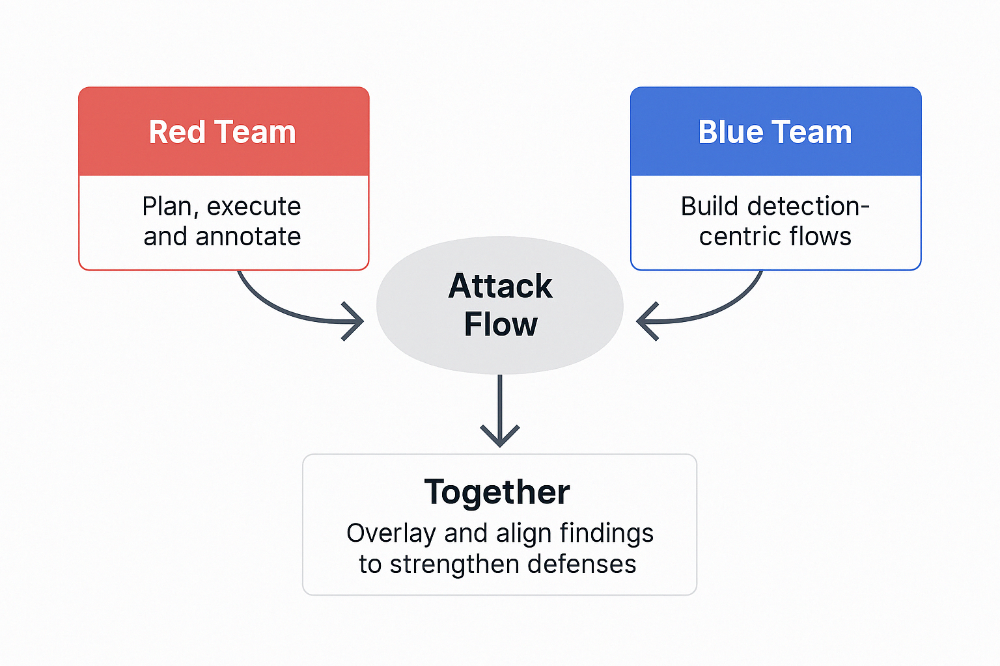

   Red Team and Blue Team Collaboration with Attack Flow

.. note::

  **Key Tips for Red Team Flow Building**
  
    * Use ``conditions`` to flag required states (e.g., ``domain user credentials obtained``).
    * Use ``notes`` to add human-readable context at key nodes.
    * Link Indicators, Process objects, and CommandLines to actions for maximum clarity.
    * Consider annotating pivot points (e.g., account switch, lateral move) with user and host metadata.

This provides the blue team with essential context to understand:
  * What was targeted and why
  * Which assets were at risk or compromised
  * Where defensive coverage may be lacking (and the blue team can fill in what detections they have for those items)

Example Exercise
~~~~~~~~~~~~~~~~

Red teams can use adversary emulation plans—such as those provided in the Adversary Emulation Library — as a foundation for constructing detailed Attack Flows that guide and document engagements.

We can first look at the `"Turla Intelligence Summary Page" <https://github.com/center-for-threat-informed-defense/adversary_emulation_library/blob/master/turla/Intelligence_Summary/Intelligence_Summary.md>`_, as this can be useful to add to the overall attack flow plan properties panel and STIX objects.

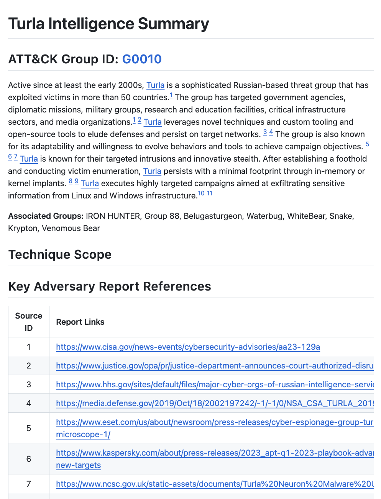

   Intelligence Summary from Turla (Snake) Adversary Emulation Library 

Next, let's look at the `"Turla - Snake Emulation Plan .YML File" <https://github.com/center-for-threat-informed-defense/adversary_emulation_library/blob/master/turla/Emulation_Plan/yaml/turla_snake.yaml>`_  and see which componenets we can use for an exercise.

* Adversary name and description: 
* Test scenarios that simulate various TTPs and commands
* Mappings to MITRE ATT&CK techniques
* Command-level execution steps and implementations in Caldera

The emulation plan, created by the ATT&CK® Evaluations team, was used during Day 2 of the ATT&CK evaluations Round 5. 
This scenario focuses on Snake, a rootkit used to compromise computers and exfiltrate data. *If you have your own plans, you can convert them to STIX and import into Attack Flow.*

For detailed information on the scenario to run, you can find the technical setup and commands `"here" <https://github.com/center-for-threat-informed-defense/adversary_emulation_library/blob/master/turla/Emulation_Plan/Snake_Scenario/Snake_Detections_Scenario.md>`_

*Building the Attack Flow from the Plan*

For example, the Turla (Snake) is publicy available via the adversary emulation library and has already been converted to a flow diagram, here: `"here" <https://center-for-threat-informed-defense.github.io/attack-flow/ui/?src=..%2fcorpus%2fTurla%20-%20Snake%20Emulation%20Plan.afb>`_ 

At a high level, we can observe the total count of each technique in the plan:

.. list-table:: ATT&CK Techniques in Turla (Snake) Adversary Emulation Plan .Yml File
   :header-rows: 1
   :widths: 20 10

   * - Technique ID
     - Count
   * - T1189
     - 1
   * - T1204.002
     - 1
   * - T1082
     - 1
   * - T1105
     - 11
   * - T1014
     - 1
   * - T1057
     - 2
   * - T1087.002
     - 2
   * - T1049
     - 1
   * - T1569.002
     - 1
   * - T1070.004
     - 3
   * - T1059.001
     - 1
   * - T1069.001
     - 3
   * - T1018
     - 1
   * - T1003.001
     - 1
   * - T1550.002
     - 1
   * - T1136.002
     - 2
   * - T1570
     - 5
   * - T1505.002
     - 1
   * - T1059.003
     - 1
   * - T1016
     - 1
   * - T1041
     - 1

Then, begin constructing the flow by mapping in the identified techniques. Gradually add conditions to represent asset compromise requirements or pivot points necessary to advance the operation. Where available, include commands from the emulation plan as ``process`` and ``command-line`` STIX objects to provide detailed execution context.

**Creating the Flow from a Plan**

  1. **Start with adversary context**: Highlight the threat actor being emulated at the top of the flow. This gives context and helps align the test with known threat behavior.

  2. **Map techniques**: Add the ATT&CK techniques from the plan into the flow in logical order. *See CTI usage guide for tips how to map reports to techniques*
  
  3. **Include conditions where it provides more context**:  Use Condition objects to define prerequisites for each stage (e.g., “User credentials acquired” or “Initial access to target machine achieved”). As the engagement progresses, conditions in the flow help capture key decision points—such as whether a required action (e.g., privilege escalation) was successful. The red team can annotate the flow with notes indicating success or failure, compromised assets, exploited vulnerabilities, and specific commands executed. This is particularly useful if certain behaviors go undetected by the blue team.

  4. **Incorporate operators**: If multiple scenarios or parallel actions are included (e.g., different lateral movement options), use AND/OR operators to represent branching paths. Throughout the operation, red teamers should track which paths were attempted, what actions were executed, and where they encountered blocks. If privilege escalation failed, for example, that should be clearly noted in the flow.

  5. **Add indicators where applicable**: to provide additional context, either for planning purposes or post-emulation reporting, you can include relevant STIX objects that map back to indicators (either of interest or that were successfully accessed)

Red teams can choose to represent each scenario in its own flow or combine them into a single, comprehensive flow. A prebuilt Attack Flow based on this plan is already available here:

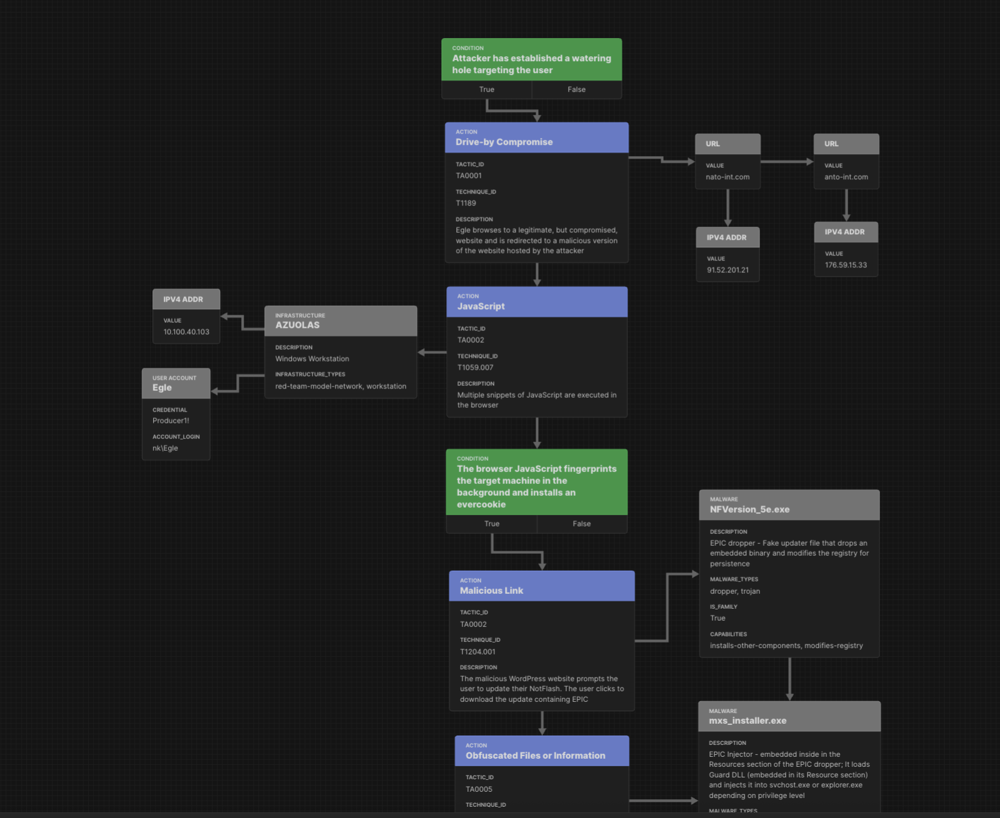

   Turla (Snake) Attack Flow created from the Adversary Emulation Plan library

Once the engagement is complete and the attack flow is built, the blue team can begin detection analysis, ideally creating their own flow based on observed telemetry. At the end, both teams can compare flows to identify missed detections, validate assumptions, and strengthen overall security posture.
