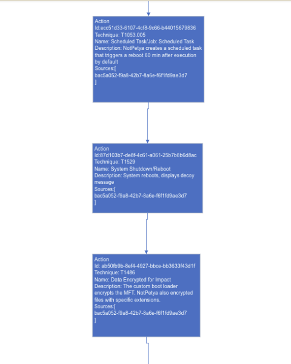

Best Practice Guide
===================

Open-Source Report Selection
-----------------------------

* Reports should be transparent about where the data originates and provide a technically competent overview of the breach or malware
* Reports should preferably be from a security vendor and/or U.S. government organization with first-hand analysis of the malware or attack to ensure credibility and reliability in reporting
* Use multiple sources to address any information gaps and correlate the data, if possible
* If available, glean details from threat intelligence on attribution and targeting to add to the flow metadata for context and relevance

Reports to Avoid
~~~~~~~~~~~~~~~~~

* Second-hand sources that simply regurgitate information about attacks and do not provide adequate technical information
* Reports focusing mainly on a security product rather than the attack 

Examples of Reports to Avoid
~~~~~~~~~~~~~~~~~~~~~~~~~~~~~

Cloudflare; `"What are Petya and NotPetya?" <https://www.cloudflare.com/learning/security/ransomware/petya-notpetya-ransomware>`_

     This article simply summarizes the attack and does not offer the technical detail needed to create a flow

Vox; June 27, 2017; `"U.S. hospitals have been hit by the global ransomware attack" <https://www.vox.com/2017/6/27/15881666/global-eu-cyber-attack-us-hackers-nsa-hospitals>`_

     This news article does not have the source credibility and technical detail needed to create a flow 

Trellix; January 20, 2022; `"Update on WhisperGate, Destructive Malware Targeting Ukraine - Threat Intelligence & Protections Update" <https://www.trellix.com/en-us/about/newsroom/stories/threat-labs/update-on-whispergate-destructive-malware-targeting-ukraine.html>`_

     This article focuses on mitigation strategies and tools rather than the technical details of the attack. However, the report bases its information on a technical report by Trellix, which would be a good source to create an attack flow. 

Examples of Reports to Use
~~~~~~~~~~~~~~~~~~~~~~~~~~~

Crowdstrike; June 29, 2017; `“NotPetya Technical Analysis -  A Triple Threat: File Encryption, MFT Encryption, Credential Theft” <https://www.crowdstrike.com/blog/petrwrap-ransomware-technical-analysis-triple-threat-file-encryption-mft-encryption-credential-theft/>`_
`NotPetya Attack Flow <https://github.com/center-for-threat-informed-defense/attack-flow-private/blob/main/corpus/notpetya.afd>`_

Cisco Talos; January 21, 2022; `"Ukraine Campaign Delivers Defacement and Wipers, in Continued Escalation" <https://blog.talosintelligence.com/2022/01/ukraine-campaign-delivers-defacement.html>`_
`WhisperGate Attack Flow <https://github.com/center-for-threat-informed-defense/attack-flow-private/blob/main/corpus/WhisperGate.afd>`_   

The DFIR Report; May 9, 2022; `"SEO Poisoning - A Gootloader Story" <https://thedfirreport.com/2022/05/09/seo-poisoning-a-gootloader-story/>`_
`Gootloader Attack Flow <https://github.com/center-for-threat-informed-defense/attack-flow-private/blob/main/corpus/Gootloader.afd>`_

Mapping Reports to ATT&CK Techniques
------------------------------------ 

*      Familiarize yourself with the `ATT&CK Enterprise Matrix <https://attack.mitre.org/matrices/enterprise/>`_
       Take Engenuity's free MAD CTI Training for additional help //inline link here 
   
* `Helpful guide <https://www.cisa.gov/uscert/sites/default/files/publications/Best%20Practices%20for%20MITRE%20ATTCK%20Mapping.pdf>`__ for adoption of best practices for mapping to ATT&CK
 
*  Read through your selected report(s) and try to order the events chronologically, beginning with Reconnaissance or Initial Access tactics and ending with Impact. If the order of events is unclear 
   in your report, you may need to compare several technical reports to determine a timeline. 
   

*  Once you have your order of events, assign a technique to each event. `ATT&CK Powered Suit <https://chrome.google.com/webstore/detail/attck-powered-suit/gfhomppaadldngjnmbefmmiokgefjddd?hl=en&authuser=0>`_ is a MITRE 
   Engenuity browser extension that can be used to instantly search for ATT&CK techniques, groups, and more. 
   
*  If there is any uncertainty regarding an action or technique, you can use the confidence property. In our current iteration of Attack Flow, the confidence property can be 0 or 1. 
   If a technique is only suspected to be used in a breach or by malware, then it should have a confidence property of 0. However, if it is confirmed to be used, then the confidence property is 1. 

Note: ATT&CK techniques do not have to be used for mapping, as Attack Flows was designed to support the use of all actions. Other sources, such as VERIS, can also be used. 

Example Technique Mapping
~~~~~~~~~~~~~~~~~~~~~~~~~~
Report Used: Cisco Talos; January, 31, 2022; `"Iranian APT MuddyWater targets Turkish users via malicious PDFs, executables" <https://blog.talosintelligence.com/2022/01/iranian-apt-muddywater-targets-turkey.html>`_
`MuddyWater Attack Flow <https://github.com/center-for-threat-informed-defense/attack-flow-private/blob/main/corpus/MuddyWater.afd>`_

Initial Access
~~~~~~~~~~~~~~~
.. image:: _static/SpearPhishing.png

Execution
~~~~~~~~~~
The malware requires user-interaction to execute

.. image:: _static/MaliciousLink.png

Command and Control
~~~~~~~~~~~~~~~~~~~~
This report downloads two variants of the infection chain. The PDF either downloads malicious XLS files or a Windows executable from an attacker-hosted website. In an attack flow, multiple paths would be passed using an operator "OR"/"AND." However, for the sake of this example, we will only map the first variation.
 
.. image:: _static/IngressTool.png 

Infection Chain
~~~~~~~~~~~~~~~~
The malicious XLS file variation executes via VBA macros and establishes persistence 

.. image:: _static/VBAMacros.png 

There was no ATT&CK technique associated with this Canary Token technique that may have served as a means of defense evasion or anti-analysis. The action was simply named "Canary Token Execution"

.. image:: _static/CanaryToken.png 

This variation of the malware concludes with the PowerShell downloader reaching out to a remote location for the final payload, which Cisco was unable to obtain 

.. image:: _static/PowerShell.png

Impact
~~~~~~~
Because Cisco was unable to obtain the final payload, we cannot determine the objective of the attack. However, we can assess possible impact with moderate confidence based on information in the report on Muddy Water's observed behavior in past campaigns. We will reflect this uncertainty in our flow in the Action descriptions and confidence property and by using an OR operator. 

.. image:: _static/Impact.png

Flow Structure
--------------
*    Begin each flow with either a *Reconnaissance*, *Resource Development*, or an *Initial Access* Technique 

          Note: If the Initial Access vector is unknown, begin the flow with an Action with the description that the Initial Access is unknown, along with any other details on the compromised state of the system.  If there are multiple possible Initial Access vectors, depict them using an OR operator.  
* Use preconditions to enhance human understanding of the flow. If a set of actions are self-explanatory, omit the precondition and connect the actions to each other directly. For example, the NotPetya encryption routine does not require preconditions in between the actions. 

* If two actions stemming from one action happen simultaneously, an AND operator is not needed
*  End each flow with an *Impact* Technique 
   
        Note: If the Impact is unknown, end the flow with an Action with the description that the impact is unknown, along with any other relevant details. Or, you may also include Impact techniques that are typical of the actor's campaigns and label them as such.

Flow Objects
------------
Metadata
~~~~~~~~~
*    Select a flow type which best represents your report(s)

     Incident 
             This flow represents a single observed attack 
    
     Campaign 
            This flow represents multiple instances of a Threat Actor pursuing a goal through observed TTPs. For example, varying malware behavior over several attacks would fall into this category. 
     
     Adversary Emulation 
            This flow represents a constructed scenario that can be used to test defenses against the observed tactics, techniques, and chains of attack of an adversary group
    
* Description 

           The metadata description for Incidents and Campaigns is open-ended but should bring context and relevance to the flow.  For example, include information on attribution, targeted company or industry or geography, specific technologies targeted, etc. if known. This way, readers can quickly gauge the relevance of the attack to their own assets. You may also want to include lessons learned, IOCs, or any other information that will inform threat prioritization and decision-making. 
    
           The metadata description of an Adversary Emulation flow is also open-ended but should contain information about the chosen scenario, as well as adversary information such as suspected identity or source country, community identifiers/aliases, suspected motivation, commonly exploited vulnerabilities/CVEs, associated malware, and targeted nations and industries if known. This information should be sourced. 
    
Actions
~~~~~~~~
* Descriptions must provide sufficient detail and must not simply repeat the technique name 

           Bad Description: Exploits remote services 
           
           Good Description: To move laterally, NotPetya tests for vulnerable SMBv1 condition (Eternal Blue/Eternal Romance exploit) and deploys an SMB backdoor

*  The source field is optional. However, if you have multiple sources for the flow, it is a best practice to reference a source for each action to so that its data and the confidence field (if in use) can be verified.    
    
    
Criteria for Public Submissions into the Corpus
------------------------------------------------ 
*   The flow must be one continuous flow from start to finish, connecting events in the order that they occurred. (Rather than multiple flows broken up) 
*   The flow must be sufficiently complex for submission. The flow must have no fewer than 10 actions and must make proper use of preconditions and operators
*   The flow must contain at least one source in the metadata. Source must be credible and technically competent. 
    
    
    