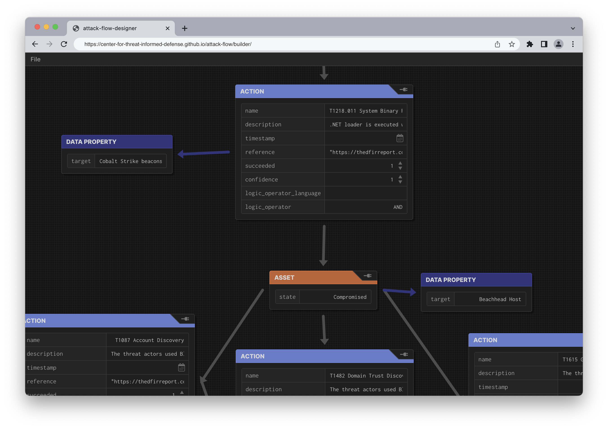
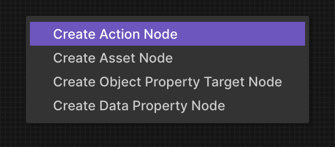
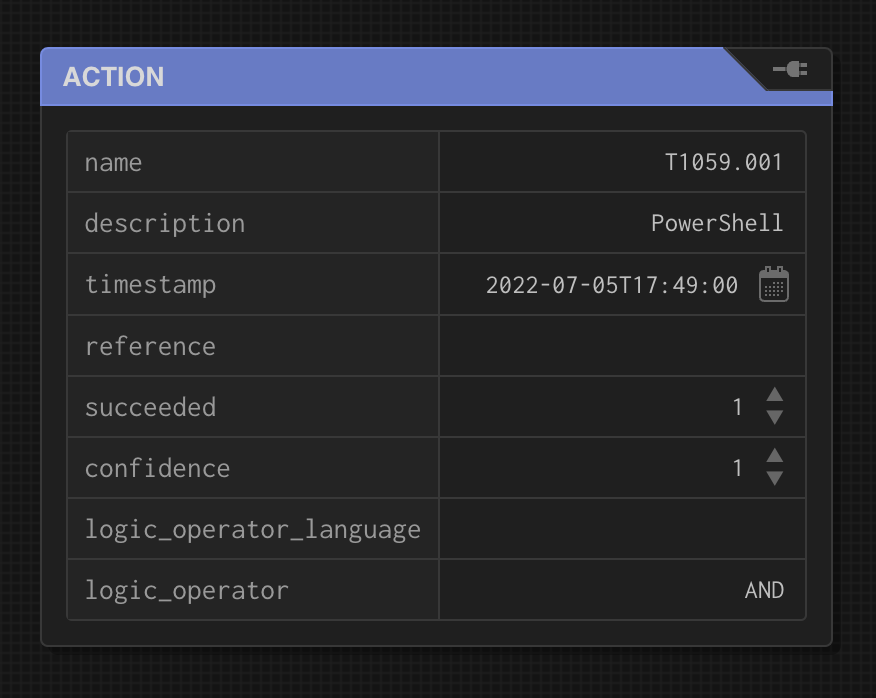
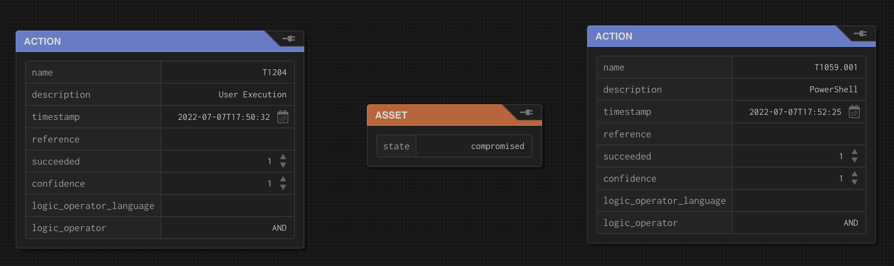
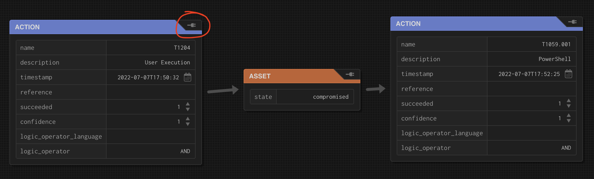

Builder
=======

Overview
--------

Attack Flow Builder is a free and open source tool for creating, viewing, and editing
Attack Flows.

   View and edit Attack Flows using an intuitive drag-and-drop interface.

This web-based tool provides a workspace where you can populate information about
adversary actions and additional context, then weave those items into a flow by drawing
arrows to indicate the sequences of adversary techniques observed during an incident or
campaign.

Getting Started
---------------

**The quickest and easiest way to get started** is with our online option. Click the
button below to open the builder in a new tab, or select one of the :doc:`example_flows`
for viewing it in Attack Flow Builder.

.. caution::

   The online Attack Flow Builder stores documents in memory and on disk on your local
   machine, so any flows that you create or edit are completely private. However, the
   online version is accessed over the internet, and so your connection may be visible
   to some third parties (e.g. GitHub, ISPs). For a completely private experience,
   consider using the download or Docker approaches described below.

.. raw:: html

    

        <a class="btn btn-primary" target="_blank" href="builder/index.html">
         Open Attack Flow Builder <i class="fa fa-external-link"></i></a>
    

When you first open the Builder, if you did not select one of the example flows then
you will initially see a blank workspace. Right-click anywhere in this space to see a
palette of options.

For example, you can select "Create Action Node" to create a new action, and then fill
in the details of the action.

Right-click to repeat the process and add an asset and another technique, then fill in
the missing details. You can drag and drop items to arrange them however you want, for
example:

Finally, connect items together by clicking on the plug icon on one item and dragging a
line to another item.

Continue to build out your flow by adding nodes, filling in the attributes, and drawing
arrows between nodes. When you are done, you go to the File menu to save your flow.

.. image:: _static/builder6.png
  :width: 300
  :alt: How to save flows.

Save Attack Flow…
   Saves the file in \*.afd format, which can be opened for further editing in the
   future.
Publish Attack Flow…
   Saves the file in \*.json format, which is the standard format for exchanging and
   processing Attack Flows.

Docker
------

If you do not want to use the Attack Flow Builder Online, you can run it locally `using
Docker <https://www.docker.com/>`__ as shown below.

.. code:: shell

   $ docker pull ghcr.io/center-for-threat-informed-defense/attack-flow-private:main
   $ docker run --name AttackFlowBuilder \
      ghcr.io/center-for-threat-informed-defense/attack-flow-private:main

Once the container is running, you can open a brower tab to http://localhost:8080/ to
view the Builder.

Download
--------

If you do not wish to use Docker, you can also download the Builder from the GitHub
repository:

1. Go to the `Attack Flow release page
   <https://github.com/center-for-threat-informed-defense/attack-flow/releases>`__
   and download ``attack_flow_builder.zip``.
2. Unzip it.
3. In the ``attack_flow_builder/`` directory, double click on ``index.html`` to open
   it in a web browser.

Developer
---------

Finally, if you wish to help contribute code for Attack Flow Builder, you can set up
Builder in :ref:`a development environment <builder_dev>`.
