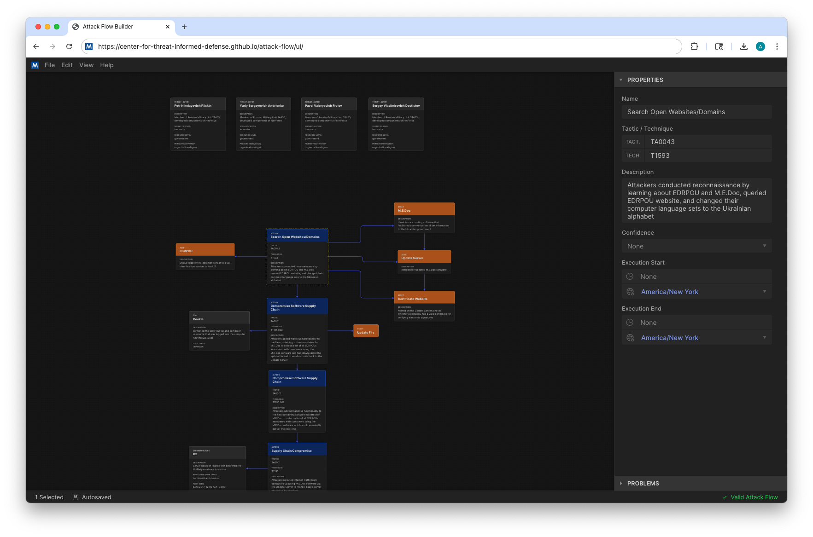
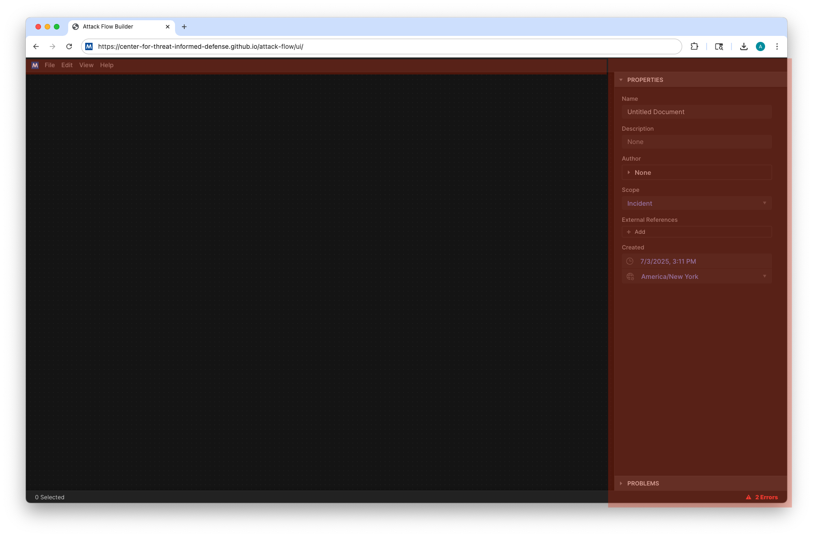
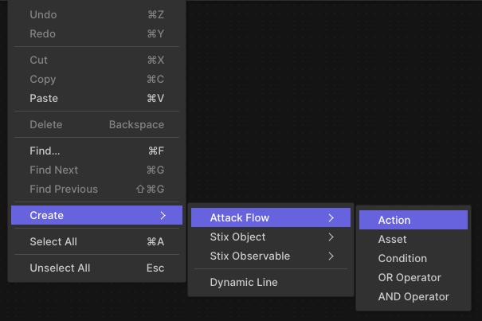
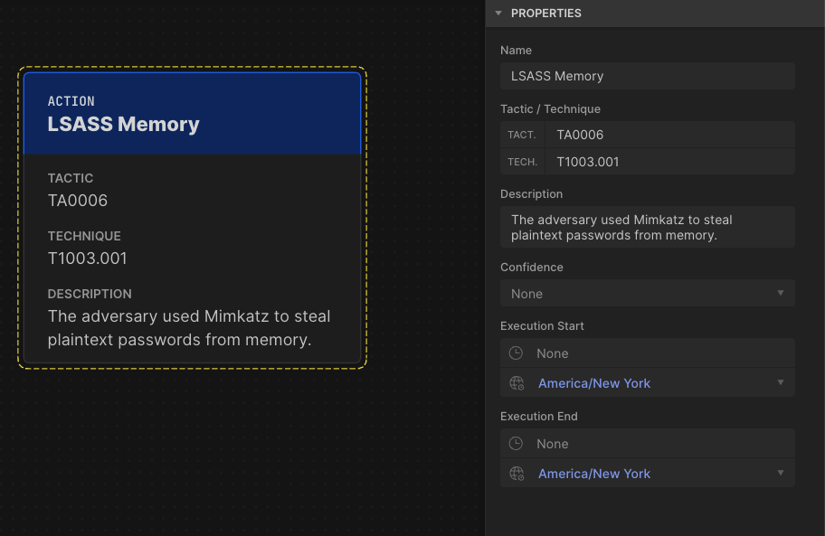
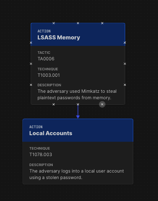
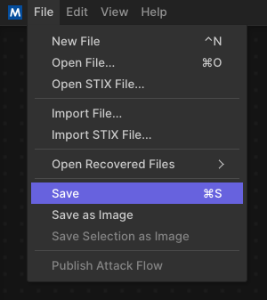

Builder
=======

Attack Flow Builder is a free and open source tool for creating, viewing, and editing
Attack Flows.

   View and edit Attack Flows using an intuitive drag-and-drop interface.

This web-based tool provides a workspace where you can populate information about
adversary actions and additional context, then weave those items into a flow by drawing
arrows to indicate the sequences of adversary techniques observed during an incident or
campaign.

Getting Started
---------------

**The quickest and easiest way to get started** is with our online option. Click the
button below to open the builder in a new tab, or select one of the :doc:`example_flows`
for viewing it in Attack Flow Builder.

.. caution::

   The online Attack Flow Builder stores documents in memory and on disk on your local
   machine, so any flows that you create or edit are completely private. However, the
   online version is accessed over the internet, and so your connection may be visible
   to some third parties (e.g. GitHub, ISPs). For a completely private experience,
   consider using the download or Docker approaches described below.

.. raw:: html

    

        <a class="btn btn-primary" target="_blank" href="../ui/">
         Open Attack Flow Builder <i class="fa fa-external-link"></i></a>
    

When you first open the Builder, if you did not select one of the example flows then
you will initially see a blank workspace. A menubar across the top contains a lot of
options for working with the flow, similar to what you would find in any flowchart software.

The right panel of the workspace contains properties for the currently selected object
or--when no object is selected--the properties for the flow itself. Begin by filling in
a name and description for your flow. You can also fill in your information in the
author fields and cite any sources using the "external references" fields.

  An empty workspace with menubar and side panel highlighted.

Right click in the workspace to open up a menu, then go to Create → Attack Flow → Action
to create a new action object.

  Using context menus to add a new action to the flow.

  This action is empty because no properties have been filled in.

Click on the action to highlight it. The action's properties are now displayed in the
side panel. Fill in a name, technique ID, and description, and notice how the action
object displays the data you've entered.

  The action displays the properties that are filled in.

Repeat the steps to create a second action with details filled in. Then drag a line from
the anchor points (little X marks) on one action to the other action to create an arrow.
Notice that if you move either action, the arrow stays attached to it.

  Build flows by creating multiple objects and connecting them together.

Continue to build out your flow by adding objects, filling in the attributes, and
drawing arrows between nodes. When you are done, you go to the File menu to save your
flow.

.. figure:: _static/builder-validation.png
  :alt: A validation error is displayed in the sidepane.
  :align: center

  This flow is invalid because the first action does not have a name filled in, and
  names are required for all actions.

If you make any errors while building your flow, e.g. not filling in a required field,
the validation pane calls your attention to the changes you need to make. If you click
one of the items, the builder will zoom to the corresponding object, which makes it easy
to locate the source of the problem.

Continue to build out your flow by adding objects, filling in the attributes, and
drawing arrows between nodes. When you are done, you go to the File menu to save your
flow.

  There are a few different options for saving or exporting your flow.

Save
  Saves the flow in \*.afb format, which can be opened for further editing in the
  future.
Save as Image
  Saves the flow in \*.png format, which is great for visualizing, using in
  presentations, sharing with others, etc..
Save Selection as Image
  When you have one or more objects selected, this menu item will save an excerpt of the
  selected items in \*.png format. (This is how many of the examples in this
  documentation were created!)
Publish Attack Flow
  Saves the flow in \*.json format, which is the machine-readable format for exchanging
  and processing Attack Flows.

.. warning::

   The Attack Flow Builder does not automatically save your work. If you accidentally
   close the tab or navigate forward or backward, you will lose any unsaved work.
   Remember to save your work frequently. (This issue will be addressed in a future
   release.)

**There are a ton of useful features in the builder!** Way more than we can cover here.
To fully master this tool, we encourage you to experiment with all of the different
options and commands and try building some sample flows.

Docker
------

If you do not want to use the Attack Flow Builder embedded in this site, you can run it
locally `using Docker <https://www.docker.com/>`__ as shown below.

.. code:: shell

   $ docker pull ghcr.io/center-for-threat-informed-defense/attack-flow:main
   $ docker run --rm --name AttackFlowBuilder -p8000:80 \
      ghcr.io/center-for-threat-informed-defense/attack-flow:main

Once the container is running, you can open a brower tab to http://localhost:8000/ to
view the Builder.

If you want to customize and build your own Docker images, edit the `Dockerfile` and
then run this command to create the Docker image:

.. code:: shell

   $ make docker-build
   docker build . -t attack-flow-builder:latest
   [+] Building 2.9s (13/13) FINISHED
   => [internal] load build definition from Dockerfile                                                                                0.0s
   => => transferring dockerfile: 269B                                                                                                0.0s
   => [internal] load .dockerignore
   ...

If building the image completes successfully, then use this command to run the image:

.. code:: shell

   $ make docker-run
   docker run --rm -p 8080:80 attack-flow-builder:latest
   /docker-entrypoint.sh: /docker-entrypoint.d/ is not empty, will attempt to perform configuration
   /docker-entrypoint.sh: Looking for shell scripts in /docker-entrypoint.d/
   /docker-entrypoint.sh: Launching /docker-entrypoint.d/10-listen-on-ipv6-by-default.sh
   ...

Alternatively, you can run the Attack Flow Builder with Docker Compose:

* `install Docker <https://docs.docker.com/engine/install>`_
* run the following commands in a terminal:

.. code:: shell

    $ curl https://raw.githubusercontent.com/center-for-threat-informed-defense/attack-flow/main/docker-compose.yml
    $ docker compose up

This will launch a container with Attack Flow Builder accessible at `http://localhost:8081 <http://localhost:8081>`_ . You can customize the provided docker-compose.yml sample file (volumes, ports, ...).

Download
--------

If you do not wish to use Docker, you can also download the Builder from the GitHub
repository:

1. Go to the `Attack Flow release page
   <https://github.com/center-for-threat-informed-defense/attack-flow/releases>`__
   and download ``attack_flow_builder.zip``.
2. Unzip it.
3. In the ``attack_flow_builder/`` directory, double click on ``index.html`` to open
   it in a web browser.

Developer
---------

Finally, if you wish to help contribute code for Attack Flow Builder, you can set up
Builder in :ref:`a development environment <builder_dev>`.
