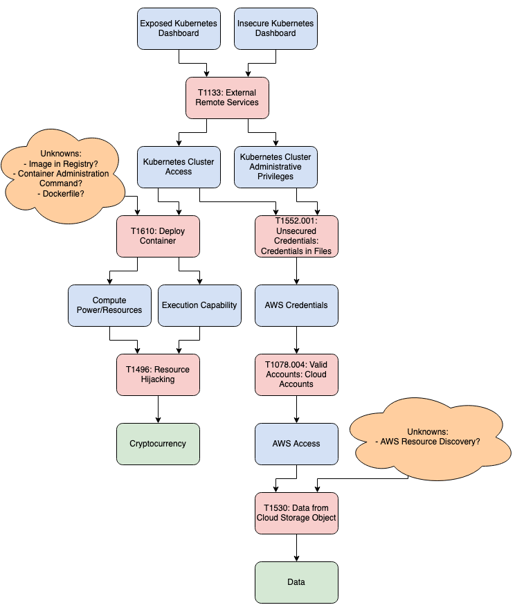

# CEO Scenario (A Thought Experiment)

## Scenario: Horoscope as a Service

This hypothetical concerns a company that sells Horoscopes-as-a-Service (HaaS).

Key Facts:

* Company: Horoscope.com
* Revenue: $10m monthly recurring revenue (MRR)
* Environment: Production Linux servers in AWS Cloud Environment

*The CEO hears about Tesla breach on MSNBC, asks, “can that happen to us?”*

This scenario adopts the perspective of the cybersecurity practitioners who
must learn about the Tesla breach, reason about the same sort of attack being
carried out against Horoscope.com, and present strategic advice back to the
CEO.

## Attack Overview

The Tesla Breach is documented in several publications, including [RedLock's
Blog](https://redlock.io/blog/cryptojacking-tesla) and
[Wired](https://www.wired.com/story/cryptojacking-tesla-amazon-cloud/). The
security firm RedLock detected this breach while scanning the internet for
unsecured Kubernetes administrator consoles.

One important conclusion drawn in RedLock's report are the measures taken by
the attackers to hide their activity.

> The hackers did not use a well known public "mining pool" in this attack.
> Instead, they installed mining pool software and configured the malicious
> script to connect to an “unlisted” or semi-public endpoint. This makes it
> difficult for standard IP/domain based threat intelligence feeds to detect
> the malicious activity.
>
> The hackers also hid the true IP address of the mining pool server behind
> CloudFlare, a free content delivery network (CDN) service. The hackers can
> use a new IP address on-demand by registering for free CDN services. This
> makes IP address based detection of crypto mining activity even more
> challenging.
>
> Moreover, the mining software was configured to listen on a non-standard port
> which makes it hard to detect the malicious activity based on port traffic.

These covert measures highlight the need to depend less on indicators of
compromise (IOCs) that attackers can cycle through rapidly, and to focus more
on attacker *behavior* using a taxonomy such as ATT&CK.

## Identifying ATT&CK Techniques

We can assemble a list of ATT&CK techniques based on public reporting. First,
the attackers abused a Kubernetes (k8s) administrator console that was open to
the internet and was not password-protected (T1133–External Remote Services).
With access to the k8s cluster, the attackers mounted a cryptojacking campaign
by deploying a new container (T1610–Deploy Container) and then running
cryptomining software in those new containers (T1496–Resource Hijacking).

In addition, analysts from RedLock noted that the k8s administrator console
contains AWS access tokens for an S3 storage bucket containing "sensitive
telemetry data". There is no public evidence that this data was accessed, or
even that this threat actor was interested in collecting such data, but we
should still consider the data breach scenario when reasoning about attacks on
Horoscope.com.

The data breach scenario would play out like this: attackers use the discovered
AWS credentials (T1552.001–Unsecured Credentials: Credentials in Files) to
access those accounts (T1078.004–Valid Accounts: Cloud Accounts),
then access data in the S3 bucket (T1530–Data from Cloud Storage Object).

In summary, the following techniques were used:

1. T1133–External Remote Services
2. T1610–Deploy Container
3. T1496–Resource Hijacking
4. T1552.001–Unsecured Credentials: Credentials In Files
5. T1078.004–Valid Accounts: Cloud Accounts
6. T1530–Data from Cloud Storage Object

This list this gives our analysts some idea about where to focus their initial
efforts.

## Visualizing Attack Flow

As an alternative for organizing the ATT&CK techniques, we can visualize the
two prongs of the attack graphically.

ATT&CK techniques are displayed in red and start with "T". Business outcomes
are displayed at the bottom in green.

The visualization highlights the separate business impacts of cryptojacking vs
data theft. Based on public reports about [the Hildegard cryptojacking
campaign](https://unit42.paloaltonetworks.com/hildegard-malware-teamtnt/), one
threat actor has made ~$1,500 in cryptocurrency. If we assume that the cloud
computing resources cost 10x more than the mined currency, then the monetary
loss to Horoscope.com is -$15,000. On the other hand, we impute the value of a
data breach at $10,000,000 in losses (an entire month of gross revenue).

Based on this estimate of loss, we decide to prioritize the data breach outcome
and put aside cryptojacking.

This leaves 4 techniques arranged in causal order:

1. T1133–External Remote Services
2. T1552.001–Unsecured Credentials: Credentials In Files
3. T1078.004–Valid Accounts: Cloud Accounts
4. T1530–Data from Cloud Storage Object

The sequence of techniques is an important factor in our analysis, because
discovering the attack earlier generally reduces the amount of damages
incurred.

## Covering ATT&CK Techniques

For each of the 4 selected ATT&CK techniques, we analyze Horoscope.com's
existing security controls to understand level of coverage they have to detect
and/or block each technique. Then we consult the following ATT&CK resources to
gather more information on these techniques.

* [ATT&CK Matrix for Linux](https://attack.mitre.org/matrices/enterprise/linux/)
* [ATT&CK Matrix for IaaS](https://attack.mitre.org/matrices/enterprise/cloud/iaas/)
* [CTID Security Stack Mappings](https://center-for-threat-informed-defense.github.io/security-stack-mappings/AWS/README.html)

This analysis is summarized in the following table.

<table>
  <tr>
    <th>Technique</th>
    <th>Current State</th>
    <th>ATT&CK Notes</th>
  </tr>
  <tr>
    <td>T1133–External Remote Services</td>
    <td>
      <ul>
        <li>Horoscope.com does not have Kubernetes console, but does have other external remote services, including SSH and Django console.</li>
        <li>All external remote services have password authentication and do not have 2FA.</li>
      </ul>
      </td>
    <td>
      <ul>
        <li>Amazon Network Firewall can block traffic from untrusted origins to internal services. (Low cost, partial coverage)</li>
        <li>Amazon VPC can segregate network access for internal services from the public internet. (Medium cost)</li>
        <li>Amazon Monitor can audit Linux authentication settings. (Medium cost)</li>
        <li>Amazon SSO includes 2FA and provides SAML integration for applications like Django. (High cost)</li>
      </ul>
    </td>
  </tr>
  <tr>
    <td>T1552.001–Unsecured Credentials: Credentials In Files</td>
    <td>
      <ul>
        <li>SSH passwords are stored encrypted in <code>/etc/passwd</code> or use PKI.</li>
        <li>Virtual machines access AWS S3 bucket using access token stored in <code>~/.aws/credentials</code>.</li>
      </ul>
    </td>
    <td>
      <ul>
        <li><em>No technical mitigations in ATT&CK.</em></li>
      </ul>
    </td>
  </tr>
  <tr>
    <td>T1078.004–Valid Accounts: Cloud Accounts</td>
    <td>
      <ul>
        <li>Virtual machines service accounts with access to S3 bucket.</li>
      </ul>
    </td>
    <td>
      <ul>
        <li>AWS Guard Duty / Security Hub can detect abuse of AWS accounts. (Medium cost)</li>
      </ul>
    </td>
  </tr>
  <tr>
    <td>T1530–Data from Cloud Storage Object</td>
    <td>
      <ul>
        <li>S3 bucket does not allow public access; it requires valid credentials.</li>
      </ul>
    </td>
    <td>
      <ul>
        <li>Set fine-grained permissions on S3 bucket. (Low cost)</li>
        <li>AWS Security Hub / Guard Duy / Macie can detect suspicious access patterns in S3 buckets. (Medium cost)</li>
      </ul>
    </td>
  </tr>
</table>

The coverage of detection and mitigation for these techniques is visualized in
the following diagram. ATT&CK techniques are displayed in the middle, detection
coverage on the left side, and mitigation coverage on the right side.

## CEO Presentation

Based on the research and application of ATT&CK above, we make the following
recommendations to the CEO:

1. In the short term, review all external remote services and configure AWS
   firewalls to restrict traffic to trusted origins.
2. In the short term, use AWS Guard Duty to detect suspicious access patterns.
3. In the medium term, migrate all existing infrastructure to use properly
   segregrated VPCs with ACLs. This can be rolled out incrementally.
4. In the long term, integrate Amazon SSO to ensure that all endpoints require
   2FA. This requires some custom development and integration with existing platforms.

The following diagram visualizes the improvements to detection and mitigation
achieved.

These recommendations provide a balance of immediate and effective action while
also laying the groundwork for long-term investements in security posture.

## ATT&CK Commentary

Notes about limitations of using ATT&CK data in this analysis:

* ATT&CK didn't offer much in the way of countermeasures or security controls
  for the techniques covered in this scenario.
* Security Stack Mappings offers limited or cryptic mitigations for some
  techniques, e.g. T1078–Valid Accounts.
