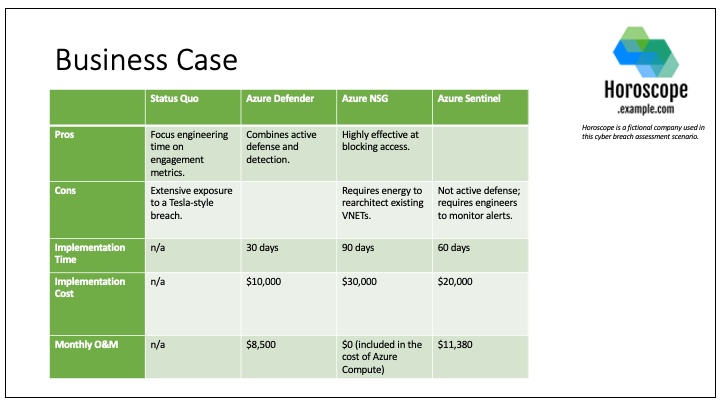

# CEO Scenario (A Thought Experiment)

## Scenario: Horoscope as a Service

This hypothetical concerns a company that sells Horoscopes-as-a-Service (HaaS).

Key Facts:

* Company: Horoscope.example.com
* Revenue: $10m monthly recurring revenue (MRR)
* Environment: Production Linux servers in Azure Cloud Environment

*The CEO hears about Tesla breach on MSNBC, asks, “can that happen to us?”*

This scenario adopts the perspective of the cybersecurity practitioners who
must research the Tesla breach, reason about the same sort of technique being
carried out against Horoscope, and present strategic advice to the CEO.

## Attack Overview

The Tesla Breach is documented in several publications, including [RedLock's
Blog](https://redlock.io/blog/cryptojacking-tesla) and
[Wired](https://www.wired.com/story/cryptojacking-tesla-amazon-cloud/). The
security firm RedLock detected this breach while scanning the internet for
unsecured Kubernetes administrator consoles.

One important conclusion drawn in RedLock's report are the measures taken by
the attackers to hide their activity.

> The hackers did not use a well known public "mining pool" in this attack.
> Instead, they installed mining pool software and configured the malicious
> script to connect to an “unlisted” or semi-public endpoint. This makes it
> difficult for standard IP/domain based threat intelligence feeds to detect
> the malicious activity.
>
> The hackers also hid the true IP address of the mining pool server behind
> CloudFlare, a free content delivery network (CDN) service. The hackers can
> use a new IP address on-demand by registering for free CDN services. This
> makes IP address based detection of crypto mining activity even more
> challenging.
>
> Moreover, the mining software was configured to listen on a non-standard port
> which makes it hard to detect the malicious activity based on port traffic.

These covert measures highlight the need to depend less on indicators of
compromise (IOCs) that attackers can cycle through rapidly, and to focus more
on attacker *behavior* using a taxonomy such as ATT&CK.

## Identifying ATT&CK Techniques

We first assemble a list of ATT&CK techniques based on public reporting. The
attackers abused a Kubernetes (k8s) administrator console that was open to the
internet and was not password-protected (T1133–External Remote Services). With
access to the k8s cluster, the attackers mounted a cryptojacking campaign by
deploying a new container (T1610–Deploy Container) and then running
cryptomining software in those new containers (T1496–Resource Hijacking).

In addition, analysts from RedLock noted that the k8s administrator console
contains Azure access tokens for an S3 storage bucket containing "sensitive
telemetry data". There is no public evidence that this data was accessed, or
even that this threat actor was interested in collecting such data, but we
should still consider the data breach scenario when reasoning about attacks on
Horoscope.

The data breach scenario would play out like this: attackers use the discovered
Azure credentials (T1552.001–Unsecured Credentials: Credentials in Files) to
access those accounts (T1078.004–Valid Accounts: Cloud Accounts),
then access data in the S3 bucket (T1530–Data from Cloud Storage Object).

In summary, the following techniques were used:

1. T1133–External Remote Services
2. T1610–Deploy Container
3. T1496–Resource Hijacking
4. T1552.001–Unsecured Credentials: Credentials In Files
5. T1078.004–Valid Accounts: Cloud Accounts
6. T1530–Data from Cloud Storage Object

This list this gives our analysts some idea about where to focus their initial
efforts.

## Visualizing Attack Flow

As an alternative for organizing the ATT&CK techniques, we can visualize the
two prongs of the attack graphically and assign an estimate of the business
losses to each outcome.

ATT&CK techniques are displayed in grey boxes and start with "T". Business
outcomes are displayed in red boxes. In betwen boxes, the pink areas represent
dollar amounts associated with those sequences of techniques. E.g. in the Data
Loss scenario the loss is $10M, while in the Resource Theft scenario the loss
is $1M.

The boxes are sized proportional to the business loss. This visualization
clearly shows how Data Loss is a much greater cost than Resource Theft.

## Mitigations

For each of the ATT&CK techniques in the graph, we analyze Horoscope's
mitigating controls to understand their ability to detect or block each
technique. Then we consult the following ATT&CK resources to gather more
information on these techniques.

* [ATT&CK Matrix for Linux](https://attack.mitre.org/matrices/enterprise/linux/)
* [ATT&CK Matrix for IaaS](https://attack.mitre.org/matrices/enterprise/cloud/iaas/)
* [Security Stack Mappings - Azure](https://center-for-threat-informed-defense.github.io/security-stack-mappings/Azure/README.html)

This analysis is summarized in the following table.

<table>
  <tr>
    <th>Technique</th>
    <th>Existing Controls</th>
    <th>ATT&CK</th>
    <th>Security Stack Mappings</th>
  </tr>
  <tr>
    <td>T1133–External Remote Services</td>
    <td>
      <ul>
        <li>Horoscope does not have Kubernetes console, but does have other external remote services, including SSH and Django console.</li>
        <li>All external remote services have password authentication but do not have 2FA.</li>
      </ul>
    </td>
    <td>
      <ul>
        <li><a href="https://attack.mitre.org/mitigations/M1035">M1035–Limit Access to Resource (Require use of VPN or other concentrator)</a></li>
        <li><a href="https://attack.mitre.org/mitigations/M1032">M1032–Multi-factor Authentication</a></li>
        <li><a href="https://attack.mitre.org/mitigations/M1030">M1030–Network Segmentation</a></li>
      </ul>
    </td>
    <td>
      <ul>
        <li>Azure Firewall (Partial)</li>
        <li>Azure Network Traffic Analytics (Partial)</li>
        <li>Just-in-Time VM Access (Significant)</li>
        <li>Network Security Groups (Partial)</li>
      </ul>
    </td>
  </tr>
  <tr>
    <td>T1552.001–Unsecured Credentials: Credentials In Files</td>
    <td>
      <ul>
        <li>SSH passwords are stored encrypted in <code>/etc/passwd</code> or use PKI.</li>
        <li>Virtual machines access Azure Storage container using access token stored in <code>~/.azure/accesstokens.json</code>.</li>
      </ul>
    </td>
    <td>
      <ul>
        <li><a href="https://attack.mitre.org/mitigations/M1022">M1022–Restrict File And Directory Permissions</a></li>
        <li><a href="https://attack.mitre.org/mitigations/M1027">M1027–Password Policies (Prohibit Password Storage In Files)</a></li>
      </ul>
    </td>
    <td>
      <ul>
        <li>n/a</li>
      </ul>
    </td>
  </tr>
  <tr>
    <td>T1078.004–Valid Accounts: Cloud Accounts</td>
    <td>
      <ul>
        <li>Virtual machines use service accounts to access Azure Storage container.</li>
      </ul>
    </td>
    <td>
      <ul>
        <li><a href="https://attack.mitre.org/mitigations/M1032">M1032–Multi-factor Authentication</a></li>
        <li><a href="https://attack.mitre.org/mitigations/M1018">M1018–User Account Management</a></li>
      </ul>
    </td>
    <td>
      <ul>
        <li>Azure AD Identity Protection (Partial)</li>
      </ul>
    </td>
  </tr>
  <tr>
    <td>T1530–Data from Cloud Storage Object</td>
    <td>
      <ul>
        <li>Storage container does not allow public access; it requires valid credentials.</li>
      </ul>
    </td>
    <td>
      <ul>
        <li><a href="https://attack.mitre.org/mitigations/M1037">M1037–Filter Network Traffic</a></li>
      </ul>
    </td>
    <td>
      <ul>
        <li>Azure Defender for Storage (Significant)</li>
        <li>Azure Sentinel (Minimal)</li>
        <li>Azure RBAC (Minimal)</li>
      </ul>
    </td>
  </tr>
  <tr>
    <td>T1610–Deploy Container</td>
    <td>
      <ul>
        <li>n/a</li>
      </ul>
    </td>
    <td>
      <ul>
        <li>n/a</li>
      </ul>
    </td>
    <td>
      <ul>
        <li>n/a</li>
      </ul>
    </td>
  </tr>
  <tr>
    <td>T1496–Resource Hijacking</td>
    <td>
      <ul>
        <li>Horoscope's financial team tracks cloud spending trend on a monthly basis.</li>
      </ul>
    </td>
    <td>
      <ul>
        <li>n/a</li>
      </ul>
    </td>
    <td>
      <ul>
        <li>Azure Sentinel (Partial)</li>
      </ul>
    </td>
</table>

Based on this analysis, we identify three security controls to focus on:

1. Move DevTools from public facing posture into Azure Network Security Groups
   (NSG).
2. Enable Azure Defender for Storage.
3. Enable Azure Sentinel to detect malicious Storage and Compute activity.

Next, we estimate the efficacy of each security control and estimate the
implementation cost and on-going operations and maintenance (O&M).

<table>
  <tr>
    <th>Control</th>
    <th>Efficacy</th>
    <th>Implementation Cost</th>
    <th>Monthly O&M</th>
  </tr>
  <tr>
    <td>Azure Defender for Storage</td>
    <td>30%</td>
    <td>
      <ul>
        <li>1 FTE-Month to configure and test</li>
        <li><strong>Total: $10,000</strong></li>
      </ul>
    </td>
    <td>
      <ul>
        <li>Azure Defender: $0.02/10k transactions</li>
        <li>0.25 FTE to monitor Defender alerts</li>
        <li>Horoscope generates 1bn storage transactions/day.</li>
        <li><strong>Total: $8,500</strong></li>
      </ul>
    </td>
  </tr>
  <tr>
    <td>Azure Sentinel</td>
    <td>35%</td>
    <td>
      <ul>
        <li>2 FTE-Months to configure and test</li>
        <li><strong>Total: $20,000</strong></li>
      </ul>
    </td>
    <td>
      <ul>
        <li>Azure Sentinel: $2.96/GB/day of log data</li>
        <li>0.25 FTE to monitor Sentinel alerts</li>
        <li>Horoscope produces 100Gb of log data/day.</li>
        <li>30 day retention</li>
        <li><strong>Total: $11,380</strong></li>
      </ul>
    </td>
  </tr>
  <tr>
    <td>Network Security Groups</td>
    <td>25%</td>
    <td>
      <ul>
        <li>3 FTE Months to rearchitect, deploy, and test</li>
        <li><strong>Total: $30,000</strong></li>
      </ul>
    </td>
    <td>
      <ul>
        <li>Azure NSG: included in the price for compute</li>
        <li><strong>Total: $0</strong></li>
      </ul>
    </td>
  </tr>
</table>

We update our ATT&CK Flow diagram to include these new security controls.

This diagram illustrates the impact of each control and the dramatic reduction
in expected losses. (View a [live version of this
diagram](https://observablehq.com/d/c698de34d77984df) online to experiment with
different numbers.)

## CEO Presentation

Based on the research and application of ATT&CK above, we put together the
following presentation for the CEO.

Download Presentation: [[PDF]](./CEO_Scenario.pdf) [[PowerPoint]](../data/../docs/CEO_Scenario.pptx)

Slide 1:

Slide 2:

