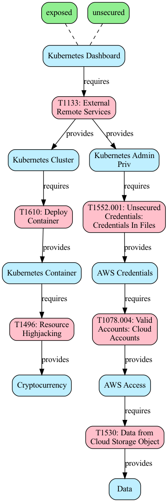
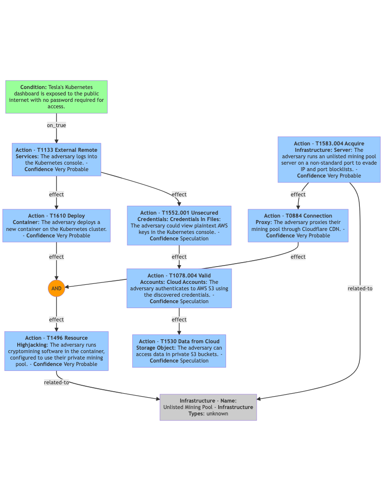
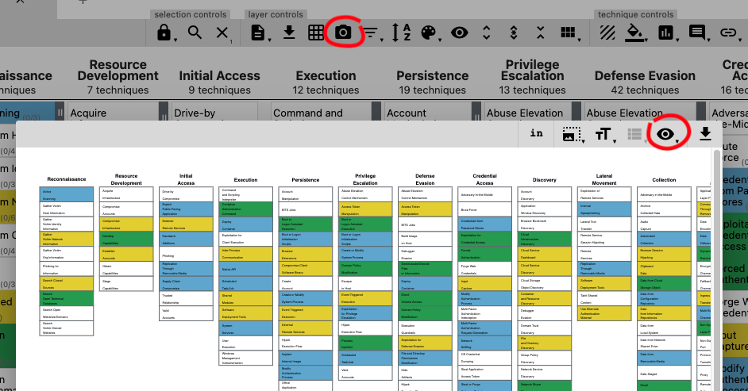
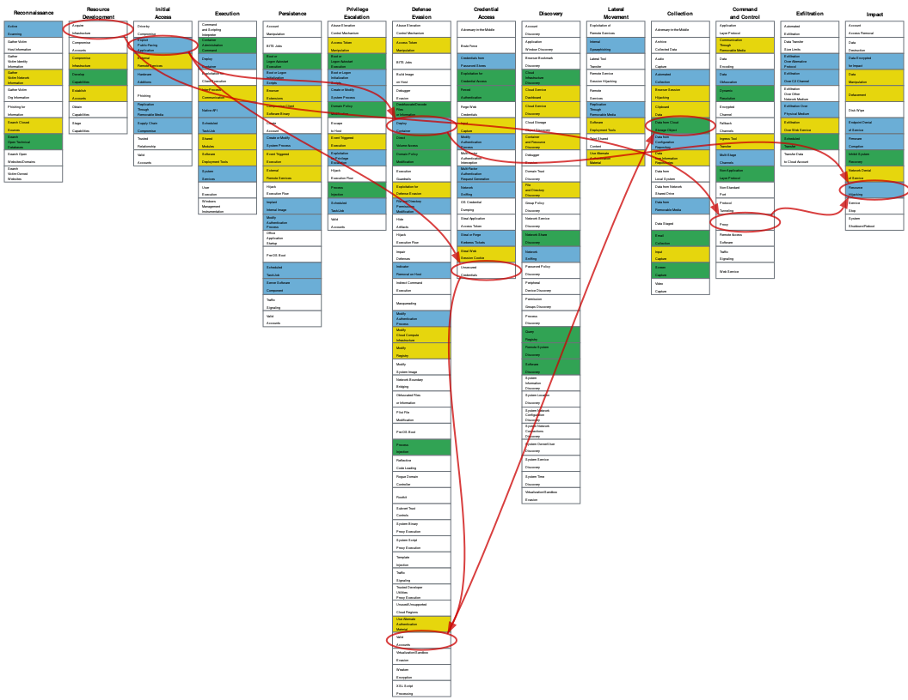
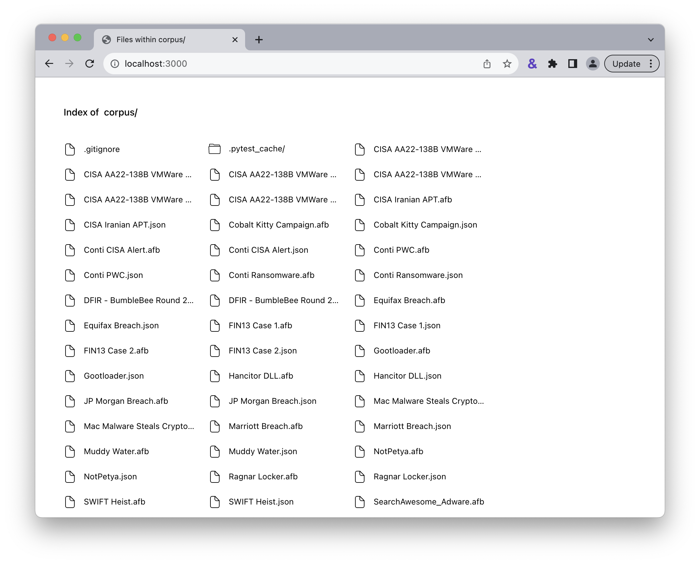
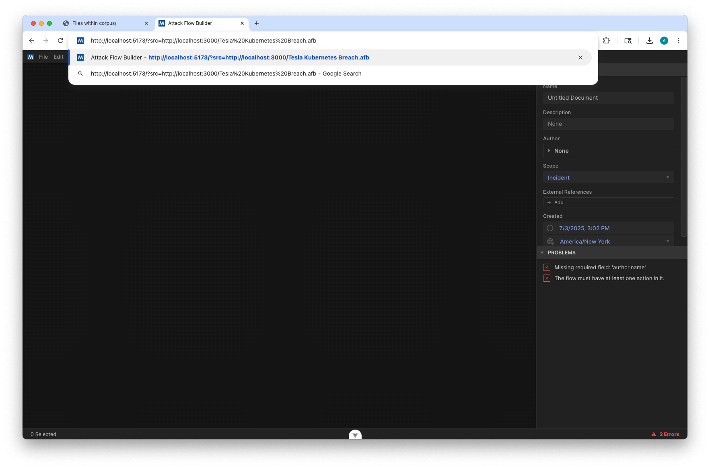
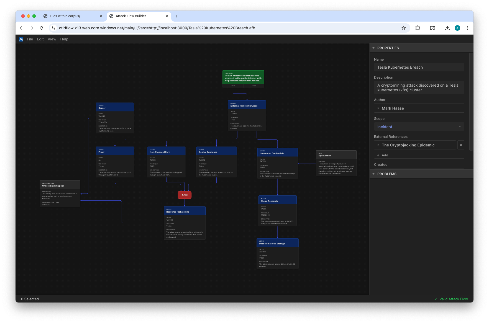

Developers
==========

If you would like to help create or maintain the code for Attack Flow, including the
Attack Flow library (Python) and the Attack Flow builder (ECMAScript/Node.js), this
document explains how to set up an environment to work on this code and the frequent
tasks that you will need to perform.

Attack Flow Library
-------------------

The Attack Flow Library is written in Python and contains tools for:

- Validating Attack Flow JSON files
- Generating schema documentation
- Visualizing Attack Flows using GraphViz, Mermaid, or ATT&CK matrix
- Running unit tests

Set up
~~~~~~

The Attack Flow Library requires Python >=3.8. You will also need to install `Python
Poetry <https://python-poetry.org/>`__ in order to handle dependencies and setting up a
virtualenv. Clone the repository as follows:

.. code:: bash

    $ git clone git@github.com:center-for-threat-informed-defense/attack-flow.git
    Cloning into 'attack-flow'...
    remote: Enumerating objects: 11137, done.
    remote: Counting objects: 100% (808/808), done.
    remote: Compressing objects: 100% (411/411), done.
    remote: Total 11137 (delta 389), reused 740 (delta 363), pack-reused 10329
    Receiving objects: 100% (11137/11137), 15.68 MiB | 4.63 MiB/s, done.
    Resolving deltas: 100% (2625/2625), done.

Once you have the repository cloned, go into that directory and install the Python
dependencies. This step will also create a virtualenv for the project so that the
dependencies do not conflict with other Python packages you may have installed.

.. code:: bash

    $ cd attack-flow
    $ poetry install
    Creating virtualenv attack-flow-arUjfNL5-py3.9 in /Users/mhaase/Library/Caches/pypoetry/virtualenvs
    Installing dependencies from lock file

    Package operations: 72 installs, 0 updates, 0 removals

    • Installing six (1.16.0)
    • Installing certifi (2022.5.18.1)
    • Installing charset-normalizer (2.0.12)
    • Installing idna (3.3)
    • Installing markupsafe (2.1.1)
    • Installing pyparsing (3.0.9)

    ...

    Installing the current project: attack-flow (2.1.0)

Finally, enter the virtualenv. You can check if the installation succeeded by running
the ``af`` command.

.. code:: bash

    $ poetry shell
    py[attack-flow] $ af version
    Attack Flow version 2.1.0

.. warning::

    The rest of the Attack Flow Library documentation assumes that you are in a Poetry
    shell. Make sure to run ``poetry shell`` in each terminal session.

Validate JSON files
~~~~~~~~~~~~~~~~~~~

Validate one or more Attack Flow JSON files:

.. code:: bash

    $ af validate corpus/*.json
    corpus/cobalt-kitty-attack-flow.json: OK
    corpus/conti_2021.json: OK
    corpus/dfir_report_zero_to_domain_admin.json: OK
    corpus/mac_malware_steals_cryptocurrecy.json: OK
    corpus/right-to-left-override.json: OK
    corpus/tesla.json: OK

There is a Makefile target ``make validate`` that validates the corpus.

.. _cli_viz:

Visualize with GraphViz
~~~~~~~~~~~~~~~~~~~~~~~

In addition to the Attack Flow Builder, there are a few other options for visualizing
Attack Flows. The first approach is converting to `GraphViz <https://graphviz.org/>`__
format:

.. code:: bash

    $ af graphviz corpus/tesla.json tesla.dot

The example command converts the Attack Flow ``tesla.json`` into GraphViz format
``tesla.dot``. If you have GraphViz installed, you can use one of its layout tools to
create an image:

.. code:: bash

    $ dot -Tpng -O tesla.dot

This command will render ``tesla.dot`` as a PNG graphics file called ``tesla.dot.png``.
It will look something like this:

   The result of converting ``tesla.json`` into ``tesla.dot.png``.

Visualize with Mermaid
~~~~~~~~~~~~~~~~~~~~~~

Another approach for visualizing flows is to convert to `Mermaid
<https://mermaid-js.github.io/mermaid/#/>`__ format. Mermaid is a newer format with
fewer features than GraphViz, but does have the benefit that it can be embedded directly
into `GitHub-Flavored Markdown
<https://github.blog/2022-02-14-include-diagrams-markdown-files-mermaid/>`__.

.. code:: bash

    $ af mermaid corpus/tesla.json tesla.mmd

You can copy/paste the resulting graph into a Markdown file, or if you have Mermaid
installed locally, you can render it as an image.

.. code:: bash

    $ mmdc -i tesla.mmd -o tesla.mmd.png

This command will render ``tesla.mmd`` as a PNG graphics file called ``tesla.mmd.png``.
It will look something like this:

   The result of converting ``tesla.json`` into ``tesla.mmd.png``.

Visualize with ATT&CK Navigator
~~~~~~~~~~~~~~~~~~~~~~~~~~~~~~~

You can also visualize an Attack Flow as an overlay on top of an `ATT&CK navigator
<https://mitre-attack.github.io/attack-navigator/>`__ layer. In order to do this, you
must open your layer in Navigator and export it to SVG:

* Open your layer in Navigator.
* Click the camera icon to open the SVG settings screen.
* Adjust the options as you like.
* Click the download icon to save as a ``.svg`` file.

    How to export SVG from ATT&CK Navigator.

Here is an example of an SVG file -- this one has several columns cropped out.

With your SVG file prepared, let's call it ``base_matrix.svg`` you can now render any
flow on top of it:

.. code:: bash

    $ af matrix matrix-base.svg corpus/tesla.json matrix-example.svg

This command reads in ``matrix-base.svg``, renders the ``corpus/tesla.json`` Attack Flow
on top of it, and writes the resulting image to ``matrix-example.svg``.

.. note::

    If your flow references subtechniques that are not displayed in the Navigator layer,
    then the script will automatically try to use the parent technique.

The output of the command will look something like this:

    A Navigator layer with the the Tesa flow rendered as an overlay.

Generate schema documentation
~~~~~~~~~~~~~~~~~~~~~~~~~~~~~

The Attack Flow Library can convert the JSON schema file into human-readable
documentation and insert it into ``language.rst``.

.. code:: bash

    $ af doc-schema schema/attack-flow-2022-01-05-draft.json docs/language.rst

This is automatically done at build time when publishing documentation, but you may want
to run this locally while modifying the JSON schema.

Build documentation
~~~~~~~~~~~~~~~~~~~

The technical documentation (i.e. what you're reading right now) is written in a
language called `reStructuredText
<https://www.sphinx-doc.org/en/master/usage/restructuredtext/basics.html>`__ (which is
similar to Markdown but with more features) and compiled using `Sphinx
<https://www.sphinx-doc.org/>`__ to produce documentation in HTML or PDF format. To build
and view the documentation:

.. code:: bash

    $ make docs-server
    [sphinx-autobuild] > sphinx-build -b dirhtml -a /Volumes/Code/ctid/attack-flow/docs /Volumes/Code/ctid/attack-flow/docs/_build
    Running Sphinx v4.5.0
    loading pickled environment... done
    building [mo]: all of 0 po files
    building [html]: all source files
    updating environment: 0 added, 0 changed, 0 removed

    ...

    [I 220601 13:35:21 server:335] Serving on http://127.0.0.1:8000
    [I 220601 13:35:21 handlers:62] Start watching changes
    [I 220601 13:35:21 handlers:64] Start detecting changes

Once the server is running, you can open http://localhost:8000 in your browser to view
the documentation. When you edit and save any ``.rst`` document, the docslive server
will recompile it and refresh the browser so that you can see the changes almost
immediately. This makes for an efficient editing workflow.

The documentation can also be built into PDF, but it's a slower and more complicated
process. You will need to have `Docker installed
<https://docs.docker.com/engine/install/>`__ and the first time you run this command it
will need to download a Docker image for building Sphinx PDFs.

.. code:: bash

    $ make docs-pdf
    ...

The resulting PDF can be found in ``docs/_build/latex/attackflow.pdf``. Alternatively,
you can download PDFs from the GitHub actions.

Run unit tests
~~~~~~~~~~~~~~

Run the unit tests using Pytest:

.. code:: bash

    $ poetry run pytest --cov=src/ --cov-report term-missing

There is a Makefile target ``make test`` that is a shortcut for the command above, as
well as ``make test-ci`` which runs the same tests but exports the code coverage data to
an XML file.

.. _builder_dev:

Attack Flow Builder
-------------------

Dev Server
~~~~~~~~~~

The Attack Flow Builder is written in JavaScript. To set up a development environment,
you first need `to install Node.js and npm
<https://docs.npmjs.com/downloading-and-installing-node-js-and-npm>`__. Then, perform
the following setup steps:

.. code:: shell

    $ cd src/attack_flow_builder
    $ npm install
    ...

Finally, to run the application:

.. code:: shell

    $ npm run serve
    DONE  Compiled successfully in 3342ms                                                                                                              3:02:19 PM

      App running at:
      - Local:   http://localhost:8080/
      - Network: unavailable

      Note that the development build is not optimized.
      To create a production build, run npm run build.

    Issues checking in progress...
    No issues found.

If this starts up successfully, then you can access the application at
http://localhost:8080/. As you edit source code and save, the server will automatically
rebuild the application and you can refresh the browser to run it again.

Update Intelligence File
~~~~~~~~~~~~~~~~~~~~~~~~

The *Intelligence File* (`builder.config.intel.ts`) drives the application's autocomplete features.
This file is generated automatically by a set of scripts which download and organize relevant ATT&CK
information into a format the application can leverage.

To update the Intelligence File, simply invoke:

.. code:: shell

    $ npm run update-intel

    > attack-flow-builder@2.0.1 update-intel
    > node ./attack/update_attack_intel.js

    → Downloading ATT\&CK Data...
    → .../attack-stix-data/master/enterprise-attack/enterprise-attack-13.0.json
    → ...m/mitre-attack/attack-stix-data/master/ics-attack/ics-attack-13.0.json
    → ...e-attack/attack-stix-data/master/mobile-attack/mobile-attack-13.0.json
    → Generating Application Intel File...

    Intelligence updated successfully.

The configured list of sources can be modified at any time from `download_sources.js`.

Preload a Flow
~~~~~~~~~~~~~~

As you are working, you may need to test a specific Attack Flow through multiple edit/compile/refresh cycles,
and repeatedly opening the same file in the Builder can be tedious. Here's a trick to automatically load a
specific flow each time you refresh the page. First, go into the corpus directory and start a mini web server.
(The first time you run this, it may prompt you to install the Node.js server package. Go ahead and do that.)

.. code:: shell

    $ cd corpus/
    $ npx serve --cors

Now open the URL `<http://localhost:3000/>`_. You will see a listing of files in the corpus.

   The mini server lists files in the corpus directory.

Right click on the file you want to preload and copy the link. Go back to Attack Flow Builder and edit the URL
to append ``?src=`` and then paste the URL to your selected flow.

   Edit the Attack Flow Builder URL

Press enter and the builder will load the selected flow.

   Attack Flow Builder preloads the selected flow.

This flow will be automatically loaded each time you refresh the page.

Command Line Publisher
~~~~~~~~~~~~~~~~~~~~~~

The Attack Flow Builder also includes a command line tool for publishing ``.afb`` files into ``.json`` format.
First, compile the script:

.. code:: shell

    $ cd src/attack_flow_builder
    $ env VUE_CLI_SERVICE_CONFIG_PATH="$PWD/vue.cli.config.js" npx vue-cli-service build \
        --target lib --name cli --formats commonjs --no-clean src/cli.ts

Once the script is compiled, run the script using the Node.js interpreter and pass in one or more builder
files to publish:

.. code:: shell

    $ node dist/cli.common.js -v ../../corpus/Target\ Breach.afb ../../corpus/Tesla\ Kubernetes\ Breach.afb
    Publishing ../../corpus/Target Breach.afb -> ../../corpus/Target Breach.json
    Publishing ../../corpus/Tesla Kubernetes Breach.afb -> ../../corpus/Tesla Kubernetes Breach.json

The JSON files are saved back to the same location as the AFB files, using the same filename stem but with the
file extension changed from ``.afb`` to ``.json``.

Releases
--------

The Attack Flow project uses a MAJOR.MINOR.PATCH version scheme. All components of the
project (the STIX extension, Python library, Attack Flow Builder) use the same version
number for simplicity. The project uses `bumpver` to automate the updating of version
number strings throughout the project. For example, to do a new major release:

.. code:: bash

    $ bumpver update --major
    INFO    - fetching tags from remote (to turn off use: -n / --no-fetch)
    INFO    - Old Version: 1.0.0
    INFO    - New Version: 2.0.0
    INFO    - git commit --message 'Bump version 1.0.0 -> 2.0.0'
    INFO    - git tag --annotate 2.0.0 --message 2.0.0

Note that the flags ``--minor`` and ``--patch`` can be used as well.

Bumpver automatically updates the version number stored in various places throughout the
project (e.g. ``pyproject.toml``, ``src/attack_flow_builder/package.json``,
``docs/conf.py``, etc), commits those changes, and creates a new tag.

Review the contents of the commit. When you are satisfied:

.. code:: bash

    $ git push --follow-tags

This command will push the new commit and tag to GitHub.
