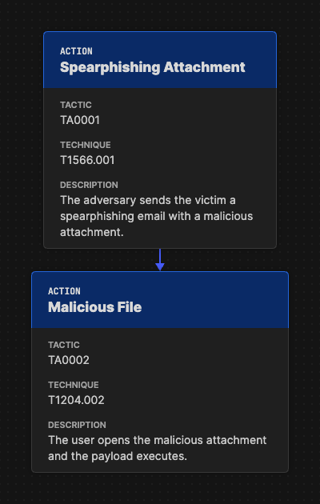
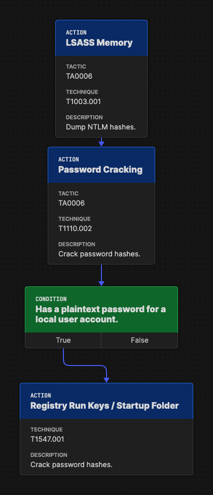
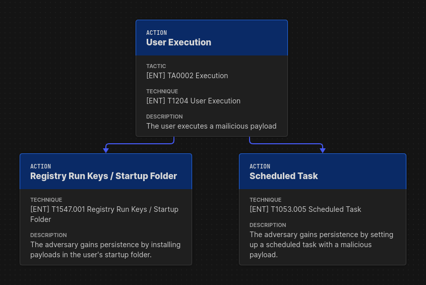
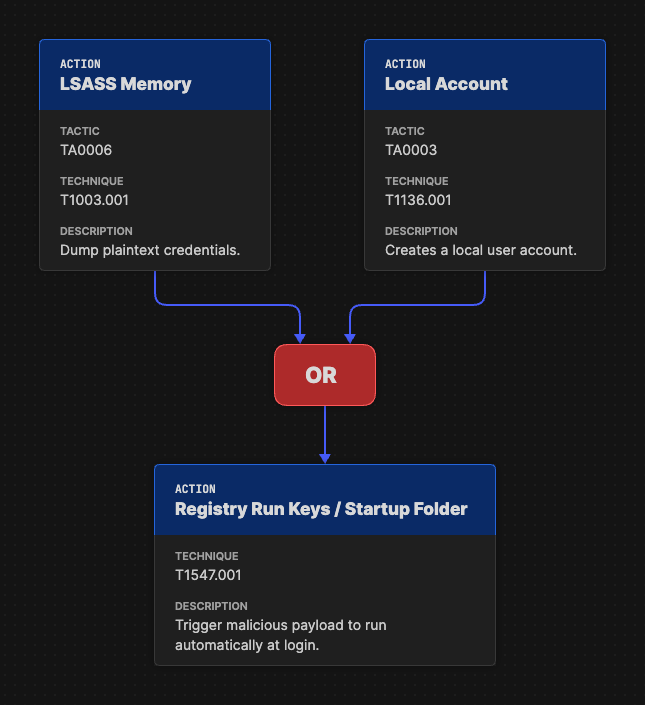
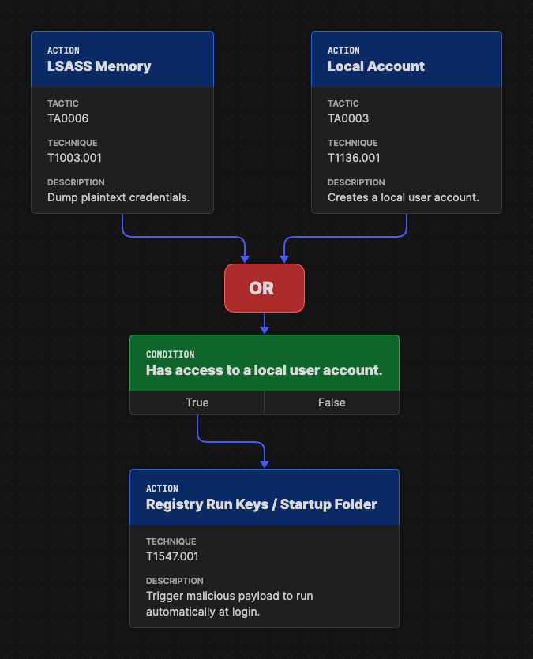
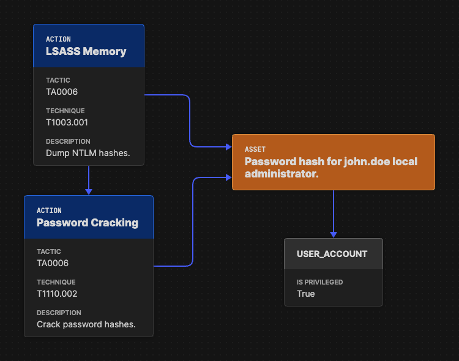
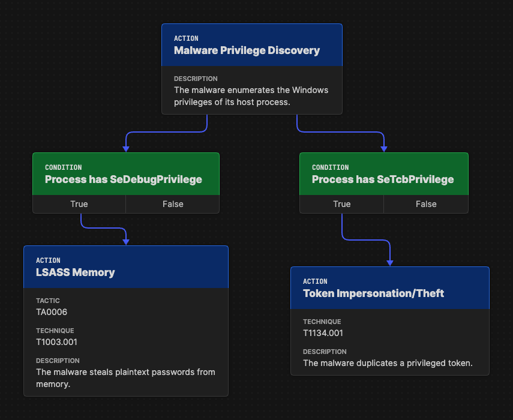
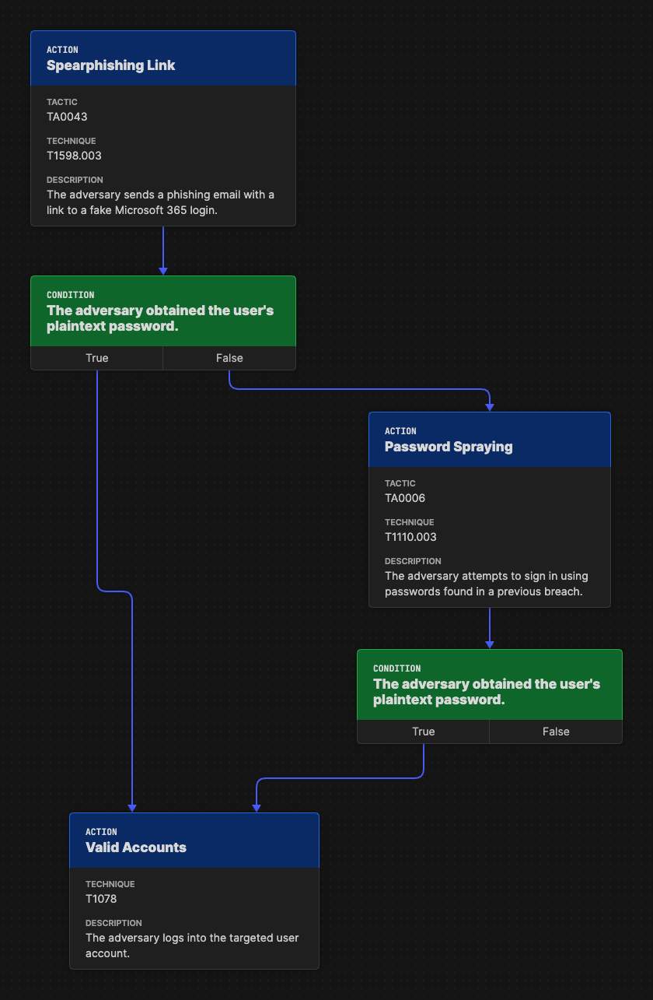
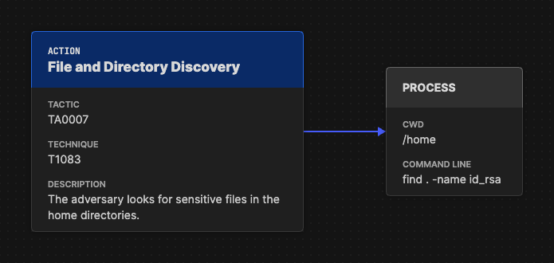

Introduction
============

This chapter introduces the main concepts of Attack Flow with visual examples taken from
the :doc:`Attack Flow Builder <builder>`. The example start with simple scenarios and
work up to complex situations.

Action Objects
--------------

An **action** represents an adversary executing a specific technique. For example,
`T1566: Phishing <https://attack.mitre.org/techniques/T1566/>`__ is a common adversarial
technique that captured in the ATT&CK knowledge base. If an adversary utilizes this behavior
during a specific breach, then that is an action.

.. note::

   The examples here depict ATT&CK techniques, but Attack Flow does not require the use
   of ATT&CK. You may use custom collections of techniques, e.g. created in `Workbench
   <https://ctid.mitre.org/projects/attck-workbench/

>`__, other knowledge
   bases `such as VERIS <http://veriscommunity.net/>`__, or even create ad hoc actions
   to describe techniques that are not part of any pre-existing taxonomy.

Adversary behavior is the focal point of the Attack Flow project, and actions are the
backbone of any flow. Sequences of adversary behavior are represented by connecting
actions together with an arrow.

   An action connected to another action represents a dependency between them.

When two actions are connected together, it represents a dependency between them: the
second action cannot be executed until the first action completes successfully. (The
handling of failed actions is discussed later.) This is not equivalent to saying that
one action happened before another! This is a more powerful concept that models how an
adversary uses one behavior to create the preconditions they need to execute the next
behavior.

Condition Objects
-----------------

Sometimes the relationship between two actions is not immediately obvious to the reader,
especially if the underlying techniques are especially obscure or rare. A **condition**
describes the state of the world after the preceding action finishes. This can be used
to clarify for the reader how two actions are related, i.e. what one action accomplishes
that enables the next action to run.

   A condition clarifies how the outcome of an action sets up the execution of another next
   action.

In the example above, the reader may not know enough about LSASS, password hashes, or
password cracking to understand how the first two actions lead to the third. The
condition object fills this gap by succinctly describing the outcome (or *effect*) of
the first two actions that enables the third action.

Parallel Attack Paths
---------------------

The adversary may have multiple available techniques to execute in a given scenario. In
the next example, the attacker has used two different persistence mechanisms. Although
the attacker is not literally executing these techniques simultaneously, it helps to
think of these as "parallel" attack paths because neither technique depends on
successful execution of the other.

   The attack branches out to show that the adversary has multiple persistence
   techniques.

.. note::

   Flows can represent adversary behavior in different scopes, e.g. portraying a single
   specific incident versus portraying an overall campaign. In a specific incident
   scope, parallel attack paths indicate the attacker executing different techniques. On
   the other hand, the campaign scope rolls up behavior across multiple incidents, so
   parallel paths represent the different behaviors that have been observed across
   multiple incidents.

Operator Objects
----------------

After a flow splits into parallel attack paths, **operators** combine them back
together. An OR operator means that only of the incoming attack paths needs to succeed
in order to continue the flow, while an AND operator means that all of the incoming
attack paths must succeed in order to continue. The next example shows that the
adversary has two different techniques for pivoting into a different user account. If
either technique succeeds, then the attack can continue forward.

   An OR operator shows that the attacker has two different techniques for pivoting to a
   local user account.

When multiple attack paths are combined, the logic can be difficult for the reader to
follow. This is a great place to use conditions to clarify what the state of the world
is at that point in the flow.

   A condition object clarifies how the actions before the operator are related to
   the action after the operator.

Perhap the reader does not understand the consequences of dumping LSASS memory or how it
relates to the actions that come afterward. The condition clarifies that the adversary
is now able to pivot into a different user account.

.. warning::

   It is possible to join paths together without using an operator by simplying pointing
   two arrows at a single action or condition. This approach is ambiguous because it's
   not clear how the sucess or failure of those paths affects the outcome of the flow,
   but ambiguity may be appropriate in some circumstances, e.g. if the underlying CTI is
   itself ambiguous.

Asset Objects
-------------

Each action can potentially have some outcome or *effect* on the world. It is often
informative to describe the effect in terms of some object in the world that has been
impacted. Actions can point to *assets* to indicate which objects are impacted as well
as which objects are used in subsequent techniques.

   An asset clarifies how actions modify the state of the world or depend on the state
   of the world.

In this example, the asset shows which particular password hash was disclosed by LSASS
memory dumping. Later in the flow, the adversary cracks that password hash. An asset can
also point to another object to provide additional structured data.

.. attention::

   The **user account** object in this example is one of the many available STIX
   objects. This aspect of Attack Flow is covered in depth later in this chapter.

Success and Failure
-------------------

When modeling complex adversary behavior, **conditions** can also depict how the
attacker handles branches that are only feasible in specific circumstances.

   Conditions model when different branches of the attack can be taken.

In this example (an excerpt from the NotPetya flow), the malware has two different
privilege escalation techniques. Each technique depends on the host process having a
specific Windows privilege. The conditions depict what state is required for each path
to continue executing. The attack can go down one path, both paths, or neither path
depending on the state of the host process.

Conditions can also model how the adversary handles failure. All the examples up to this
point have used the *true* branch of each condition to represent what happens when the
underlying condition is true. But conditions also have a *false* branch that is
activated when the condition is not true.

   The "false" branch portrays what happens when a technique fails.

In this example, the adversary attempts to steal a targeted user's credentials via
spearphishing. Since this technique relies evading email filtering and tricking users,
it is inherently unreliable. The condition object after spearphishing shows a decision
point for the adversary: if they obtained a credential then they can move on to logging
in with it. But if the spearphshing fails, then the adversary falls back to a password
spraying technique in another attempt to obtain a valid credential.

Additional STIX Objects
-----------------------

This introduction focuses on the core Attack Flow objects, but Attack Flow is based on
the STIX industry standard, so you can also use any available STIX object in your flows!
STIX contains a variety of useful objects to enrich your flow with including IOCs and
contextual details. This next example shows the standard STIX **process** object being
used to provide details about how the file discovery technique was executed.

   The process object provides technical details regarding how the action was executed.

Now that you are familiar with the central concepts, continue reading to review the
corpus of example flows and how to use the Attack Flow Builder to start creating your
own flows.
