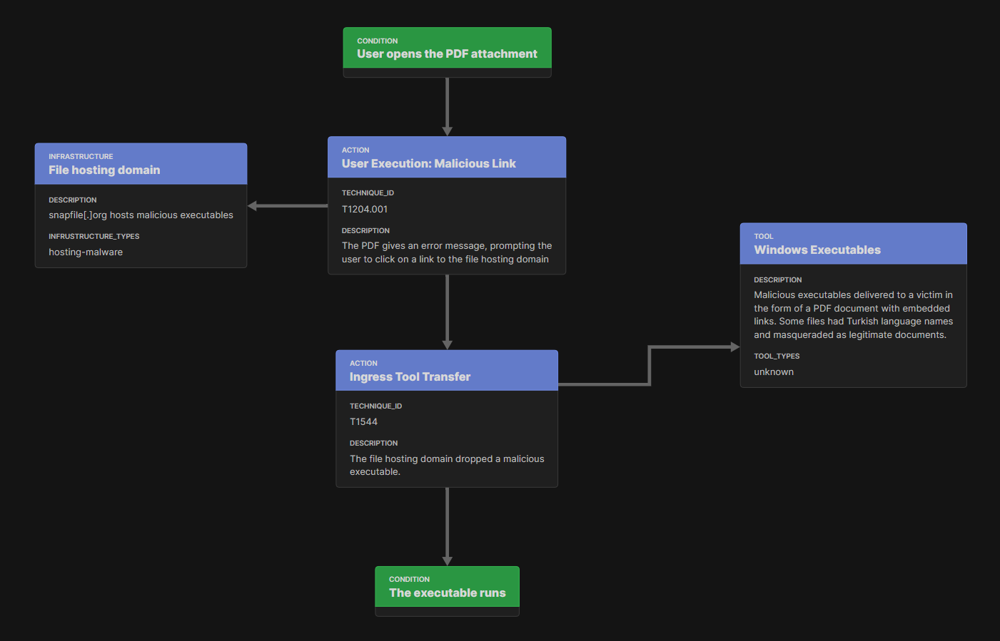

Introduction
============

This chapter introduces the main concepts of Attack Flow with visual examples taken from
the :doc:`Attack Flow Builder <builder>`. The example start with simple scenarios and
work up to complex situations.

Action Objects
--------------

An **action** represents an adversary executing a specific technique. For example,
`T1566: Phishing <https://attack.mitre.org/techniques/T1566/>`__ is a common adversarial
technique that captured in the ATT&CK knoweldge base. If an adversary utilizes this behavior
during a specific breach, then that is an action.

.. note::

   The examples here depict ATT&CK techniques, but Attack Flow does not require the use
   of ATT&CK. You may use custom collections of techniques, e.g. created in `Workbench
   <https://ctid.mitre-engenuity.org/our-work/attack-workbench/>`__, other knowledge
   bases `such as VERIS <http://veriscommunity.net/>`__, or even create ad hoc actions
   to describe techniques that are not part of any pre-existing taxonomy.

Adversary behavior is the focal point of the Attack Flow project, and actions are the
backbone of any flow. Sequences of adversary behavior are represented by connecting
actions together with an arrow.

.. figure:: _static/action_to_action.png
   :alt: An action connected to another action.
   :align: center

   An action connected to another action.

When two actions are connected together, it represents a dependency between them: the
second action cannot be executed until the first action completes successfully. (The
handling of failed actions is discussed later.) This is not equivalent to saying that
one action happened before another! This is a more powerful concept that models how an
adversary uses one behavior to create the preconditions they need to execute the next
behavior.

Condition Objects
-----------------

Sometimes the relationship between two actions is not immediately obvious to the reader,
especially if the underlying techniques are especially obscure or rare. A **condition**
describes the state of the world after the preceding action finishes. This can be used
to clarify for the reader how two actions are related, i.e. what one action accomplishes
that enables the next action to run.

.. figure:: _static/action_to_condition.png
   :alt: A condition clarifies how the outcome of one action sets up the execution of the next action.
   :align: center

   A condition clarifies how the outcome of one action sets up the execution of the next
   action.

Parallel Attack Paths
---------------------

The adversary may have multiple available techniques to execute in a given scenario. In
the next example, the attacker has used two different persistence mechanisms. Although
the attacker is not literally executing these techniques simultaneously, it helps to
think of these as "parallel" attack paths because neither technique depends on
successful execution of the other.

.. figure:: _static/2paths.png
   :alt: The attack branches out to show that the adversary has multiple persistence techniques, and neither one relies on the other.
   :align: center

   The attack branches out to show that the adversary has multiple persistence
   techniques, and neither one relies on the other.

Operator Objects
----------------

After a flow splits into parallel attack paths, **operators** combine them back
together. An OR operator means that only of the incoming attack paths needs to succeed
in order to continue the flow, while an AND operator means that all of the incoming
attack paths must succeed in order to continue.

.. figure:: _static/action_OR_operator.png
   :alt: An OR operator shows that the attacker has two different techniques for pivoting to a local user account.
   :align: center

   An OR operator shows that the attacker has two different techniques for pivoting to a
   local user account.

This example shows that the adversary has two different techniques for pivoting into a
different user account. If either technique succeeds, then the attack can continue
forward.

When multiple attack paths are combined, the logic can be difficult for the reader to
follow. This is a great place to use conditions to clarify what the state of the world
is at that point in the flow.

Tuesday TODO: just one condition, not three

.. figure:: _static/operator_to_state.png
   :alt: A condition object clarifies how the actions before the operator are related to the action after the operator.
   :align: center

   A condition object clarifies how the actions before the operator are related to
   the action after the operator.

Perhap the reader does not understand the consequences of dumping LSASS memory or how it
relates to the actions that come afterward. The condition clarifies that the adversary
is now able to pivot into a different user account.

.. attention::

   It is possible to join paths together without using an operator by simplying pointing
   two arrows at a single action or condition. This approach is ambiguous because it's
   not clear how the sucess or failure of those paths affects the outcome of the flow,
   but ambiguity may be appropriate in some circumstances, e.g. if the underlying CTI is
   itself ambiguous.

Success and Failure
-------------------

When modeling complex adversary behavior, **conditions** can also represent how the
attacker handles failures.

Tuesday TODO: add screenshot of true/false branches

This example shows an attacker trying a technique that requires a privileged account. If
the attacker is currently in control of a privileged account, then the technique
succeeds and the flow continues on the "true" branch. On the other hand, if the current
account is not privileged, then the flow continues on the "false" branch and the
attacker resorts to another approach to reach their object. The combination of
conditions and operators is very powerful for modeling complex adversary behavior.

Additional STIX Objects
-----------------------

This introduction focuses on the core Attack Flow objects, but Attack Flow is based on
the STIX industry standard, so you can also use any available STIX object in your flows!
STIX contains a variety of useful objects to enrich your flow and storing detailed,
structured data including IOCs and contextual details.

Tuesday TODO: update STIX SDO screenshots

   This flow uses the Infrastructure and Tool objects from STIX.

Now that you are familiar with the central concepts, continue reading to review the
corpus of example flows and how to use the Attack Flow Builder to start creating your
own flows.
