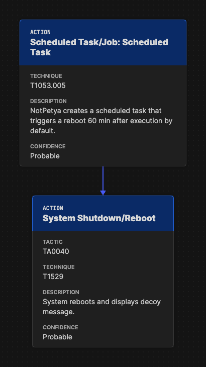

Best Practices
--------------

Project Name
~~~~~~~~~~~~

The technical specification and the project as a whole are referred to as
"Attack Flow" (with capital letters), while the individual files created using
the language are referred to as "attack flows" (lower case).

Flow Structure
~~~~~~~~~~~~~~

The following best practices pertain to how the individual objects are arranged
together to form an attack flow.

**Begin a flow with either a Reconnaissance, Resource Development, or Initial
Access Technique.** If the Initial Access vector is unknown, begin the flow with
a condition stating that the Initial Access vector is unknown, along with any
other details on the compromised state of the system. If there are multiple
possible Initial Access vectors, combine them using an OR operator.

**Use preconditions to enhance human understanding of the flow.** If a set of
actions are self-explanatory, omit the precondition and connect the actions to
each other directly. For example, the NotPetya encryption routine does not
require preconditions in between the actions.

   A condition object is not necessary between these actions because the
   relationship between is very obvious.

**End a flow with an Impact technique.** If the Impact is unknown, end the flow
with condition stating that the impact is unknown, along with any other relevant
details.

Flow Data
~~~~~~~~~

**The description field for the flow is open-ended but should bring context and
relevance to the flow.** For example, include information on attribution,
targeted company/industry/geography, specific technologies targeted, etc. This
helps readers can quickly gauge the relevance of the attack to their own assets.
You may also want to include lessons learned, IOCs, or any other information
that will inform threat prioritization and decision-making.

**Action descriptions should provide sufficient detail and not simply repeat the
technique name.** For example, "Exploits remote services," is a poor description
because it is a rephrasing of a technique name. A better description would be,
"to move laterally, NotPetya tests for vulnerable SMBv1 condition (Eternal
Blue/Eternal Romance exploit) and deploys an SMB backdoor.""

**Refrain from attaching conditions directly to other conditions.** Although the
specification does not forbid this, it is duplicative and wastes space. Consider
combining the two conditions into one object with a description that describes both
aspects of the state.

Tailoring Flows by Audience
~~~~~~~~~~~~~~~~~~~~~~~~~~~

Attack flow content and metadata should be tailored to the specific audience to
maximize effectiveness. Consider the following:

* **Threat Hunters** – Reference or include specific **analytics**, detection
  logic, or alert mappings that helped identify the behavior. This ensures
  repeatability and allows other hunters to validate or refine detection
  capabilities.
* **Cyber Threat Intelligence (CTI) Analysts** – If the flow is used for
  external reporting, remove **sensitive information** and focus on the
  **critical impact** and adversary behavior. Consider including **TTPs and
  relevant threat groups** for a broader intelligence context.
* **Adversary Emulation Teams** – Provide details on **malicious commands and
  techniques** that were **not detected** by existing analytics, helping them
  build realistic tests to improve detection.
* **Incident Responders** – Include **timeline information, lateral movement
  paths, and compromised credentials** to support forensic analysis and
  remediation efforts.
* **Leadership & Executives** – Emphasize the **scale of the operation**,
  highlight **critical assets compromised**, and demonstrate the **business
  impact**. Use high-level summaries rather than technical details to ensure
  clarity.
* **SOC Analysts** – Provide actionable insights such as **log sources**, event
  IDs, and real-world examples of detection to aid faster investigation and
  triage.

Structuring your flow according to your audience improves communication, speeds up response times, and ensures the right level of detail is conveyed.

Quality Standards for Public Flows
~~~~~~~~~~~~~~~~~~~~~~~~~~~~~~~~~~

The project includes a number of :doc:`../example_flows`. We encourage you to submit flows
you create for inclusion in this public corpus. Additions to the public corpus should
follow the best practices described above as well as meet the following requirements:

* Must have 10+ actions with proper structure.
* Must include at least one credible source in metadata.
