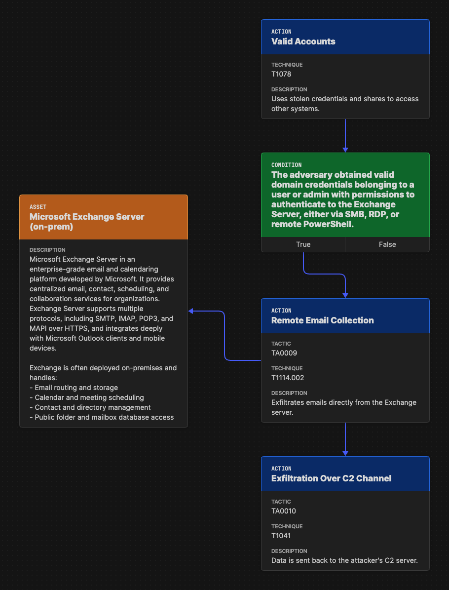

Defensive Posture
-----------------

Defenders use Attack Flow to visualize chains of adversary behavior and assess
where their security controls are effective—and where they’re not. By modeling
attack sequences, they can identify detection gaps, prioritize mitigations, and
strengthen resilience across the kill chain.

**Key applications include:**

- Providing a clear, structured representation of attack paths to identify
  **coverage gaps** and **defensive choke points**.
- Building large flow diagrams to **support incident response**, extracting
  actionable insights from system logs and telemetry.
- Visualizing convergence points across different attack paths to assess
  **layered defenses** and where to focus **mitigation efforts**.
- Highlighting **critical assets** that have been or could be compromised,
  helping defenders prioritize protections.
- Enriching red team flows post-engagement: Blue teams can **annotate flows with
  detection rules**, showing which actions were observed or blocked.
- Collaborating with CTI teams to receive **adversary-specific flows**, then
  overlaying **existing detection rules or controls** to measure preparedness
  and identify blind spots.

Attack Flow helps defenders go beyond single detections to understand how
adversaries chain behaviors—and how to break those chains effectively.

Mapping System Data to Attack Flow
~~~~~~~~~~~~~~~~~~~~~~~~~~~~~~~~~~

Mapping event logs to Attack Flow is often more straightforward than mapping CTI
reports, as event logs provide **detailed, sequential data** that naturally
aligns with Attack Flow’s structured format. Since system event logs capture
actions in chronological order, they translate more directly into attack
sequences. While automation tools exist to try and map event logs to ATT&CK
TTPs, we will walk through the process manually.

Example Windows Event Logs for Attack Flow
******************************************

Below are example **Windows Event Logs (Sysmon and Security Event Logs)**
representing different attack behaviors. These logs are formatted in **true
Windows Event Log (XML format)**.

*Event Log 1: File Enumeration (`Get-ChildItem`)*

.. code-block:: xml

    <Event xmlns="http://schemas.microsoft.com/win/2004/08/events/event">
      <System>
        <Provider Name="Microsoft-Windows-Sysmon" Guid="{5770385F-C22A-43E0-BF4C-06F5698FFBD9}" />
        <EventID>1</EventID>
        <TimeCreated SystemTime="2025-02-24T14:34:50.123Z"/>
        <Execution ProcessID="5432" ThreadID="2345"/>
        <Computer>COMP123</Computer>
      </System>
      <EventData>
        <Data Name="UtcTime">2025-02-24T14:34:50.123Z</Data>
        <Data Name="ProcessGuid">{d47a9e53-3e1a-4123-9d50-bf8f8f7c6db6}</Data>
        <Data Name="ProcessId">5432</Data>
        <Data Name="Image">C:\Windows\System32\WindowsPowerShell\v1.0\powershell.exe</Data>
        <Data Name="CommandLine">Get-ChildItem -Path C:\Users\Public\Documents\ -Include *.txt,*.doc,*.docx,*.xlsx,*.pub -Recurse</Data>
        <Data Name="User">COMP123\JohnDoe</Data>
        <Data Name="ParentProcessId">4210</Data>
        <Data Name="ParentImage">C:\Windows\explorer.exe</Data>
      </EventData>
    </Event>

*Event Log 2: File Deletion (`Remove-Item`)*

.. code-block:: xml

    <Event xmlns="http://schemas.microsoft.com/win/2004/08/events/event">
      <System>
        <Provider Name="Microsoft-Windows-Sysmon" Guid="{5770385F-C22A-43E0-BF4C-06F5698FFBD9}" />
        <EventID>1</EventID>
        <TimeCreated SystemTime="2025-02-24T14:36:05.234Z"/>
        <Execution ProcessID="5531" ThreadID="2356"/>
        <Computer>COMP123</Computer>
      </System>
      <EventData>
        <Data Name="UtcTime">2025-02-24T14:36:05.234Z</Data>
        <Data Name="ProcessGuid">{e15f3e2d-2c44-4a7d-b765-9a8c23e12345}</Data>
        <Data Name="ProcessId">5531</Data>
        <Data Name="Image">C:\Windows\System32\WindowsPowerShell\v1.0\powershell.exe</Data>
        <Data Name="CommandLine">Remove-Item -Path C:\Users\Public\Documents\* -Force -Recurse</Data>
        <Data Name="User">COMP123\JohnDoe</Data>
        <Data Name="ParentProcessId">4210</Data>
        <Data Name="ParentImage">C:\Windows\explorer.exe</Data>
      </EventData>
    </Event>

*Event Log 3: New User Account Created (`net user /add`)*

.. code-block:: xml

    <Event xmlns="http://schemas.microsoft.com/win/2004/08/events/event">
      <System>
        <Provider Name="Microsoft-Windows-Security-Auditing" Guid="{54849625-5478-4994-A5BA-3E3B0328C30D}" />
        <EventID>4720</EventID>
        <TimeCreated SystemTime="2025-02-24T15:40:10.567Z"/>
        <Execution ProcessID="5672" ThreadID="1243"/>
        <Computer>COMP123</Computer>
      </System>
      <EventData>
        <Data Name="TargetUserName">hackeradmin</Data>
        <Data Name="TargetDomain">COMP123</Data>
        <Data Name="TargetSid">S-1-5-21-987654321-234567890-345678901-1010</Data>
        <Data Name="CallerUserName">JaneAdmin</Data>
        <Data Name="CallerDomain">COMP123</Data>
        <Data Name="CallerSid">S-1-5-21-1454471165-1004336348-682003330-1001</Data>
        <Data Name="Privileges">SeCreateGlobalPrivilege</Data>
        <Data Name="NewAccountType">Standard</Data>
        <Data Name="SamAccountName">hackeradmin</Data>
        <Data Name="Description">New local user account added, possibly for persistence.</Data>
      </EventData>
    </Event>

*Event Log 4: Mimikatz Execution (Credential Dumping - LSASS)*

.. code-block:: xml

    <Event xmlns="http://schemas.microsoft.com/win/2004/08/events/event">
      <System>
        <Provider Name="Microsoft-Windows-Sysmon" Guid="{5770385F-C22A-43E0-BF4C-06F5698FFBD9}" />
        <EventID>1</EventID>
        <TimeCreated SystemTime="2025-02-25T15:25:37.456Z"/>
        <Execution ProcessID="7852" ThreadID="3152"/>
        <Computer>COMP123</Computer>
      </System>
      <EventData>
        <Data Name="UtcTime">2025-02-25T15:25:37.456Z</Data>
        <Data Name="ProcessGuid">{b2f8d0d7-c62f-4e4b-9a3c-38d74bca4321}</Data>
        <Data Name="ProcessId">7852</Data>
        <Data Name="Image">C:\Windows\Temp\mimikatz.exe</Data>
        <Data Name="CommandLine">mimikatz.exe privilege::debug sekurlsa::logonpasswords exit</Data>
        <Data Name="Hashes">MD5=5f66b82558ca92e54e77f216ef4c066c; SHA1=b8c2d5a2a3b2d5d3a6b5c3d2a4e7c5d1b6c7e8d9; SHA256=419a3c39243e6615993547d3b5443b005c3fc6b2b3e4f8c53a5e8e3c5d6a9f8b</Data>
        <Data Name="User">COMP123\JaneAdmin</Data>
        <Data Name="ParentProcessId">3240</Data>
        <Data Name="ParentImage">C:\Windows\System32\cmd.exe</Data>
        <Data Name="ParentCommandLine">cmd.exe /c mimikatz.exe</Data>
        <Data Name="Description">Adversary executed Mimikatz to dump credentials from LSASS memory.</Data>
      </EventData>
    </Event>

These event logs demonstrate **Windows system events for different attack stages**:

- PowerShell enumeration (`Get-ChildItem`)
- File deletion (`Remove-Item`)
- New local user creation (`net user /add`)
- Credential dumping via Mimikatz (`sekurlsa::logonpasswords`)

If applicable, you can map the events you observe directly to MITRE ATT&CK
techniques (but you can also label it more generally). Once you identify
malicious or interesting activity in your logs, you can list out the techniques
and what indicators were related to that event.

- T1083 - File and Directory Discovery → `Get-ChildItem`
- T1070.004 - File Deletion → `Remove-Item`
- T1136.001 Create Account: Local Account → `net user /add`
- T1003.001 - OS Credential Dumping: LSASS Memory → `sekurlsa::logonpasswords`

Event Logs to Flow Diagram
~~~~~~~~~~~~~~~~~~~~~~~~~~

.. attention::

  Attack Flow now supports the automatic import of STIX bundles to provide an
  intial flow diagram.

The close timing of these events may suggest a coordinated sequence involving
data staging, exfiltration, and cleanup. Highlighting the timestamps in the
Attack Flow can help illustrate this progression.

Let’s now map these four techniques into an Attack Flow diagram to visualize the
sequence of behaviors more effectively.

.. figure:: ../_static/example-flow-short.png
   :alt: Attack Flow diagram built from the example system event logs with just ATT&CK techniques in sequential order based off timestamp.
   :figclass: center

   Diagram showing ATT&CK techniques in sequence from example system event logs,
   based on timestamps.

Post-Flow: Identifying Gaps in Adversary Behaviors
~~~~~~~~~~~~~~~~~~~~~~~~~~~~~~~~~~~~~~~~~~~~~~~~~~

This sequence shows how an adversary leveraged **PowerShell command shells** to
carry out multiple malicious actions. By identifying PowerShell as a key
execution method, we can **prioritize detection and mitigation strategies**. If
you're conducting **chokepoint analysis**, consider strengthening **detections
and mitigations around PowerShell activity**. Enhancing coverage here can help
detect, disrupt, and/or prevent downstream techniques before they escalate.

.. note::

  **Key Tips for Hunting for Malicious Activity and Threats**

    * Your first clue of malicious activity can appear at any point in an
      attack—tracing backward helps identify the initial compromise, while
      looking forward reveals the adversary's actions and attack progression.
    * A useful tool for searching for related techniques is `"CTID's Technique
      Inference Engine (TIE)"
      <https://center-for-threat-informed-defense.github.io/technique-inference-engine/#/>`_
      which can help piece together missed areas of compromise.
    * Once you determine malicious activity, investigate to determine the scope
      and scale of the attack.

.. figure:: ../_static/tie.png
   :alt: The Technique Inference Engine (TIE) uses a machine learning model trained on cyber threat intelligence to recommend likely TTPs based on a known input TTP. TIE will help analysts quickly understand what is likely to have happened next based on a broad corpus of threat intelligence.
   :figclass: center

   Diagram showing ATT&CK techniques in sequence from example system event logs,
   based on timestamps.

So what does visualizing this show us? We can see PowerShell and Windows Command
Shell being used, where one leads to  three techniques and the other leads to
one. This can give us insight into prioritization of detections to build in the
future, but it may  also indicate that we need to investigate detections around
the one with less behaviors detected as something could have been missed.

Supplemental Fields and STIX Object Mappings
~~~~~~~~~~~~~~~~~~~~~~~~~~~~~~~~~~~~~~~~~~~~

Lastly, consider incorporating these **supplemental fields**, many of which map
directly to **STIX (Structured Threat Information eXpression) objects**. These
details help correlate related events, track adversary behavior, and enhance
detection and response throughout an investigation.

*These can be automatically generated if importing a STIX bundle into an Attack Flow.*

.. list-table::
   :header-rows: 1
   :widths: 30 70

   * - **Field (STIX Object)**
     - **Description**
   * - **Process or Executable Name & Location (Process)**
     - Identifies unusual or suspicious programs, especially those outside
       standard directories or with deceptive names.
   * - **Parent Process (Process)**
     - Reveals whether a process is spawned by a legitimate application or
       leveraged by malware for stealth.
   * - **Command-Line Arguments & Parameters (Process)**
     - Exposes execution intent and potential malicious actions.
   * - **Configuration Changes (Windows Registry Key, Software)**
     - Tracks altered system or application settings, including modified
       **Windows Registry keys** or configurations impacting security.
   * - **User Accounts Involved (User Account)**
     - Highlights **privilege escalation**, suspicious account activity, or
       abnormal user behaviors.
   * - **Network Connections (Network Traffic, IPv4/IPv6 Address, Domain Name)**
     - Links processes to external threats, **Command & Control (C2) servers**,
       suspicious IP addresses, or malicious domains.
   * - **File & Executable Hashes (File, Artifact)**
     - Helps identify **known malware samples**, detect tampered files, and
       correlate threats via hash values (MD5, SHA-1, SHA-256).
   * - **In-Memory Artifacts (Process, Attack Pattern)**
     - Captures **loaded processes, injected code segments**, and memory-based
       attack techniques.
   * - **Timestamps of Key Actions (Observed Data, Indicator)**
     - Establishes attack **sequence and progression**, helping analysts
       reconstruct the attack timeline.

By integrating these **STIX-compatible attributes** into your **attack flow**,
you can improve **event correlation, adversary tracking, and intelligence
sharing**, ultimately enhancing your cybersecurity defense strategy.

.. figure:: ../_static/example-flow-documentation.png
   :alt: Attack Flow diagram combining ATT&CK techniques with contextual data from STIX objects and observables
   :figclass: center

   Attack Flow diagram combining ATT&CK techniques with contextual data from
   STIX objects and observables.

*Asset Interaction and Tracking*

**Assets**: such as systems, services, credentials, and data—are central to any
red team operation. Attack Flow can help track and visualize:

- **Initial Access Targets**: Systems that serve as entry points (e.g.,
  vulnerable web servers, email clients).
- **Pivot Assets**: Hosts used for lateral movement or privilege escalation.
- **Compromised Resources**: Credentials, file shares, databases, domain
  controllers.
- **Critical Assets**: Data exfiltration targets or mission-critical systems.

An example of what an asset may look like

   Example Flow Snippet of techniques leading to a compromised asset and a
   related course of action STIX object to take.
