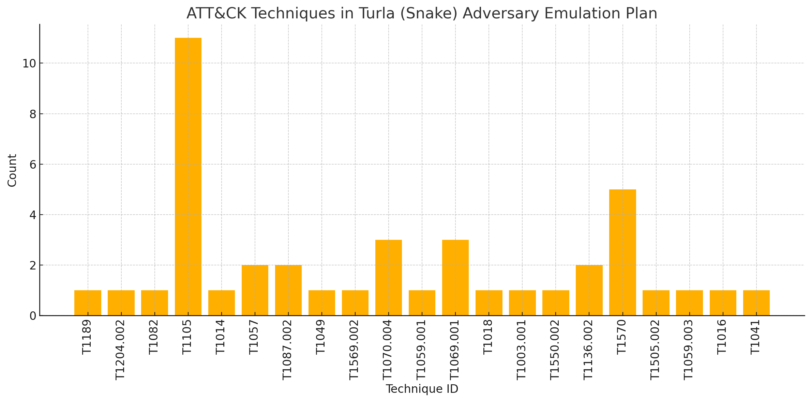

Red Teaming
-----------

Attack Flow is a powerful tool for red teams to plan, document, and communicate
simulated adversary behavior during engagements. 

**Key applications include:**

* Red teams will build out a flow as part of the planning phase before a live operation. 
* Red teamers use Attack Flow at the end of an operation in their final report to show what they performed and compare with Blue Team. They summarize total TTPs executed, indicators, and assets that were compromised. This tells the story of the entire attack path (i.e., what were the meanings of the route taken)

Attack Flow can be applied throughout the lifecycle of a red team operation:

* **Pre-engagement**: Plan out attack paths using known TTPs of a real adversary.
* **During the operation**: Track which techniques were executed, which failed, and the outcome of each action.
* **Post-engagement**: Generate a report comparing Red vs. Blue team results, showing missed detections, compromised assets, and executed commands relating to specific adversary behaviors.

Pre-Engagement: Planning with Attack Flow
~~~~~~~~~~~~~~~~~~~~~~~~~~~~~~~~~~~~~~~~~

When planning a red team engagement, Threat Intelligence and IR teams will have the opportunity to weigh in on which adversaries are needing to be tested based off what they see as a threat to their organization. This collaborative planning ensures that the red team’s tests are not only realistic but also strategically valuable for improving detection and defense.
Attack Flows can help visualize these threat scenarios for red teamers and help them select representative behaviors to emulate.

Prior to the operation, red teams often collaborate with:

- **CTI teams** to identify adversaries that align with current threats to the organization. CTI analysts may suggest:

  - Determine active or trending APT groups, novel adversarial techniques
  - Industry-specific targeting patterns
  - Recent malware campaigns observed in the wild and/or the internal environment

- **Blue Teams or Detection Engineers** to focus the scope of testing. Red teams may:

  - Discuss control coverage assumptions or known gaps
  - Coordinate on which detection rules or analytics to evaluate
  - Align testing around high-value assets or specific services

During and After Execution
~~~~~~~~~~~~~~~~~~~~~~~~~~
Red teams can use flows abstractly (focusing on TTPs) or at high fidelity (capturing commands, conditions, and outcomes).

* Record commands, hostnames, IPs, PIDs, and usernames
* Annotate successes and failures to capture realistic scenarios
* Capture details down to the permissions level for techniques
* Use STIX Note and Indicator objects to enrich the flow, examples below:
    - ``Asset names or host identifiers`` (e.g., DC01, FIN-SQL-02)
    - ``Asset roles`` (e.g., file server, HR workstation, domain controller)
    - ``Access method or privilege level`` (e.g., user, admin, SYSTEM)
    - ``Associated indicators`` (e.g., executed commands, processes, hashes, network connections)
* Document pivot points and compromised items (e.g., credentials, accounts, servers, etc.)
* Consider developing a conversion pipeline from automated red team tools—such as Caldera or Cobalt Strike—to generate STIX bundles that can be imported into Attack Flow

Post-Engagement: Reporting and Collaboration
~~~~~~~~~~~~~~~~~~~~~~~~~~~~~~~~~~~~~~~~~~~~

*Reporting*

After an engagement, red teams can **export their Attack Flows in JSON** to share with internal stakeholders, Blue Teams, or detection engineers. In larger attack flows (e.g., impacting 2,000+ hosts), teams need ways to segment actions across different subsets of assets. When transitioning from red team to IR team, focus shifts from TTP-level planning to asset-level impact assessment.

These completed attack flow diagrams:

* Provide a clear, visual timeline of what was executed
* Help defenders validate what was and was not detected
* Enable threat hunters to replay or simulate observed behaviors
* Serve as long-term records of adversary simulations for compliance or training
* Visualization scripts can be created to process the JSON output of flows for high level knowledge (e.g., tactics covered, TTPs, number of compromised assets, etc.)

Attack Flow enables both red and blue teams to:

* Compare execution (Red) vs. detection (Blue) side-by-side
* Identify missed detections or blind spots
* Validate coverage of specific techniques
* Inform future detection engineering and threat modeling

*Post-Engagement Collaboration*

.. figure:: ../_static/redblue_diagram.png
   :alt: Red Team and Blue Team Collaboration with Attack Flow
   :align: center

   Red Team and Blue Team Collaboration with Attack Flow

.. note::

  **Key Tips for Red Team Flow Building**
  
    * Use ``conditions`` to flag required states (e.g., ``domain user credentials obtained``).
    * Use ``notes`` to add human-readable context at key nodes.
    * Link Indicators, Process objects, and CommandLines to actions for maximum clarity.
    * Consider annotating pivot points (e.g., account switch, lateral move) with user and host metadata.

This provides the blue team with essential context to understand:
  * What was targeted and why
  * Which assets were at risk or compromised
  * Where defensive coverage may be lacking (and the blue team can fill in what detections they have for those items)

Example Exercise
~~~~~~~~~~~~~~~~

Red teams can use adversary emulation plans—such as those provided in the Adversary Emulation Library — as a foundation for constructing detailed Attack Flows that guide and document engagements.

We can first look at the `"Turla Intelligence Summary Page" <https://github.com/center-for-threat-informed-defense/adversary_emulation_library/blob/master/turla/Intelligence_Summary/Intelligence_Summary.md>`_, as this can be useful to add to the overall attack flow plan properties panel and STIX objects.

.. figure:: ../_static/turla_intelligence_summary.png
   :alt: Intelligence Summary Turla
   :align: center

   Intelligence Summary from Turla (Snake) Adversary Emulation Library 

Next, let's look at the `"Turla - Snake Emulation Plan .YML File" <https://github.com/center-for-threat-informed-defense/adversary_emulation_library/blob/master/turla/Emulation_Plan/yaml/turla_snake.yaml>`_  and see which componenets we can use for an exercise.

* Adversary name and description: 
* Test scenarios that simulate various TTPs and commands
* Mappings to MITRE ATT&CK techniques
* Command-level execution steps and implementations in Caldera

The emulation plan, created by the ATT&CK® Evaluations team, was used during Day 2 of the ATT&CK evaluations Round 5. 
This scenario focuses on Snake, a rootkit used to compromise computers and exfiltrate data. *If you have your own plans, you can convert them to STIX and import into Attack Flow.*

For detailed information on the scenario to run, you can find the technical setup and commands `here <https://github.com/center-for-threat-informed-defense/adversary_emulation_library/blob/master/turla/Emulation_Plan/Snake_Scenario/Snake_Detections_Scenario.md>`_

*Building the Attack Flow from the Plan*

For example, the Turla (Snake) is publicy available via the adversary emulation library and has already been converted to a flow diagram, here: `here <https://center-for-threat-informed-defense.github.io/attack-flow/ui/?src=..%2fcorpus%2fTurla%20-%20Snake%20Emulation%20Plan.afb>`_ 

At a high level, we can observe the total count of each technique in the plan:

   ATT&CK Techniques used by Turla

Then, begin constructing the flow by mapping in the identified techniques. Gradually add conditions to represent asset compromise requirements or pivot points necessary to advance the operation. Where available, include commands from the emulation plan as ``process`` and ``command-line`` STIX objects to provide detailed execution context.

**Creating the Flow from a Plan**

  1. **Start with adversary context**: Highlight the threat actor being emulated at the top of the flow. This gives context and helps align the test with known threat behavior.

  2. **Map techniques**: Add the ATT&CK techniques from the plan into the flow in logical order. *See CTI usage guide for tips how to map reports to techniques*
  
  3. **Include conditions where it provides more context**:  Use Condition objects to define prerequisites for each stage (e.g., “User credentials acquired” or “Initial access to target machine achieved”). As the engagement progresses, conditions in the flow help capture key decision points—such as whether a required action (e.g., privilege escalation) was successful. The red team can annotate the flow with notes indicating success or failure, compromised assets, exploited vulnerabilities, and specific commands executed. This is particularly useful if certain behaviors go undetected by the blue team.

  4. **Incorporate operators**: If multiple scenarios or parallel actions are included (e.g., different lateral movement options), use AND/OR operators to represent branching paths. Throughout the operation, red teamers should track which paths were attempted, what actions were executed, and where they encountered blocks. If privilege escalation failed, for example, that should be clearly noted in the flow.

  5. **Add indicators where applicable**: to provide additional context, either for planning purposes or post-emulation reporting, you can include relevant STIX objects that map back to indicators (either of interest or that were successfully accessed)

Red teams can choose to represent each scenario in its own flow or combine them into a single, comprehensive flow. A prebuilt Attack Flow based on this plan is already available `here: <https://center-for-threat-informed-defense.github.io/attack-flow/ui/?src=..%2fcorpus%2fTurla%20-%20Snake%20Emulation%20Plan.afb>`_ 

.. figure:: ../_static/turla_flow.png
   :alt: Turla Flow
   :align: center
   :scale: 100%

   Turla (Snake) Attack Flow created from the Adversary Emulation Plan library. Click to enlarge.

Once the engagement is complete and the attack flow is built, the blue team can begin detection analysis, ideally creating their own flow based on observed telemetry. At the end, both teams can compare flows to identify missed detections, validate assumptions, and strengthen overall security posture.
