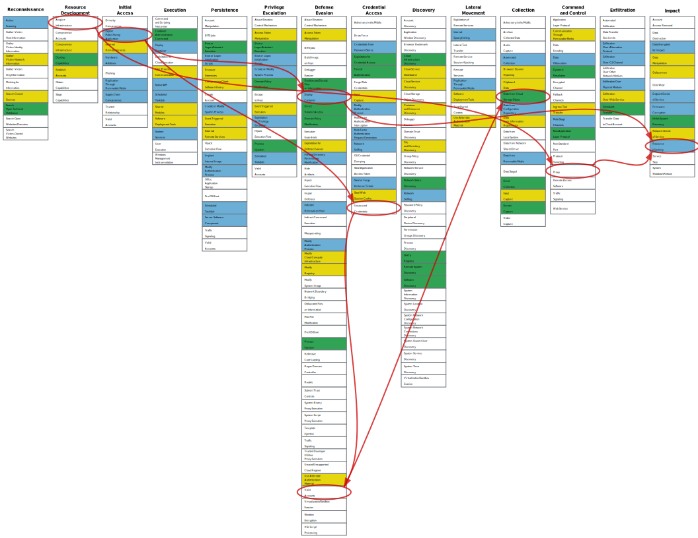
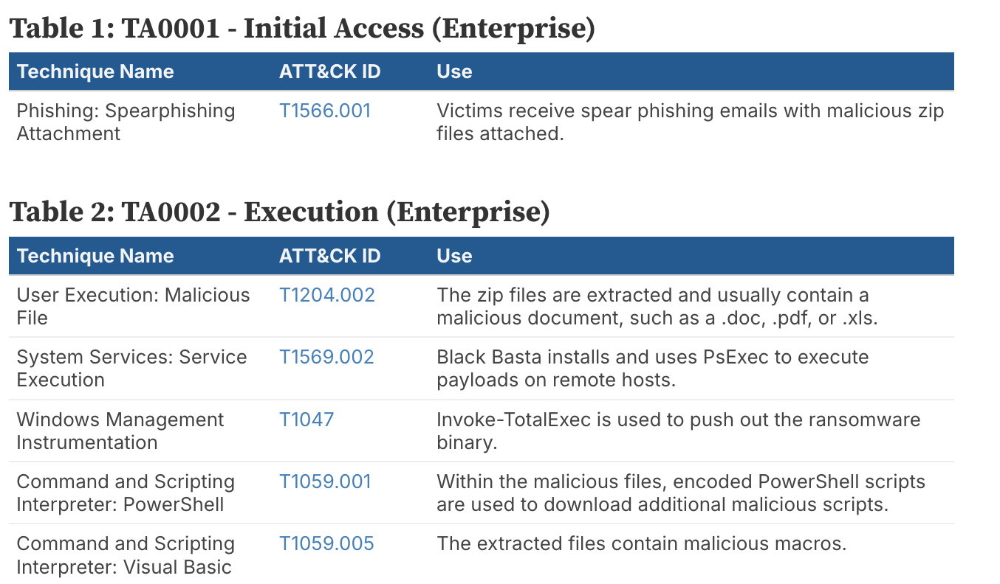
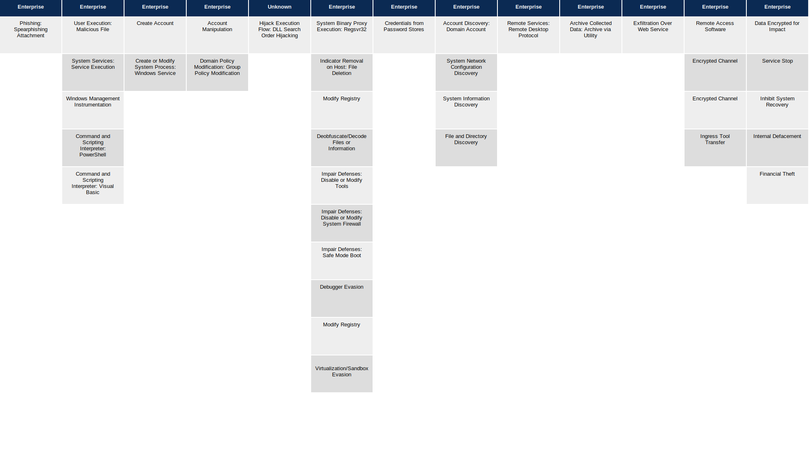
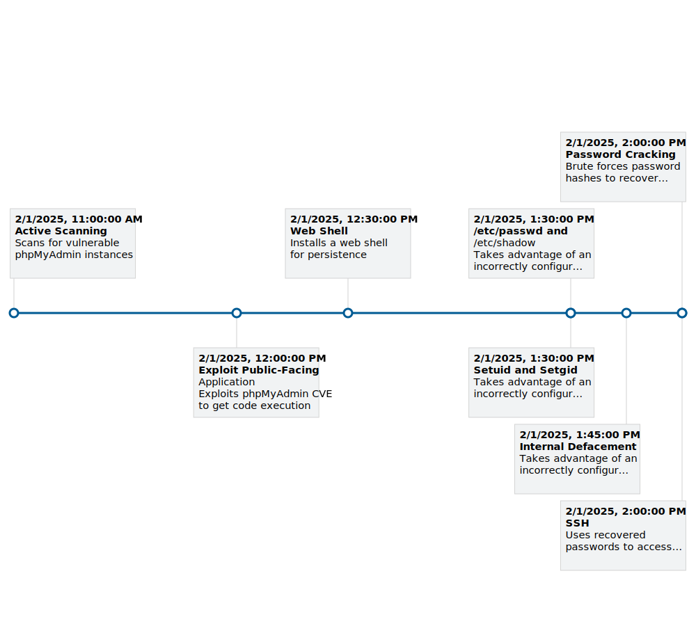
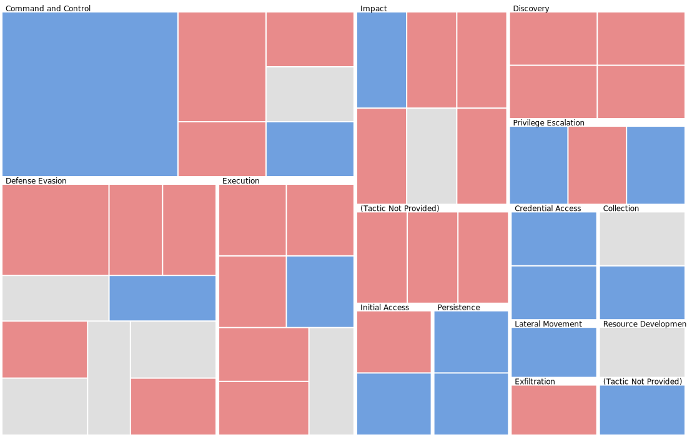

Visualization
=============

Attack Flow offers several tools for visualizing sequences of behaviors. The :doc:`Attack Flow Builder
<builder>` is a great option, offers easy navigation of large flows, and exports to PNG format. We also have
several :ref:`command line visualizations <cli_viz>` as well as some `experimental visualizations
<https://observablehq.com/@mehaase/attack-flow-business>`__.

.. raw:: html

    

        <a class="gallery-item" href="#att-ck-navigator">
            

            

            

                <h4>ATT&CK Navigator</h4>
            

        </a>
        <a class="gallery-item" href="#tactic-table">
            

            

            

                <h4>Tactic Table</h4>
            

        </a>
        <a class="gallery-item" href="#matrix-view">
            

            

             

                <h4>Matrix View</h4>
            

        </a>
        <a class="gallery-item" href="#tactic-table">
            

            

            

                <h4>Timeline View</h4>
            

        </a>
        <a class="gallery-item" href="#treemap-view">
            

            

             

                <h4>Treemap View</h4>
            

        </a>
    

    

ATT&CK Navigator
----------------

With this visualization, you can visualize an Attack Flow drawn on top of an ATT&CK Navigator matrix. First, choose a
Navigator base layer or supply your own. Then upload an Attack Flow. Finally, preview and download the
resulting visualization.

.. raw:: html

    

        <a class="btn btn-primary" target="_blank" href="https://observablehq.com/d/0f89cf4ba5a52ce5">
         Try out the Navigator Visualization
        <svg id="launch" xmlns="http://www.w3.org/2000/svg" width="18.224" height="18.224" viewBox="0 0 18.224 18.224">
            <path id="Path_777" data-name="Path 777" d="M0,0H18.224V18.224H0Z" fill="none"/>
            <path id="Path_778" data-name="Path 778" d="M15.149,15.149H4.519V4.519H9.834V3H4.519A1.518,1.518,0,0,0,3,4.519V15.149a1.518,1.518,0,0,0,1.519,1.519H15.149a1.523,1.523,0,0,0,1.519-1.519V9.834H15.149ZM11.353,3V4.519h2.726L6.614,11.983l1.071,1.071,7.464-7.464V8.315h1.519V3Z" transform="translate(-0.722 -0.722)" fill="#fff"/>
        </svg>
        </a>
    

Tactic Table
----------------
With this visualization, you can generate a tactic table automatically from an Attack Flow. The tactic table is inspired by the format that CISA uses in their cybersecurity advisories. (`See example here. <https://www.cisa.gov/news-events/cybersecurity-advisories/aa25-071a#:~:text=for%20ransom%20negotiation-,MITRE%20ATT%26CK%20Tactics%20and%20Techniques,-See%20Table%203>`_)

.. raw:: html

    

        <a class="btn btn-primary" target="_blank" href="https://observablehq.com/d/010f86f3168a6b83">
         Try out the Tactic Table Visualization
        <svg id="launch" xmlns="http://www.w3.org/2000/svg" width="18.224" height="18.224" viewBox="0 0 18.224 18.224">
            <path id="Path_777" data-name="Path 777" d="M0,0H18.224V18.224H0Z" fill="none"/>
            <path id="Path_778" data-name="Path 778" d="M15.149,15.149H4.519V4.519H9.834V3H4.519A1.518,1.518,0,0,0,3,4.519V15.149a1.518,1.518,0,0,0,1.519,1.519H15.149a1.523,1.523,0,0,0,1.519-1.519V9.834H15.149ZM11.353,3V4.519h2.726L6.614,11.983l1.071,1.071,7.464-7.464V8.315h1.519V3Z" transform="translate(-0.722 -0.722)" fill="#fff"/>
        </svg>
        </a>
    

   An example Tactic Table

Matrix View
----------------
With this visualization, you can automatically generate an ATT&CK Matrix comprised of nodes from an uploaded ATT&CK

.. raw:: html

    

        <a class="btn btn-primary" target="_blank" href="https://observablehq.com/d/11f0d433ededff7b">
         Try out the Matrix View Visualization
            <svg id="launch" xmlns="http://www.w3.org/2000/svg" width="18.224" height="18.224" viewBox="0 0 18.224 18.224">
                <path id="Path_777" data-name="Path 777" d="M0,0H18.224V18.224H0Z" fill="none"/>
                <path id="Path_778" data-name="Path 778" d="M15.149,15.149H4.519V4.519H9.834V3H4.519A1.518,1.518,0,0,0,3,4.519V15.149a1.518,1.518,0,0,0,1.519,1.519H15.149a1.523,1.523,0,0,0,1.519-1.519V9.834H15.149ZM11.353,3V4.519h2.726L6.614,11.983l1.071,1.071,7.464-7.464V8.315h1.519V3Z" transform="translate(-0.722 -0.722)" fill="#fff"/>
            </svg>
        </a>
    

Timeline View
----------------
On this page, you can generate a timeline visualization automatically from an Attack Flow. The timeline is inspired by examples of timelines used in cyber threat reporting in the wild.

.. raw:: html

    

        <a class="btn btn-primary" target="_blank" href="https://observablehq.com/d/263cc424a77aacd5">
         Try out the Timeline View Visualization
        <svg id="launch" xmlns="http://www.w3.org/2000/svg" width="18.224" height="18.224" viewBox="0 0 18.224 18.224">
            <path id="Path_777" data-name="Path 777" d="M0,0H18.224V18.224H0Z" fill="none"/>
            <path id="Path_778" data-name="Path 778" d="M15.149,15.149H4.519V4.519H9.834V3H4.519A1.518,1.518,0,0,0,3,4.519V15.149a1.518,1.518,0,0,0,1.519,1.519H15.149a1.523,1.523,0,0,0,1.519-1.519V9.834H15.149ZM11.353,3V4.519h2.726L6.614,11.983l1.071,1.071,7.464-7.464V8.315h1.519V3Z" transform="translate(-0.722 -0.722)" fill="#fff"/>
        </svg>
        </a>
    

Treemap View
----------------
On this page, you can visualize the distribution of techniques across multiple Attack Flows. The data is visualized in a Tree Map, where each technique present in a Flow has its own box, grouped by tactic. The size of each technique's box in the tree map is proportional to the number of times that technique appeared in the uploaded Flows. The color of each technique's box is related to the technique's score from the uploaded Navigator layer. Or, if you don't upload a Navigator layer, the colors will be determined by tactics.

.. raw:: html

    

        <a class="btn btn-primary" target="_blank" href="https://observablehq.com/d/8c2d767bd699a8f7">
         Try out the Treemap Visualization
         <svg id="launch" xmlns="http://www.w3.org/2000/svg" width="18.224" height="18.224" viewBox="0 0 18.224 18.224">
            <path id="Path_777" data-name="Path 777" d="M0,0H18.224V18.224H0Z" fill="none"/>
            <path id="Path_778" data-name="Path 778" d="M15.149,15.149H4.519V4.519H9.834V3H4.519A1.518,1.518,0,0,0,3,4.519V15.149a1.518,1.518,0,0,0,1.519,1.519H15.149a1.523,1.523,0,0,0,1.519-1.519V9.834H15.149ZM11.353,3V4.519h2.726L6.614,11.983l1.071,1.071,7.464-7.464V8.315h1.519V3Z" transform="translate(-0.722 -0.722)" fill="#fff"/>
        </svg>
        </a>
    

