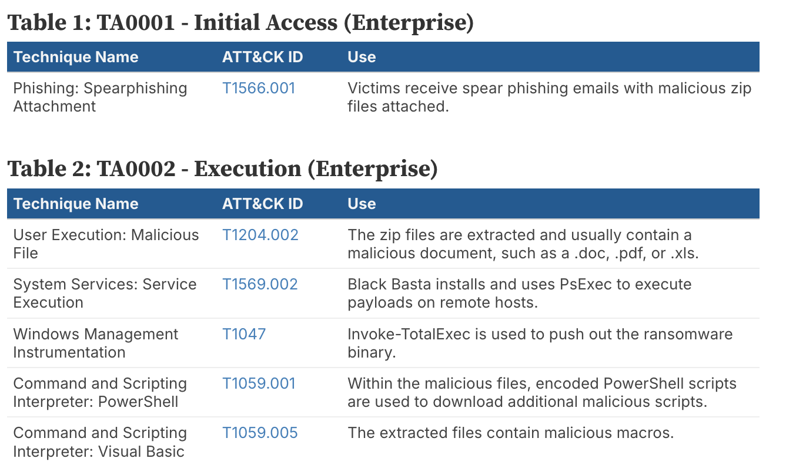
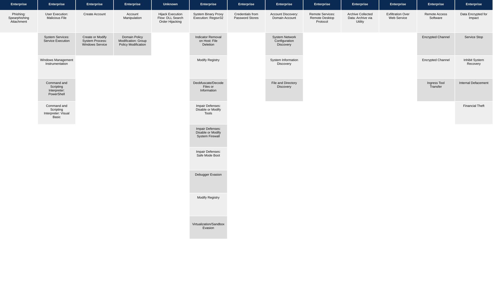
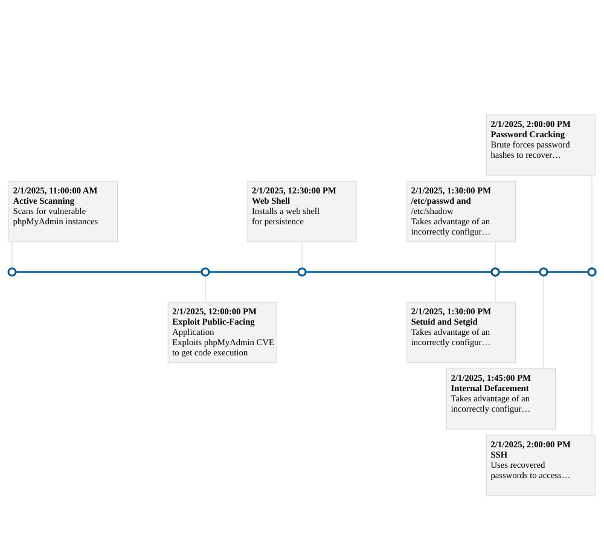
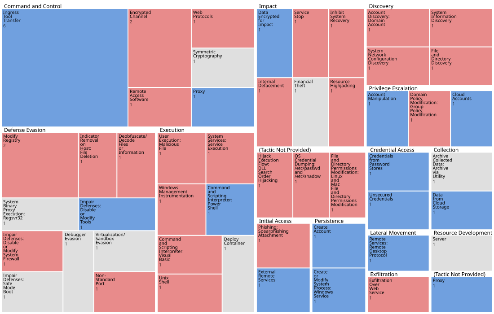

Visualization
=============

The Attack Flow Builder offers several tools for visualizing sequences of behaviors. In addition to being able to visualize and save your flows to PNG in the Builder, the following types of visualizations are available under the View menu. All the visualizations support resizing, full screen view, export to SVG, and copy to PNG.

.. raw:: html

    

        <a class="gallery-item" href="#presentation-view">
            

            

            

                <h4>Presentation View</h4>
            

        </a>
        <a class="gallery-item" href="#tactic-table">
            

            

            

                <h4>Tactic Table</h4>
            

        </a>
        <a class="gallery-item" href="#stix-ioc-table">
            

            

            

                <h4>STIX IOC Table</h4>
            

        </a>
        <a class="gallery-item" href="#matrix-view">
            

            

             

                <h4>Matrix View</h4>
            

        </a>
        <a class="gallery-item" href="#timeline-view">
            

            

            

                <h4>Timeline View</h4>
            

        </a>
        <a class="gallery-item" href="#treemap-view">
            

            

             

                <h4>Treemap View</h4>
            

        </a>
    

    

Presentation View
------------------
With this visualization, you can visualize a large, complex Attack Flow in a single powerpoint slide. We reduce a flow down to just the actions, conditions, and operators, and represent that in a space-saving snake format.

.. figure:: _static/presentation-view.png
   :scale: 80%
   :alt: An example presentation view of the Equifax Breach corpus flow.
   :align: center

   An example Presentation visualization

Tactic Table
----------------
With this visualization, you can generate a tactic table automatically from an Attack Flow. The tactic table is inspired by the format that CISA uses in their cybersecurity advisories. (`See example here. <https://www.cisa.gov/news-events/cybersecurity-advisories/aa25-071a#:~:text=for%20ransom%20negotiation-,MITRE%20ATT%26CK%20Tactics%20and%20Techniques,-See%20Table%203>`_) This visualization also supports multiple flows: click to upload another ``.afb`` file and see the number of times each technique is used across those flows.

   An example Tactic Table

STIX IOC Table
----------------
With this visualization, you can generate a STIX IOC table automatically from an Attack Flow. The STIX IOC table is very similar in format to the Tactic Table visualization, but it lists STIX Objects and Observables instead.

.. figure:: _static/stix-ioc.png
   :scale: 80%
   :alt: An example STIX IOC table
   :align: center

   An example STIX IOC Table

Matrix View
----------------
With this visualization, you can automatically generate an ATT&CK Matrix comprised of nodes from an uploaded Attack Flow. If your flow contains multiple frameworks, they will all be combined into a single matrix.

Timeline View
----------------
On this page, you can generate a timeline visualization automatically from an Attack Flow. The timeline is inspired by examples of timelines used in cyber threat reporting in the wild. This visualization requires each action node to contain a start timestamp.

Treemap View
----------------
On this page, you can visualize the distribution of techniques across multiple Attack Flows. The data is visualized in a Tree Map, where each technique present in a Flow has its own box, grouped by tactic. The size of each technique's box in the tree map is proportional to the number of times that technique appeared in the uploaded Flows. The color of each technique's box is related to the technique's score from the uploaded Navigator layer. Or, if you don't upload a Navigator layer, the colors will be determined by tactics.

Legacy Visualizations
------------------------
Some users of Attack Flow may remember visualizations being housed in Observable notebooks. We still have those available to the public, but are no longer maintaining or updating them.

* `ATT&CK Navigator <https://observablehq.com/d/0f89cf4ba5a52ce5>`_
* `Tactic Table <https://observablehq.com/d/010f86f3168a6b83>`_
* `Matrix View <https://observablehq.com/d/11f0d433ededff7b>`_
* `Timeline View <https://observablehq.com/d/263cc424a77aacd5>`_
* `Treemap View <https://observablehq.com/d/8c2d767bd699a8f7>`_
