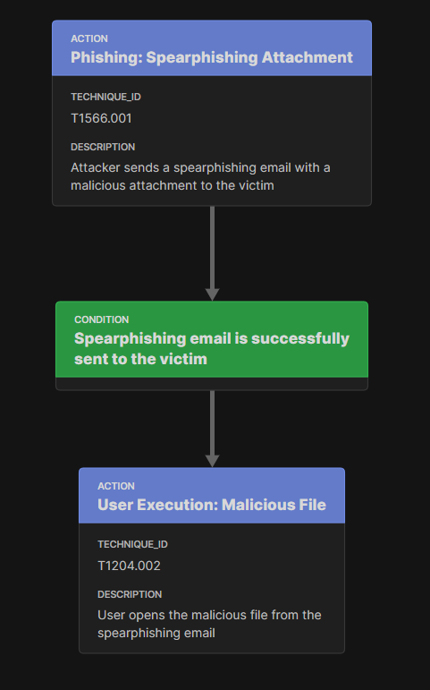
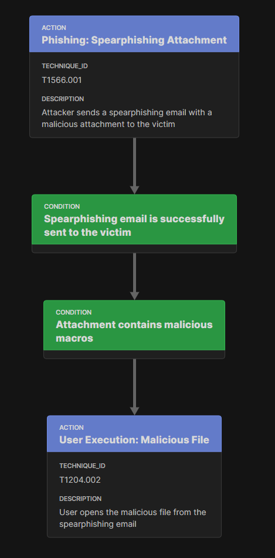
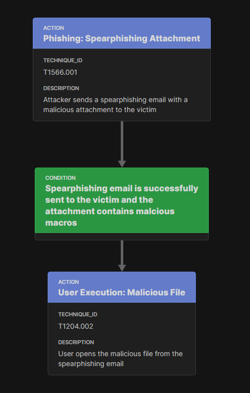
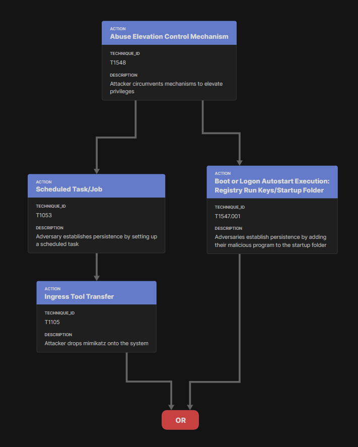

Walkthrough
========

..
  Whenever you update walkthrough.rst, also look at README.md and consider whether
  you should make a corresponding update there.

Introduction
------------

This section walks through various scenarios using the Attack Flow standard. Scenarios are presented in order of increasing complexity and demonstrate how the Attack Flow standard maps different adversary techniques and behaviors.

Actions
-------

Actions are the backbone of each attack flow. Actions describe the tactics and techniques used by malware or an attacker. When building an attack flow, the simplest flow uses actions connected to other actions. 

.. figure:: _static/action_to_action.png
   :alt: Screenshot of an action connected to another action in the Attack Flow Builder.
   :align: center

   Actions connected to other actions. 

Connecting actions together indicates an inherent dependency between them. The following action relies on the successful completion of the preceding action to run. 

Action to Condition
-------------------

A condition is used to specify a dependency between two actions. Each condition describes a precondition necessary for the following action to occur. Conditions should be used between actions if their dependency is not obvious.  

   Actions connected via a condition. 

Condition to Condition
----------------------

A condition may require its own condition before running properly. In this case, conditions can connect to each other; however, this is not recommended to do in an attack flow. 

   Conditions connected to each other.

If possible, it is recommended to combine conditions. 

   Alternative option. Two conditions combined. 

Paths
-----

Paths are added to the underlying structure of an attack flow to reduce ambiguity. There purpose is to define whether the preceding action or condition is true or false. 

   Both true and false paths are present in this attack flow. If the condition is true, then the flow continues; if the condition is false, then the flow ends. 

.. figure:: _static/1paths.png
   :alt: Screenshot of true path stemming from a condition.
   :align: center

   True path stemming from a condition. It is assumed that the on_false path would end the attack flow; therefore, it is not necessary to include in the attack flow. The attack flow only continues successfully if the condition or action is true.   

Operators
---------

In complex scenarios, operators are used to express the relationship between conditions or actions. Currently, the two defined operators are AND or OR. The AND operator is used when more than one condition or action is required to successfully continue along the attack flow. The OR operator is used when only one condition or action is needed to continue the attack flow. 

.. figure:: _static/OR_operator.png
   :alt: Screenshot of an OR operator between two conditions.
   :align: center

   The OR operator between two conditions indicates that at least one condition must be present for the attack flow to continue successfully.

.. figure:: _static/action_OR_operator.png
   :alt: Screenshot of an OR operator between two actions. 
   :align: center

   The OR operator between two actions indicates that both actions occur simultaneously but only one must complete successfully for the attack flow to continue. 

.. figure:: _static/AND_operator.png
   :alt: Screenshot of an AND operator between two states. 
   :align: center

   The AND operator between two conditions indicates that both conditions must be present for the attack flow to continue successfully.  

.. figure:: _static/action_AND_operator.png
   :alt: Screenshot of an AND operator between two actions. 
   :align: center

   The AND operator between two actions indicates that both actions occur simultaneously and must be present for the attack flow to continue successfully. 

Operator to Condition
---------------------

For complex attack flows, a condition may be added after an OR operator. 

.. figure:: _static/operator_to_state.png
   :alt: Screenshot of an OR operator connected to a condition.  
   :align: center

   OR operator separating different conditions.

In this scenario, one of two conditions must be present for the attack flow to continue; then, another additional condition is needed before the action can occur.

Conditions to Action
--------------------
Conditions can be connected to an action without an operator. However, this causes reader ambiguity, since it is not clear whether both conditions must occur (indicated by an AND operator) or if only one condition must occur (indicated by an OR operator).

.. figure:: _static/states_to_action.png
   :alt: Screenshot of two conditions connecting to an action.  
   :align: center

   Conditions connected to an action without an operator, creating ambiguity. 

When multiple conditions lead to a single action, it is recommended to use an operator to reduce ambiguity. 

Complex Examples of an Attack Flow 
----------------------------------

By adding the above techniques together, unique attack flows can be created. 

.. figure:: _static/example1.png
   :alt: Screenshot of a complex part of an attack flow using an operator.  
   :align: center

   An example of part of an attack flow. Only one action must occur for the subsequent condition and action to be successful.

.. figure:: _static/example2.png
   :alt: Screenshot of a complex part of an attack flow using an operator leading to different parts of the flow.  
   :align: center

   An example of part of an attack flow. Depending on which condition occurs is how the attack flow will proceed. If conditionA occurs, then the attack flow will proceed down the path underneath conditionA (left side of the flow). If conditionB occurs, then the attack flow will proceed down the path underneath conditionB (right side of the flow).

.. figure:: _static/example3.png
   :alt: Screenshot of a complex part of an attack flow using an operator leading to different parts of the flow, which rejoins into a single path.  
   :align: center

   An example of part of an attack flow. Depending on which condition occurs is how the attack flow will proceed. If conditionA occurs, then the attack flow will proceed to the actions underneath conditionA (left side of the flow). If conditionB occurs, then the attack flow will proceed to the actions underneath conditionB (right side of the flow). At the end, the attack flow comes together into a single path.

.. figure:: _static/example4.png
   :alt: Screenshot of a complex part of an attack flow using paths. 
   :align: center

   An example of part of an attack flow. If conditionA occurs, then the attack flow follows the on_true path. If conditionA is false, then conditionB occurs. Depending on whether conditionB is true or false is which action occurs.

.. figure:: _static/example5.png
   :alt: Screenshot of a complex part of an attack flow using paths and multiple conditions. 
   :align: center

   An example of part of an attack flow. Depending on which condition occurs is which action will occur. If no conditions are true, then the attack flow ends.