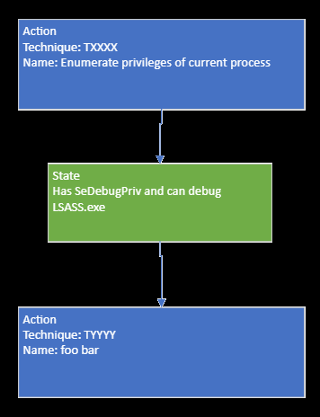

Walkthrough
===========

..
  Whenever you update walkthrough.rst, also look at README.md and consider whether
  you should make a corresponding update there.

Introduction
------------

This section walks through various scenarios using the Attack Flow standard. Scenarios are presented in order of increasing complexity and demonstrate how the Attack Flow standard maps different adversary techniques and behaviors.

Actions
-------

Actions are the backbone of each attack flow. Actions describe the tactics and techniques used by malware or an attacker. When building an attack flow, the simplest flow uses actions connected to other actions.

.. figure:: _static/action_to_action.png
   :alt: Screenshot of an action connected to another action in the Attack Flow Builder.
   :align: center

   Actions connected to other actions.

Connecting actions together indicates an inherent dependency between them. The following action relies on the successful completion of the preceding action to run.

Action to State
---------------

A state is used to specify a dependency between two actions. Each state describes a precondition necessary for the following action to occur. States should be used between actions if their dependency is not obvious.

.. figure:: _static/action_to_precondition.png
   :alt: Screenshot of actions connected with a state in the Attack Flow Builder.
   :align: center

   Actions connected via a state.

State to State
--------------

A state may require its own state before running properly. In this case, states can connect to each other; however, this is not recommended to do in an attack flow.

.. figure:: _static/state_to_state.png
   :alt: Screenshot of states connected to each other.
   :align: center

   States connected to each other.

If possible, it is recommended to combine states.

   Alternative option. Two states combined.

Operators
---------

In complex scenarios, operators are used to express the relationship between states or actions. Currently, the two defined operators are AND or OR. The AND operator is used when more than one state or action is required to successfully continue along the attack flow. The OR operator is used when only one state or action is needed to continue the attack flow.

.. figure:: _static/OR_operator.png
   :alt: Screenshot of an OR operator between two states.
   :align: center

   The OR operator between two states indicates that at least one state must be present for the attack flow to continue successfully.

.. figure:: _static/action_OR_operator.png
   :alt: Screenshot of an OR operator between two actions.
   :align: center

   The OR operator between two actions indicates that both actions occur simultaneously but only one must complete successfully for the attack flow to continue.

.. figure:: _static/AND_operator.png
   :alt: Screenshot of an AND operator between two states.
   :align: center

   The AND operator between two states indicates that both states must be present for the attack flow to continue successfully.

.. figure:: _static/action_AND_operator.png
   :alt: Screenshot of an AND operator between two actions.
   :align: center

   The AND operator between two actions indicates that both actions occur simultaneously and must be present for the attack flow to continue successfully.

Operator to State
-----------------

For complex attack flows, a state may be added after an OR operator.

.. figure:: _static/operator_to_state.png
   :alt: Screenshot of an OR operator connected to a state.
   :align: center

   OR operator separating different states.

In this scenario, one of two states must be present for the attack flow to continue; then, another additional state is needed before the action can occur.

States to Action
----------------
States can be connected to an action without an operator. However, this causes reader ambiguity, since it is not clear whether both states must occur (indicated by an AND operator) or if only one state must occur (indicated by an OR operator).

.. figure:: _static/states_to_action.png
   :alt: Screenshot of two states connecting to an action.
   :align: center

   States connected to an action without an operator, creating ambiguity.

When multiple states lead to a single action, it is recommended to use an operator to reduce ambiguity.

Complex Examples of an Attack Flow
----------------------------------

By adding the above techniques together, unique attack flows can be created.

.. figure:: _static/example1.png
   :alt: Screenshot of a complex part of an attack flow.
   :align: center

   An example of part of an attack flow. Only one action must occur for the subsequent state and action to be successful.

.. figure:: _static/example2.png
   :alt: Screenshot of a complex part of an attack flow.
   :align: center

   An example of part of an attack flow. Depending on which state occurs is which path the flow follows.

.. figure:: _static/example3.png
   :alt: Screenshot of a complex part of an attack flow.
   :align: center

   An example of part of an attack flow. Depending on which state occurs is which path the flow follows. At the end, the attack flow comes together into a single path.
