Walkthrough
========

..
  Whenever you update walkthrough.rst, also look at README.md and consider whether
  you should make a corresponding update there.

Introduction
------------

This section walks through various scenarios using the Attack Flow standard. Each scenario increases in complexity and demonstrates how the Attack Flow standard maps different adversary techniques and behaviors.

Actions
-------

The backbone of each attack flow is actions. Actions describe the tactics and techniques used by malware or an attacker. When building an attack flow, the simpliest form uses actions connected to other actions. 

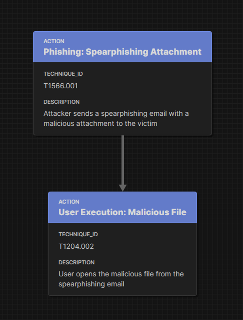

   Actions connected to other actions. 

Connecting actions together indicates an inherent dependency between them. The following action relies on the success of the preceding action to run successfully. 

Action to State
----------------------

To specify a dependency between two actions, a state is used. Each state describes a precondition necessary for the following action to occur. States should be used between actions if their dependency is not obvious.  

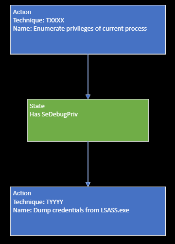

   Actions connected via a state. 

State to State
--------------

A state may require its own state before running properly. In this case, states can connect to each other; however, this is not recommended to do in an attack flow. 

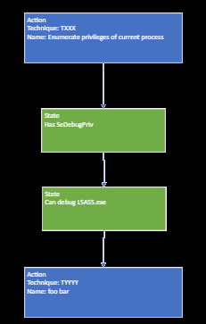

   States connected to each other.

If possible, it is recommended to combine states or have two states connected to one action node. 

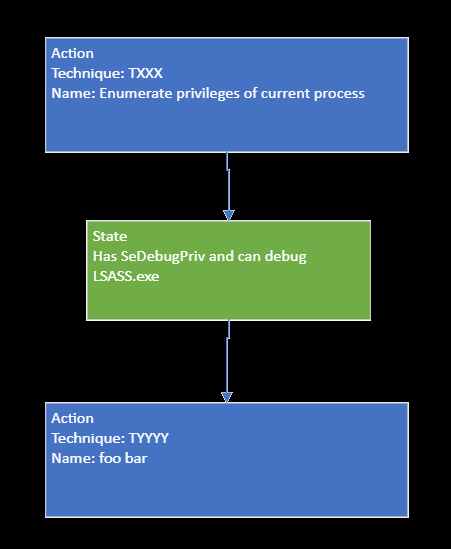

   Alternative option. Two states leading into one action. 

Operators
---------

In complex scenarios, operators are used to combine states or actions. Approved operators are AND or OR. When more than one state or action is required to successfully continue along the attack flow, the AND operator should be used. When only one state or action is needed to continue the attack flow, the OR operator should be used.

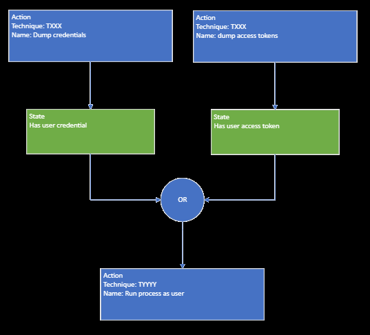

   OR operator between two states, indicating that at least one state but be present for the attack flow to continue successfully.

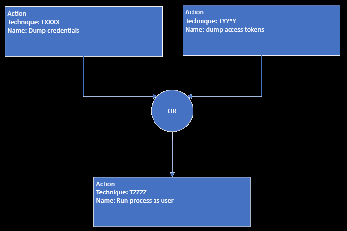

   OR operator between two actions, indicating that both actions occur simultaneously but only one must complete successfully for the attack flow to continue. 

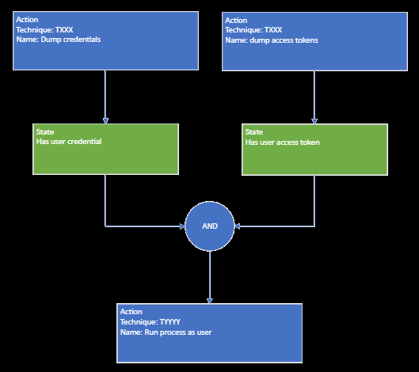

   AND operator between two states, indicating that both states must be present for the attack flow to continue successfully.  

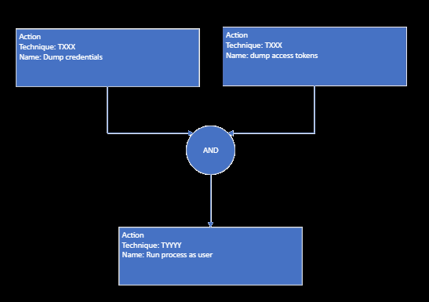

   AND operator between two actions, indicating that both actions occur simultaneously and must be present for the attack flow to continue successfully. 

Operator to State
-----------------

For complex attack flows, a state may be added after an operator. 

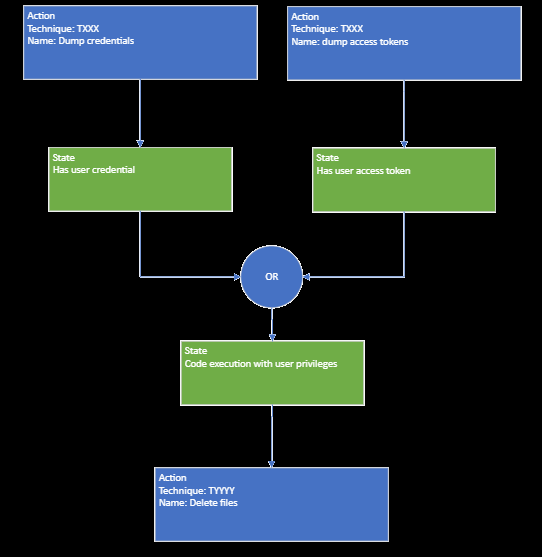

   OR operator separating different states.

In this scenario, one of two states but be present for the attack flow to continue; then, another additional state is needed before the action can occur.

A scenario where a state is connected to another state with an operator will only use an OR operator. If an AND operator needs to be used, then all states can precede the operator.

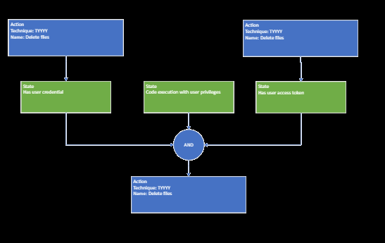

   AND operator connecting multiple states to one action. 

States to Action
----------------
States can be connected to an action without an operator. However, this causes reader ambiguity, since it is not clear whether both states must occur (usually indicated by an AND operator) or if only one state must occur (usually indicated by an OR operator).

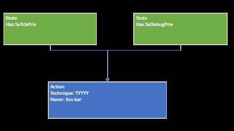

   States connected to an action without an operator, creating ambiguity. 

It is recommended to use an operator if multiple states lead to a single action.

Complex Examples of an Attack Flow 
----------------------------------

By adding the above techniques together, unique attack flows can be created. 

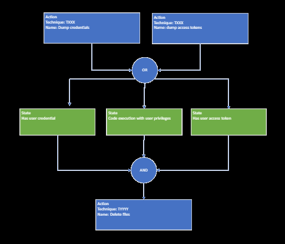

   An example of part of an attack flow. Only one action must occur all three states must be present for the end action to be successful.

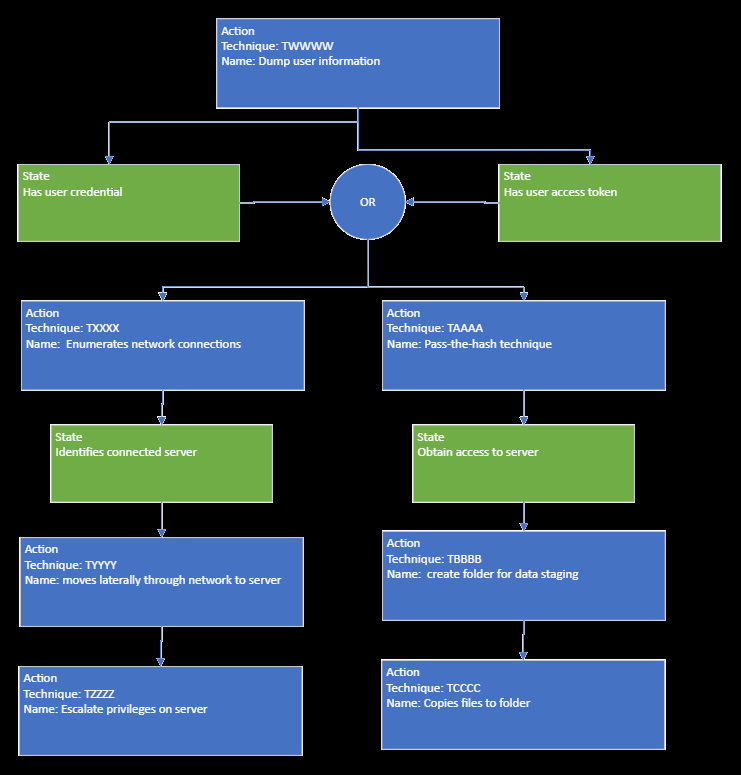

   An example of part of an attack flow. Depending on which state occurs is which path the flow follows. 

.. figure:: _static/example3.png
   :alt: Screenshot of a complex part of an attack flow.  
   :align: center

   An example of part of an attack flow. Depending on which state occurs is which path the flow follows. At the end, the attack flow comes together into a single path.
